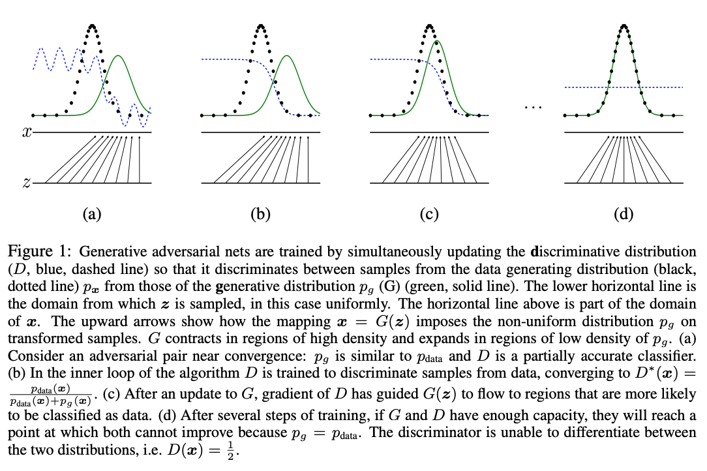
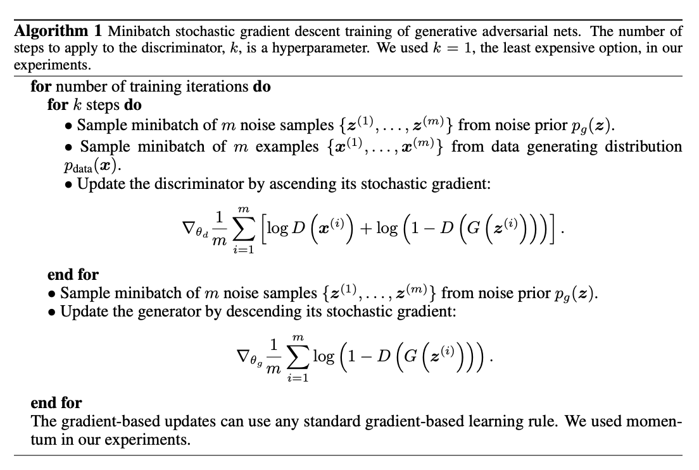
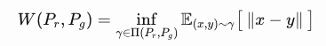
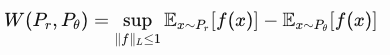

## Evolution of Cost Function in GAN 

### 1. Standard GAN

Ian J. Goodfellow: [Gnerative Adversial Nets](https://papers.nips.cc/paper/5423-generative-adversarial-nets.pdf)

####Key points

**Intuition:** to create a new architecture to make generative models perform as well as **discriminative models.** 

**General architecture:** adversarial training => Generators (**G**) generates things, while discriminator (**D**) sees real things and fake things and learns how to differentiate the two.

**Training:**

Min-Max game: D to maximize the probability of assigning correct labels to both training samples and generated samples;  G to minimize $log(1-D(G(z)))$, which means generator's distribution $p_g$ of samples $G(z, \theta)$ obtained when $z \sim p_z$ converges to a better estimator of real sample's distribution $p_r$. 

**Value Function:**

#### Theoretical Analysis

But when applyed, the generator objective function is changed to following format in order to avoid flat gradient during training discriminator: $max_{\theta_g} E{z\sim p(z)} log(D_{\theta_d}(G_{\theta_g}(z)))$ , instead of $min_{\theta_g}E(1-D(G(z)))$.

### 2. Problems

This [article](https://medium.com/@jonathan_hui/gan-why-it-is-so-hard-to-train-generative-advisory-networks-819a86b3750b) has summarized tha main problems of GAN, including **mode collapse, gadient vanishment, and non-convergence**.

https://medium.com/@jonathan_hui/gan-why-it-is-so-hard-to-train-generative-advisory-networks-819a86b3750b

GAN model converges when discriminator and generator reach a **[Nash Equibrilium](http://www.columbia.edu/~rs328/NashEquilibrium.pdf)**. But using gradient descent in such minmax game will cause counteration between the actions of discriminator and generator.

### 3. Divergence

Now again, let's think about what's generator doing in GAN. Actually, it is trained to learn how to transform the the input noise $z$ in uniform or normal distribution to the real samples' distribution, or we can say it's a **mapping function** to convert one distribution to defined distribution: $p_g = G(z, z\sim p_z) \sim p_r$. So it's an important issue how to measure the degree of similarity between these two distributions. Normally, we have **KL divergence** and **JS divergence** to compare distribution similarities. 

#### KL-Divergence

[Kullback-Leibler divergence](https://jhui.github.io/2017/01/05/Deep-learning-Information-theory/)：

Note KL-divergence is **not symmetric**al: $D_{KL}(p || q) \ne D_{KL}(q || p)$.

When p(x) approaches 0, KL(x) will drop to 0. For $D_{KL}(p||q)$, penality is high if $p(x) > 0$ but $q(x) \rightarrow 0$, penalizing heavily when **some modes of real images will be missed**; but penality is low when $p(x)\rightarrow 0$ and $q(x) > 0$, indicating **some bad generated images are acceptable** ; as for the reverse $D_{KL}(q||p)$, the case also reverses: penality will be high when $p(x)\rightarrow 0$ and $q(x)>0$, penalizing heavily when **generated images don't look real**; penality will be low if $p(x) > 0$ but $q(x) \rightarrow 0$, which means **missing modes are acceptable**. In the former case, we want **more diveristy with poorer quality**; in the latter one, **better quality with less diversity** is desired. 

#### JS-Divergence

Sometimes we need a **symmetrical** form of divergence, here comes the [JS-divergence](https://en.wikipedia.org/wiki/Jensen%E2%80%93Shannon_divergence):

If the discriminator is optimal, the generator's objective function is: 

$C(G) = -log(4) + 2 * D_{JS}(p_r||p_g)$

This is also what GAN tries to optimize during training. **When $p_ g$ approaches $p_ r$ , this cost function could achieve its minimum value $-log4$**. In another word, the objective function for the generator is: $min_G V(D^*, G) = 2D_{JS}(p_r||p_g)-log4$ where $G^*$ is the optimum. But according to [this post](https://medium.com/@jonathan_hui/gan-why-it-is-so-hard-to-train-generative-advisory-networks-819a86b3750b), JS-divergence gradient also suffers **vanishment** problem when $p_g$ and $p_x$ are far apart.

Another thing should be noticed during the usage of JS-divergence as cost function is **huge computing cost**. For example, when we want to convert random noise into a MNIST hand written digit, there are $28 x 28 =784$ pixels need to be operated. Assume all of these pixels are independent and they have only 2 options (like 0 or 1), there will be $2^{784}$ potential interval or value combinations. It almost impossible to calculate JS or KL divergence with these intervals.

### 4. Improvement in Cost Function 

Since the cost function based on KL-deivergence or JS-divergence seem to be a huge source of many problems in GAN like mode collapse, gradient vanishment and training instability, many research have focused on developing new divergence metrics to replace JS-divergence. Here are some of them:

- Pearson $\chi ^ 2$ divergence in  Least Square GAN (LSGAN)
- Wasserstein distance in Wasserstein GAN (**WGAN**)
- Relativistic generalized distance in Relativistic GAN (RGAN) and Relativistic Average (RaGAN)
- Energy Based GAN (EBGAN) and Boundary Equilibrium (BEGAN)
- Deep Regret Analytic GAN (DRAGAN)
- Loss Sensitive GAN (LS-GAN) and Generalized Loss-Sensitive GAN (GLS-GAN)

---

#### LSGAN

LSGAN design a new objective function that helps alleviate the vanishment problem using JS-divergence with generator. As its name impicates, the cost function is in square format and here it is:

$min_D L(D) = E_{x\sim p_x}(D(x)-b)^2+E_{z\sim p_z}(D(G(z))-a)^2$

$min_G L(G) = E_{z\sim p_z} (D(G(z))-c)^2$

Note the last term of $min_GV_{LSGAN}(G)$ is not relavant to G and $a,b$ are the target discrinator labels for generated images and real images while $c$ is target generator labels for generated images. 

Following the covergence approvement in SGAN, the optimal discriminator with fixed $G$ will be:

Put $D^*$ into $L(G)$ and add an extra item that isn't relavant to G, then we will get:

If we set $b-c=1, b-a=2$ (like $a=-1,b=1,c=0$) , it is a **Pearson $\chi ^2$ Divergence**: $L(G)=0.5 \chi^2_{Person}(p_d+p_g||2p_g) $. Another proposal is to set $c=b=1, a=0$ based on the intuition that LSGAN want the **target discriminator label for real images to be 1 and generated images to be 0 and target label for generated images to be 1 for the generator.** Both settings produce similar result in experiment. 

However, LSGAN is still using a kind of divergence to measure similarity of 2 distributions. It means the fluctuation problem in SGAN still exists.

---

#### WGAN

There have already been a bunch of awesome posts that explain the mechanism of WGAN:

https://lilianweng.github.io/lil-log/2017/08/20/from-GAN-to-WGAN.html

https://vincentherrmann.github.io/blog/wasserstein/

https://www.alexirpan.com/2017/02/22/wasserstein-gan.html

https://medium.com/@jonathan_hui/gan-wasserstein-gan-wgan-gp-6a1a2aa1b490

The main contribution of this paper is introducing a new distance metrics called **Wasserstein distance** or **Earth mover distance** (EM distance). An good example to illustrate EM distance can be referred [here](https://lilianweng.github.io/lil-log/2017/08/20/from-GAN-to-WGAN.html). It is the **minimum cost of transporting the mass** from data distribution $q$ to $p$. [This post](https://www.alexirpan.com/2017/02/22/wasserstein-gan.html) gives the provement that the:

> Every distribution that converges under the KL, reverse-KL, TV, and JS divergences also converges under the Wasserstein divergence.
>
>  Small earth mover distance corresponds to a small difference in distributions.

And [this post](https://lilianweng.github.io/lil-log/2017/08/20/from-GAN-to-WGAN.html) explain why Wasserstein is better than JS and KL divergence. This plot summaries its advantage: Wasserstein distance has a much **smoother gradient** everywhere , which means WGAN can learn no mattter the generator. 

The Wasserstein distance is defined:

But this form is hard to estimate, so the author uses [Kantorvich-Rubinstein duality](https://en.wikipedia.org/wiki/Wasserstein_metric#Dual_representation_of_W1) to transform the definition into its dual format: 

where the $sup$ is **least upper bound** and $f$ is a 1-Lipschitz function. But how to enforce the Lipschitz constraint becomes another issue for WGAN training. The author of WGAN also raises 3 ways:

- **Weight Clipping**: $w \leftarrow clip(w, -c, c)$ 

  This method is sensitive to hyperparameter c, and the gradient explosion and vashiment may still remain with bad-tuned c.

  

  Besides, weight cripping also reduces model capacity to fit complex functions.

  

- **Gradient Penality**
