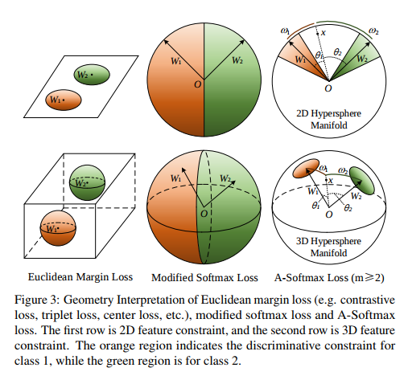

# 1. L-Softmax Loss -- Large margin softmax Loss
**Large-Margin Softmax Loss for Convolutional Neural Networks** [[Paper](http://proceedings.mlr.press/v48/liud16.pdf)] [[Code](https://github.com/wy1iu/LargeMargin_Softmax_Loss)]

**特点：** intra-class compactness and inter-class separability; adjust margin by m also avoid overfitting; optimized by SGD

**weakness of softmax loss, contrastive loss, triplet loss**  
softmax: only learn separable features, not explicitly encourage intra-class compactness and inter-class-separability

contrastive loss / triplet loss: number of training: **O(N2)**; designed pair of selection: the former takes pair of inputs; the later requires 3 -- anchor sample, positive sample and negative sample.

#### 动机
对于原始的softmax(处于简化的考虑省略掉残差项b)： f是最后一层fc **W** 的activation，fyi可以写作 也就是W和x的内积  0 ≤ Θj ≤ π。因此原来的式子也可以写作：

如果设x为class1，即W1Tx > W2Tx => ||W1||.||x|| cos(θ1) > ||W2||.||x|| cos(θ2)。为了获得更严格的分类边界，引入边界参数m，使，此时的Θ1的范围被限制到了(0, π/m),比原始的边界(0, π)更小，**m越大分类标准越严格**。

#### L-Softmax定义
因此将L-softmax定义为： ，其中D(Θ)需要是单调递减并且D(π/m) = cos(π/m) （当m=1的时候L-softmax就是原始softmax）。为了简化FP和BP计算，这里定义ψ（Θ）为:  k∈[0, m-1]

在实际计算中，将Θ用Wx/||W||.||x||替换，而cos(mΘyi)用切比雪夫多项式展开： 2n ≤ m

#### 几何意义
对于二分类，当||W1|| = ||W2||, 此时的分类只依赖与x与W1和W2之间的夹角。如果所有训练数据能够完美二分类，那么分类之间的 **angle margin是(m-1)/(m+1)Θ1,2**，其中Θ1,2是W1，W2之间的夹角。令Θ'=mΘ，如果L-softmax和原始的softmax都可以优化到相同的值，由于L-softmax的Θ比原始的Θ’小了m-1倍，所以x于W1之间的夹角会更小(也即是 **同类之间的点分布更加集中**)。对于||W1|| ≠ ||W2||的情况，||W||更大的一方Θ也更大。

#### 优化
对于Li，L-softmax与原始softmax之间的不同就是fyi，在前后向传播的时候只需要fyi，而fj,j ≠ yi的时候与原始softmax没有区别。**FP**：  
 其中cos(Θyi) =  k ∈ [0, m-1]

**BP**  

当m=2， 上面两式写为： 

**m**:从测试结果来看，m设为2以上都能取得较好的效果，m越大，分类效果越明显，但是训练的时候也越难收敛。

# 2. A-Softmax (angular softmax)
**SphereFace: Deep Hypersphere Embedding for Face Recognition** [[Paper](https://arxiv.org/pdf/1704.08063.pdf)] [[Code](https://github.com/wy1iu/sphereface)]

#### 改进
A-Softmax是L-softmax的改进，添加了 **两条限制：1). ||W1|| = ||W2|| = 1; 2). b1=b2=0**，此时decision boundary (W1-W2)x+b1-b2=0变成了,也就是decision boundary只取决于 **角度**。这项改进是由于在人脸识别中，softmax loss学习出来的特征本身就具有 **角分布**，Euclidean margin based loss并不很适合用于softmax loss。 

引入这两个限制以后，原始softmax变成: ；引入L-Softmax的角度参数m，

#### 几何意义

#### m
**属性**:与L-softmax意义，m的值越大， angular margin也会越大，在manifold上的限制区域也越小，但是学习会更加困难；对于二分类，mmin≥2+√3;对于多分类mmin ≥ 3 (mmin是指m的最小值能够使最大的类内angular距离比最小的类间angular距离要小。)

#### 效果
只用WebFace能够与大力出奇迹的facenet在Megaface挑战赛上一较高下,强无敌。

# 3. Triplet Loss (FaceNet)
**FaceNet: A Unified Embedding for Face Recognition and Clustering** [[Paper](https://arxiv.org/pdf/1503.03832.pdf)] [[Code](https://github.com/davidsandberg/facenet)]

image embedding 为 f(x)∈ Rd,即将图片转换成d维Euclidean space。将一个人的脸的一张图片作为anchor，需要使之与这个人的其他图片(positive)之间的距离更近而与其他人图片(negative)的距离更远。因此在训练是会后每次都需要 **3张图片** 为一组输入(Triplet)：一张anchor，一张postive，一张negative

 α是区分postive pairs和negative pairs之间的margin (需要根据结果来调，比较烦)。τ是训练集N的所有可能的triplet。训练时需要minimize的的loss为：

**注意：** Triplet的选择比较麻烦，具体可以参考下文章。

# 4. center loss
**A Discriminative Feature Learning Approach for Deep Face Recognition** [[Paper](http://ydwen.github.io/papers/WenECCV16.pdf)]

center loss:  Cyi ∈ Rd是第yi个class的feature的中心。本来Cyi需要在所有这个类的图片计算后进行更新，但是这在实际操作中不太实际。因此这里实在在每个 **mini-batch** 实现更新；同时为了避免在mini-batch中由于少量的错分类造成的大的偏差，引入了 **α来控制center的学习率**。Loss和center的更新为：

联合Loss为L softmax + L center loss： λ平衡这个loss之间的权重。

