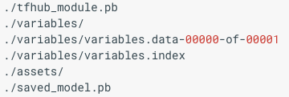
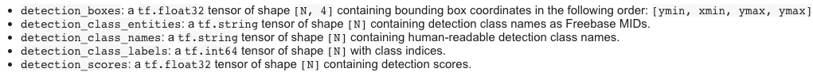

# Brief Introduction for Using TensorFlow Hub  (v.1.12)

## 1. What is TensorFlow hub?

Tensorflow Hub is a library for **reusable machine learning modules**, where a **module** contains a **self-contained piece of a TensorFlow Graph** along with its weights and assets. So It could be reused for transfer learning across different tasks.

## 2. Why use it?

 Very easy to use for there is no need to have a clear understanding about the model architecture for retraining or inference. Just only add a small snippet of  code in your program to convert it into a fantastic deeplearning application. Sounds cool, right?

## 3. How to use?

#### 1) Installation

Just `pip` install the tensorflow_hub package.

`pip install tensorflow-hub`

**Note: ** TensorFlow 1.7 or later is also required.

#### 2)  Explanation of using a module

TF hub module is imported into a TF program by instantiating a `Module` object. This adds the module's variables to current TF graph.  

```python
import tensorflow as tf
import tensorflow_hub as hub 

m = hub.Module("path/to/a/module_dir", trainable=True, tags={"train"}) # file path
features = m(images) # extract feature
# post processing
logits = tf.layers.dense(features, NUM_CLASSES)
prob = tf.nn.softmax(logits)
```

After instantiating, module `m` can be used multiple times from **tensor inputs** to **tensor outputs**. Sometimes, module has more than one *signatures* that allow usage in multiple ways. In previous call, the signature parameter is omitted which is named 'default' indeed. 

If a signature has multiple inputs, they must be passed as a **dict**, with keys defined by given signature. If the signature has multiple outputs, result should be retrieved in **dict** by setting `as_dict=True`.

```python
outputs = m(dict(apples=x1, oranges=x2), signature="fruit_to_pet", as_dict=True)
y1 = outputs["cats"]
y2 = outputs["dogs"]
```

Tensorflow **ONLY** run those parts of the module that end up as dependencies of a target in `tf.Session.run()`

---

Instead of loading module from **file** directly, the module could be created from a **URL**.

```python
m = hub.Module("https://tfhub.dev/google/progan-128/1") 
```

In this way, module need to be downloaded and cached in local system temp directory. Or you could switch to another directory to override default one by setting environment parameter `TFHUB_CACHE_DIR` .

```shell
export TFHUB_CACHE_DIR=/my_module_path
```

BTW, modules uploaded to tf hub library follow this naming rule: **respository url + module publisher + module name + module version**. In this example, this name means that it is a progran model, a generative model, released by google in its initial version. If you want to download the compressed tar ball model file, append `?tf-hub-format=compressed` to the end of URL path, like https://tfhub.dev/google/progan-128/1?tf-hub-format=compressed. Inspecting into the tar ball file, you will find these file in the root:



#### 3) Example of using tf_hub for image classification

Let just use an [inception V3](https://arxiv.org/abs/1512.00567) classifier as an example and its module hub url is: https://tfhub.dev/google/imagenet/inception_v3/classification/1

```python
from urllib.request import urlopen
from io import BytesIO
from PIL import Image, ImageOps
import cv2

def download_and_resize_image(url, filename, new_width=256, new_height=256):
  response = urlopen(url)
  image_data = response.read()
  image_data = BytesIO(image_data)
  pil_image = Image.open(image_data)
  pil_image = ImageOps.fit(pil_image, (new_width, new_height), Image.ANTIALIAS)
  pil_image_rgb = pil_image.convert('RGB')
  pil_image_rgb.save(filename, format='JPEG', quality=90)
```

```python
# instantiating module 
tf.reset_default_graph()
module = hub.Module("https://tfhub.dev/google/imagenet/inception_v3/classification/1")
height, width = hub.get_expected_image_size(module)

img_url = "https://cdn.pixabay.com/photo/2017/02/20/18/03/cat-2083492_960_720.jpg"
img_jpg = "cat.jpg"

# input and output tensor
input_tensor = tf.placeholder(tf.float32, shape=[1, width, height, 3])
logits = module(input_tensor)
labels = tf.argmax(logits, axis=1)

# download_and_resize_image(img_url, img_jpg, width, height)
image = cv2.imread(img_jpg)
# input range from 0-1
image_rgb = (cv2.cvtColor(image, cv2.COLOR_BGR2RGB)/256)
inputs = np.expand_dims(image_rgb, 0).astype(np.float32)

# set up session
initializer = tf.global_variables_initializer()
sess = tf.Session()
sess.run(initializer)

# predict
res = sess.run(labels, feed_dict={input_tensor: inputs})
print(res)

# 283: 'Persian cat',
```

ImageNet label id-to-name reference could be found [here](https://gist.github.com/yrevar/942d3a0ac09ec9e5eb3a)

If you want to get **image feature vectors** rather than logits for image classification, USE signature name **image_feature_vector** instead of **image_classification**.

```python
outputs = module(dict(images=images), signature="image_feature_vector", as_dict=True)
features = outputs["default"]
```

See [here](https://www.tensorflow.org/hub/common_signatures/images#feature-vector) for detailed signature specification for image tasks.

### 4) Example of using TF hub for object detection

This [tutorial](https://github.com/tensorflow/hub/blob/master/examples/colab/object_detection.ipynb) has provided a detailed explanation about how to use TF hub to perform object detection. So far, there have been 2 detectors uploaded by google, which are [Faster RCNN Inception RestNet V2](https://tfhub.dev/google/faster_rcnn/openimages_v4/inception_resnet_v2/1) and [SSD MobileNet V2](https://tfhub.dev/google/openimages_v4/ssd/mobilenet_v2/1). 

Here we just need to address those different from previous classification task. What detector returns is a dict like this, so as mentioned before, we should claim `as_dict=True` when executing module. 



```python
detector = hub.Module(module_handle)
image_string_placeholder = tf.placeholder(tf.string)
decoded_image = tf.image.decode_jpeg(image_string_placeholder)
decoded_image_float = tf.image.convert_image_dtype(image=decoded_image, dtype=tf.float32)
module_input = tf.expand_dims(decoded_image_float, 0)
result = detector(module_input, as_dict=True)
```

**Note** these 2 modules **DON'T** support **fine-tuning** and **batching** yet. So it seems if you want to retrain a detector, you'd better to use [TensorFlow object detection API](https://github.com/tensorflow/models/tree/master/research/object_detection).

#### 5) Example of using GAN for generator

To be honest, the intuition for me to have a taste on tf hub is mainly from [BigGAN](). It is the best GAN generator ever yet and almost improves Inception Scores by > 100 to former state-of-art model, SAGAN. This great work is revealed by DeepMind for ICLR 2019, even Ian Goodfellow has retweeted it. 

Just simply summarize the main idea in the paper here and maybe detailed explanation would be in later post. 

- The key point is that **SCALING UP** highly benefit GAN training both in fidelity and variety. 
- Applying with **orthogonal regularization** to generator make it easy to use truncation trick to control over trade off between fidelity and variety
- Current GAN techniques are sufficient to enable large models and distributed large-batch training.

BigGAN module can be found [here](https://tfhub.dev/deepmind/biggan-256/2) and a demo to run it can also be found on [this colab website](https://colab.research.google.com/github/tensorflow/hub/blob/master/examples/colab/biggan_generation_with_tf_hub.ipynb#scrollTo=SeZ7u3rWd9jz). Here is a  simple demo: 

```python
import tensorflow as tf
import tensorflow_hub as hub
import cv2
import numpy as np
from scipy.stats import truncnorm

# MODULE_PATH = 'https://tfhub.dev/deepmind/biggan-128/2'  # 128x128 BigGAN
MODULE_PATH = 'https://tfhub.dev/deepmind/biggan-256/2'  # 256x256 BigGAN
# MODULE_PATH = 'https://tfhub.dev/deepmind/biggan-512/2'  # 512x512 BigGAN

tf.reset_default_graph()
module = hub.Module(MODULE_PATH)
inputs = {k: tf.placeholder(v.dtype, v.get_shape().as_list(), k)
          for k, v in module.get_input_info_dict().items()}
output = module(inputs)
print("Inputs: \n", '\n'.join('{}:{}'.format(*kv) for kv in inputs.items()))
input_z = inputs['z']
input_y = inputs['y']
input_trunc = inputs['truncation']
dim_z = input_z.shape.as_list()[1]
vocab_size = input_y.shape.as_list()[1]

# generate random noise for image generation
def truncated_z_sample(batch_size, truncation=1., seed=None):
    state = None if seed is None else np.random.RandomState(seed)
    values = truncnorm.rvs(-2, 2, size=(batch_size, dim_z), random_state=state)
    return truncation * values

def one_hot(label, vocab_size=vocab_size):
    label = np.asarray(label)
    if len(label.shape) <= 1:
        label = np.asarray(label)
        if len(label.shape) == 0:
            label = np.asarray([label])
        assert len(label.shape) == 1
        num = label.shape[0]
        output = np.zeros((num, vocab_size), dtype=np.float32)
        output[np.arange(num), label] = 1
        label = output
    assert len(label.shape) == 2
    return label

def sample(sess, noise, label, truncation=1., batch_size=8, vocab_size=vocab_size):
    noise = np.asarray(noise)
    label = np.asarray(label)
    num = noise.shape[0]
    if len(label.shape) == 0:
        label = np.asarray([label] * num)
    if label.shape[0] != num:
        raise ValueError('Got # noise samples ({}) != # label samples ({})'
                       .format(noise.shape[0], label.shape[0]))
    label = one_hot(label, vocab_size)
    ims = []
    for batch_start in range(0, num, batch_size):
        s = slice(batch_start, min(num, batch_start + batch_size))
        feed_dict = {input_z: noise[s], input_y: label[s], input_trunc: truncation}
        ims.append(sess.run(output, feed_dict=feed_dict))
    ims = np.concatenate(ims, axis=0)
    assert ims.shape[0] == num
    ims = np.clip(((ims + 1) / 2.0) * 256, 0, 255)
    ims = np.uint8(ims)
    return ims


initializer = tf.global_variables_initializer()
sess = tf.Session()
sess.run(initializer)

num_samples = 5   # control number of generated images
truncation = 0.6  # contral fidelity
noise_seed = 0
category = "283) Persian cat"  # which category to generate
z = truncated_z_sample(num_samples, truncation, noise_seed)
y = int(category.split(')')[0])
ims = sample(sess, z, y, truncation=truncation)
grid = np.concatenate(ims, axis=1)
grid = np.asarray(grid, np.uint8)
grid = cv2.cvtColor(grid, cv2.COLOR_RGB2BGR)
cv2.imshow("res", grid)
cv2.waitKey(0)
```

Run it and you will get something like this:


## 4. Fine-Tuning

To achieve a bettern performance on your own dataset, it's also very easy for fine-tuning. Just instantiate the module with `hub.Module(..., trainable=True)` to make trainable and import `REGULARIZATION_LOSSES`. For example, here is an example of how to get Integrated with TensorFlow Estimator:

```python
def model_fn(features, labels, mode, params):
    # use inception_v3 as an example
    module = hub.Module("https://tfhub.dev/google/imagenet/inception_v3/feature_vector/1")
    input_layer = features["input"]
    outputs = module(input_layer)
    logits = tf.layers.dense(inputs=outputs, units=params["num_classes"])
	# predict
    predictions = {
        "classes": tf.argmax(input=logits, axis=1),
        "probabilities": tf.nn.softmax(logits, name="softmax_tensor")
    }
    if mode == tf.estimator.ModeKeys.PREDICT:
        return tf.estimator.EstimatorSpec(mode=mode, predictions=predictions)

    loss = tf.losses.sparse_softmax_cross_entropy(labels=labels, logits=logits)
    # train
    if mode == tf.estimator.ModeKeys.TRAIN:
        optimizer = tf.train.GradientDescentOptimizer(learning_rate=0.001)
        train_op = optimizer.minimize(
            loss=loss,
            global_step=tf.train.get_global_step())
        return tf.estimator.EstimatorSpec(mode=mode, loss=loss, train_op=train_op)

    # eval
    eval_metric_ops = {
        "accuracy": tf.metrics.accuracy(
            labels=labels, predictions=predictions["classes"])}
    return tf.estimator.EstimatorSpec(
        mode=mode, loss=loss, eval_metric_ops=eval_metric_ops)
```


## Summary

Now we have taken a quick tour for TensorFlow Hub. In my opinion, it is a friendly tool for backend developer to capture deep learning power in their programs and that's its meaning. BUT for a algorithm developer, it't not powerful and flexible enough since you still need to struggle to support those custom ops first. Anyway, existence of a model zoo where you can review and inspect models you have interests in is a good new to all developers. Hope TF hub will grow better!

## Reference

- TF Hub: https://www.tensorflow.org/hub/  
- [BigGAN colab demo](https://colab.research.google.com/github/tensorflow/hub/blob/master/examples/colab/biggan_generation_with_tf_hub.ipynb#scrollTo=SeZ7u3rWd9jz)
- [Using Inception-v3 from TensorFlow Hub for transfer learning](https://medium.com/@utsumuki_neko/using-inception-v3-from-tensorflow-hub-for-transfer-learning-a931ff884526)


