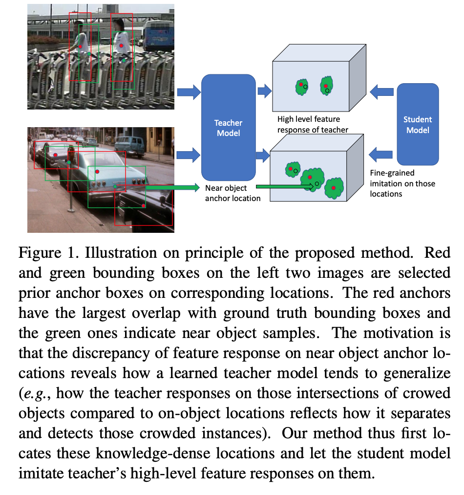
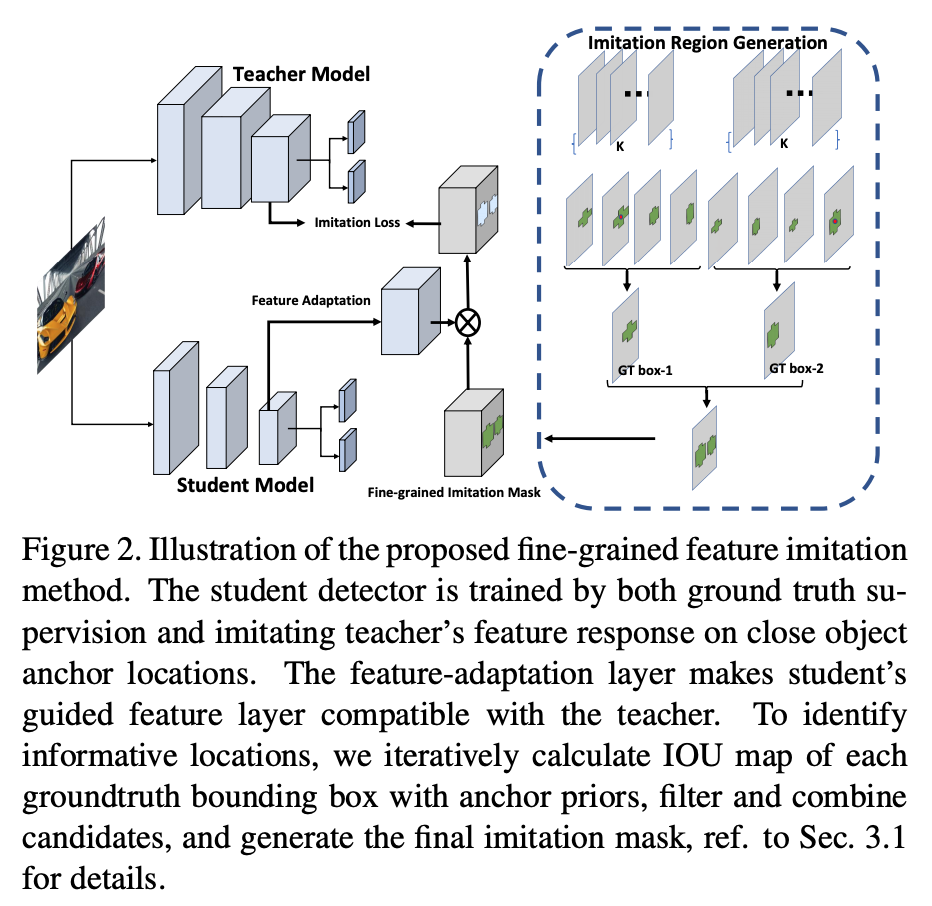
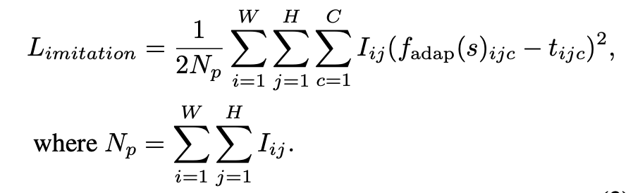
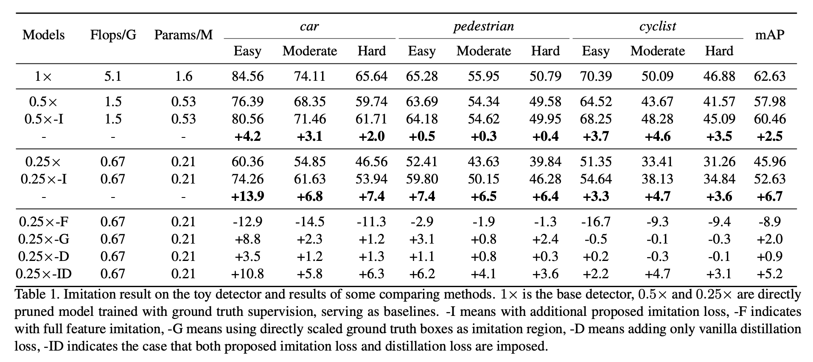
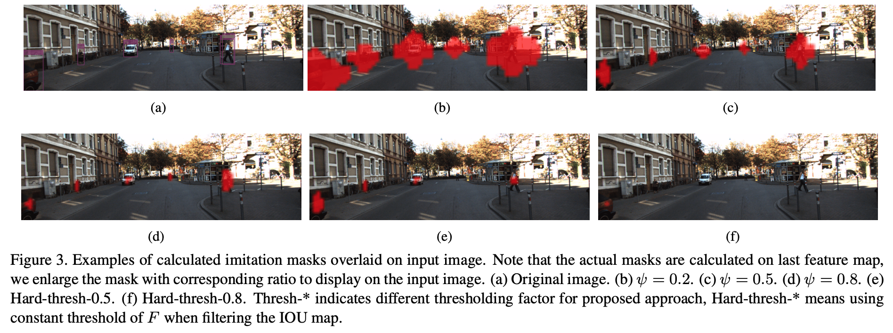
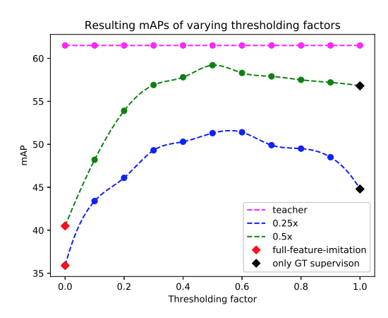

## Distilling object detectors with fine-grained feature imitation (CVPR2019)

[(Paper)](https://arxiv.org/pdf/1906.03609.pdf), [(Code)](https://github.com/twangnh/Distilling-Object-Detectors)

#### 动机

与分类不同，蒸馏方法在检测中如果进行**全特征模拟**的话对子网络的提升很有限(这里存疑，文章没有明确指出全特征包含哪些特征层)。这可能是由于过多的无用背景anchor引入的噪音覆盖了来自teacher net的监督信息。文章认为检测器会**关注目标区域以及其周边**的位置，**目标区域上的不同positive anchor之间的差异表现的就是teacher net对于检测目标的泛化特点**。

#### 方法

- 计算每一个gt box和该特征层上WxHxK个anchor的IOU得到IOU map m

- 找出最大值M=max(m)，乘以$\psi$ 作为过滤anchor的阈值:$F=M*\psi$

- 将大于F的anchor合并用OR操作得到WxH的feature map mask

- 遍历所有的gt box并合并获得最后总的mask

- 将需要模拟的student net feature map之后添加feature adaption层使其和teacher net的feature map大小保持一致。

- 加入mask信息得到这些anchor在student net中和在teacher net 中时的偏差作为imitation loss，加入到蒸馏的训练的loss中，形式如下：

  

  总loss为：$L = L_{gt}+\lambda L_{imitation}$

#### 实验结果

1. 全特征模拟，gt box区域模拟，原生蒸馏loss，imitation loss的影响

   

   这里用的student net是缩减通道和骨架block数的faster rcnn网路。

   - 
   - 使用全特征模拟（hint learning：**teacher net和student net的feature map大小不一致**）（F）的精度甚至不如直接拿student net训练的结果，说明全特征包含的太多背景anchor用于监督训练引入噪声太大
   - 使用gt box作为监督信号（G）说明可以显著降低全特征学习的噪声问题，但是效果不如加入positive anchor的方法（I）也说明了gt box周围包含的信息也是teachnet用于定位的重要依据。
   - 单纯蒸馏loss（**首先使用adaption层将student net 和teacher net的大小整成一致**）（D）提升的精度很少(mAP 0.9%)，说明直接移植分类的蒸馏方式在检测中是不合适的。
   - 同时使用蒸馏loss和imitation loss的效果(ID)比单纯使用imitation loss还要差，说明高层级的特征模拟和蒸馏关注的东西是不一致的。

2. 不同$\psi$ 值对结果的影响

   - 不同的$\psi$值gt box周边有效的anchor数量也不同，导致覆盖的区域大小不同。

   

   - 不同$\psi$值训练出来的student net性能不同，对于0.25x的网络，其值设为0.5时表现最佳。

   

   #### 总结

   这篇文章通过实验说明直接使用分类的蒸馏方式在检测中表现差的原因，并以此为动机加入目标区域周边的anchor作为监督信息，避免了完全模拟时的背景噪声问题，从而获得了比较好的蒸馏效果。这种思路还是attention的思路，而且比较通用，只要是基于anchor的检测模式，都可以引入这种蒸馏方式。此外文章中还做了大量的实验来支撑作者的intuition。

