## EfficientNet: Rethinking Model Scaling for Convolutional Neural Networks (ICML2019)

[(Paper)](https://arxiv.org/pdf/1905.11946.pdf) [(tf code)](https://github.com/tensorflow/tpu/tree/master/models/official/efficientnet) [(pytorch code)](https://github.com/lukemelas/EfficientNet-PyTorch)

###动机

ConvNet的设计一般需要考虑固定的算力资源进行的，如果有更多的算力，可以将网络放大来获得更高的精度。那么这个放大是否有一定的原则从而使放大后的网络的精度和效率可以更好？通过实验表明经过**简单的固定比例缩放**就可以实现很好的网络的**深度，宽度，分辨率的平衡**从而达到更好的accuracy-efficiency tradeoff。基于这个观察，文章提出**compound scaling method**的缩放方法，同时采用MNAS的神经架构搜索方法搜索到基础骨架，然后与缩放结合，实现又好有快的efficient net。

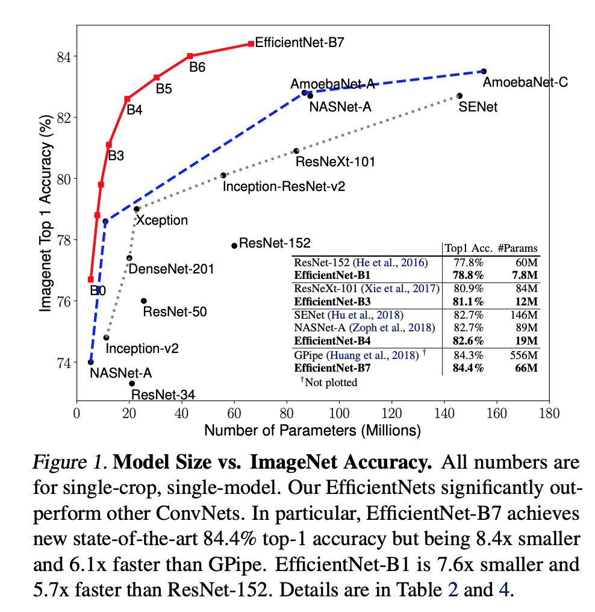

### 方法

#### Compound scaling

1. **ConvNet设计的不同的scale方式**

   缩放的维度包括：网络宽度(w)，深度(d)，分辨率(r)。缩放增加的FLOPS为：$r^2*w^2*d$。

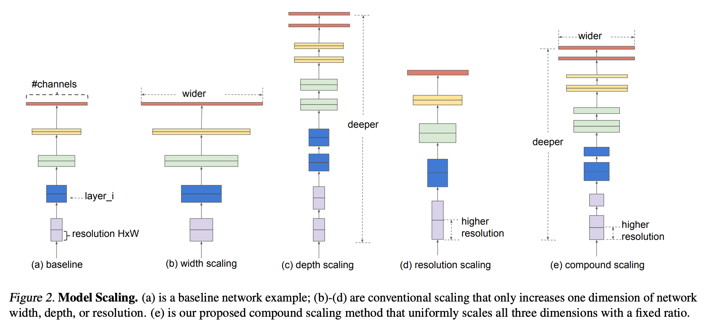

缩放的目标就是在**限定算力和内存的情况下试下模型精度的最大化**，约束条件如下：

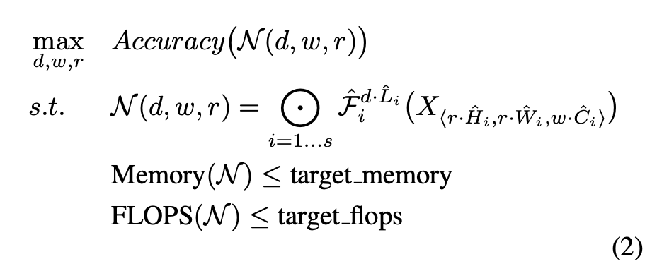

根据实验观测到的结果，**放大**上述任一维度都可以提高模型精度，但是模型越大，效果增益越不明显。

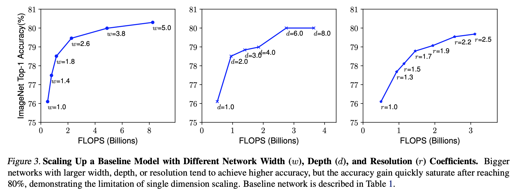

而**协调这3个维度的比例**也能显著提高模型精度和效率：

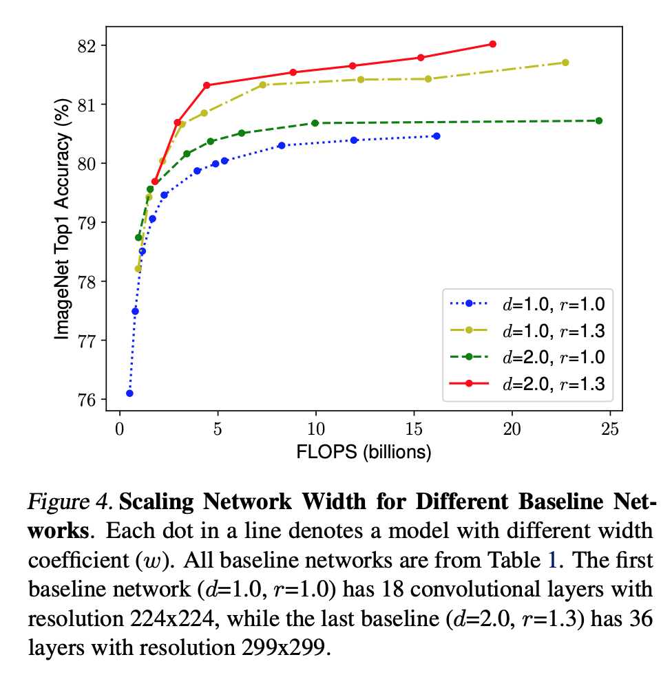

2. **Compound Scaling**

   这里提出一种新的scale方式通过compound coefficient $\phi$ 在以下原则下来均匀放大这3个维度：

   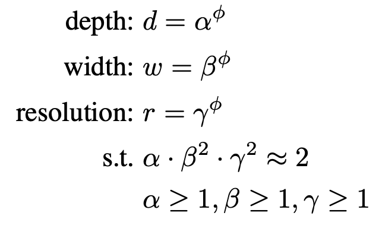

    

   其中$\phi$用来约束模型算力需求，代表可以使用的资源。根据之前提到的FLOPs随d，w，r增加的方式，对于任意$\phi$ ，模型缩放后的算力需求为$2^{\phi}$。

3. **神经骨架搜索**

   使用[MNAS](https://arxiv.org/abs/1807.11626)采用的搜索空间，优化的目标为:$ACC(m)*[FLOPS(m)/T]^w$ ，其中ACC为模型精度，FLOPS为模型算力，T为目标模型算力，w=-0.07作为超参控制精度和算力的tradeoff。 搜索得到的网络结构类似MNAS的结构，成为**EfficientNet B0**，主要包含**mobile inverted bottleneck MBConv和SE optimization结构**。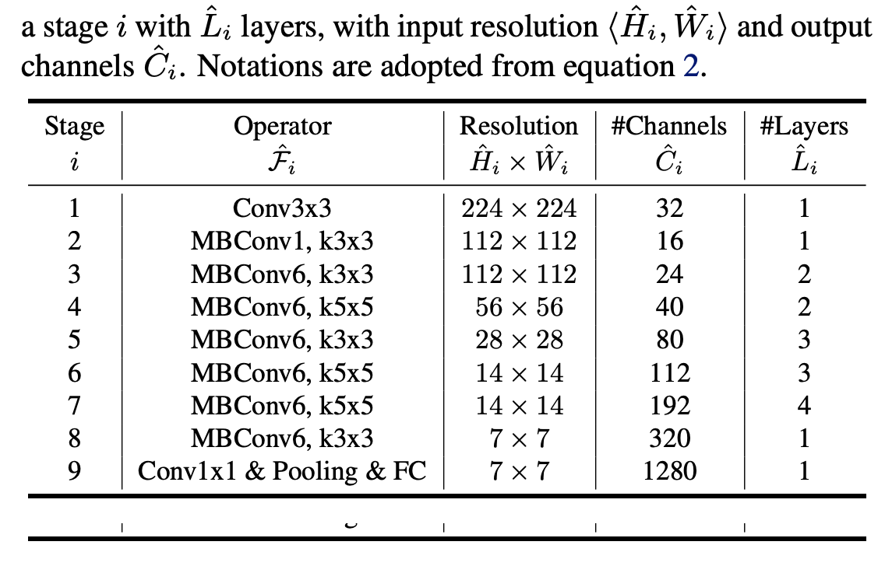

   然后以B0为基础通过以下两步生成B1-B7：

   - 固定$\phi=1$，即假设算力可以增加1倍，通过小范围的**网格搜索**确定$\alpha,\beta,\gamma$，在B0结构下$\alpha=1.2,\beta=1.1,\gamma=1.15$时可以达到最好的效果。
   - 固定上面搜索到的$\alpha，\beta,\gamma$，然后放大$\phi$获得不同大小的EfficientNet B1-B7。

   

### 实验结果

1. EfficientNet 在ImageNet上的表现：

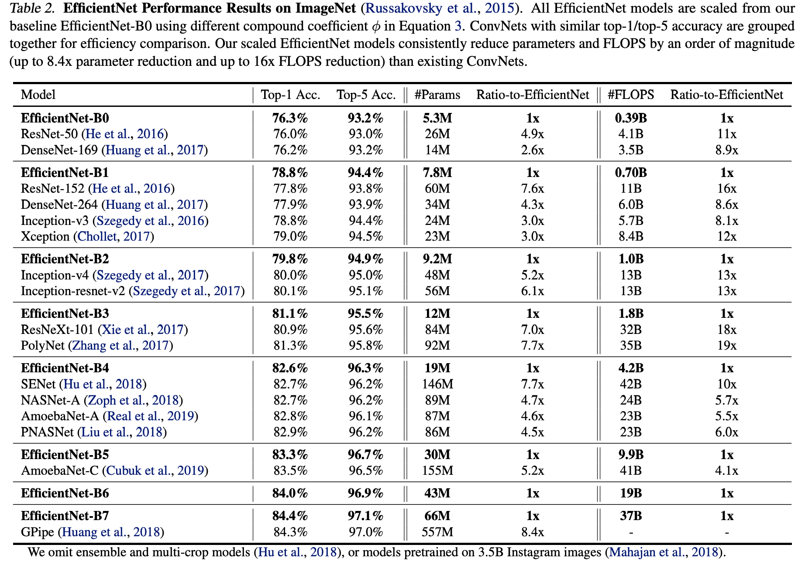

2. 对Mobilenet和Resnet使用compound scaling的效果

   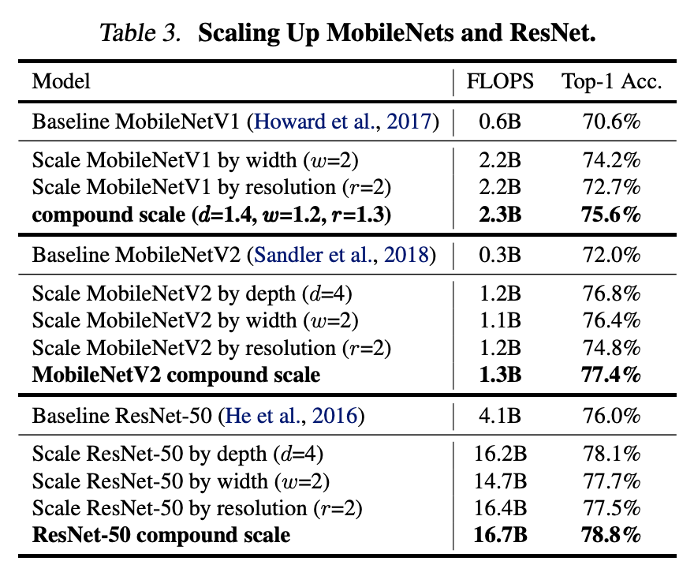

3. EfficientNet的迁移学习能力

   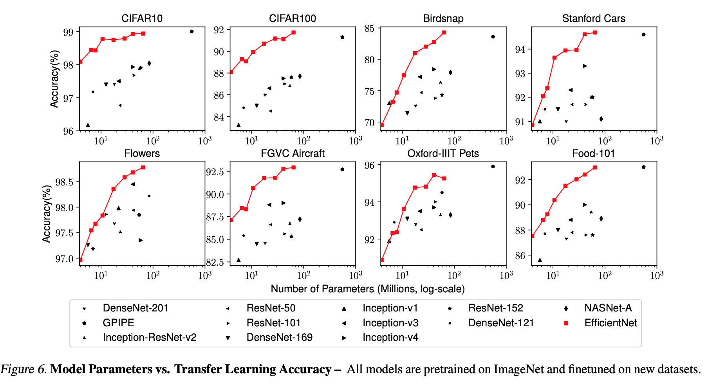

4. Compound scaling对应其他scale方式对模型的提升效果更好

   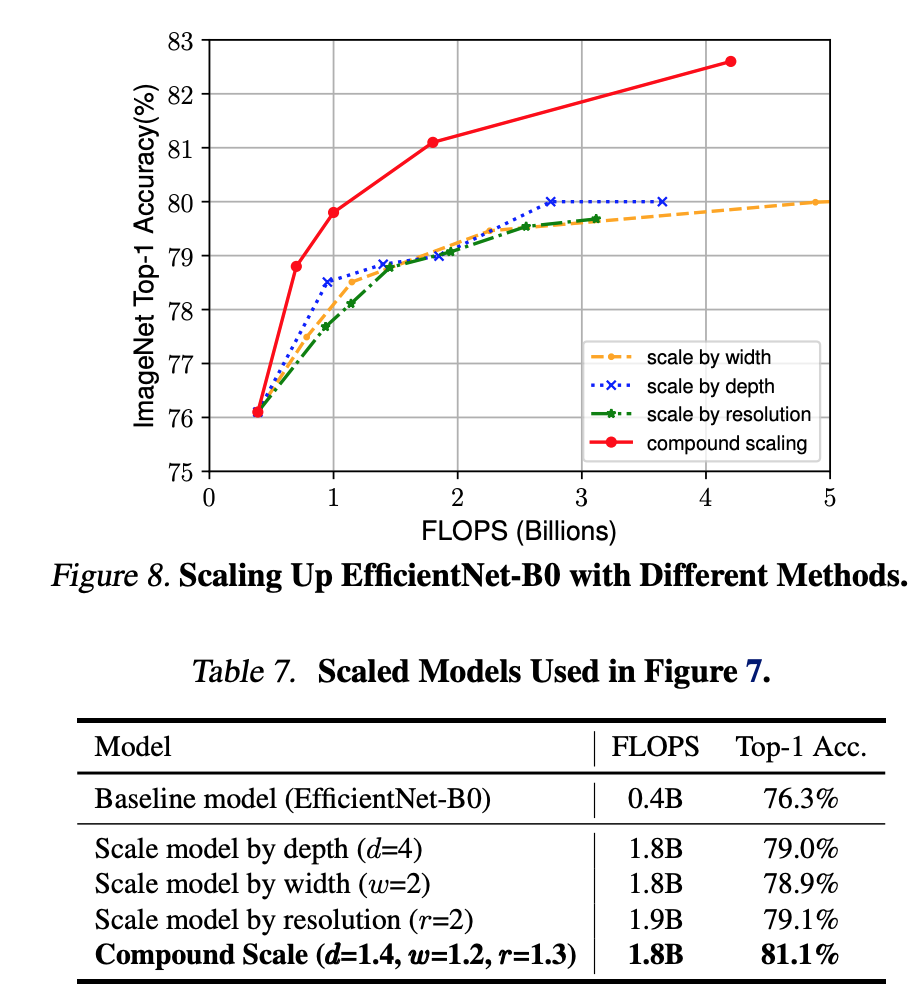

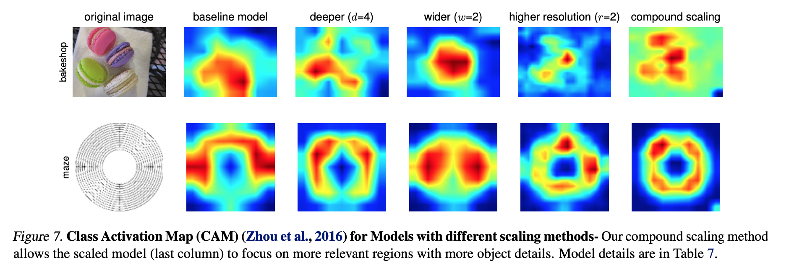

### 总结

这篇文章从网络宽度，深度，分辨率深入研究了网络的尺寸对模型性能的影响，其结果也表明在不改变模型算力需求的前提下单单通过优化网络的尺寸就能实现模型性能的显著提高。而结合NAS方式搜索出来的精度-效率最佳平衡的骨架模块，这两者结合的结果就是平衡最佳的EfficientNet。