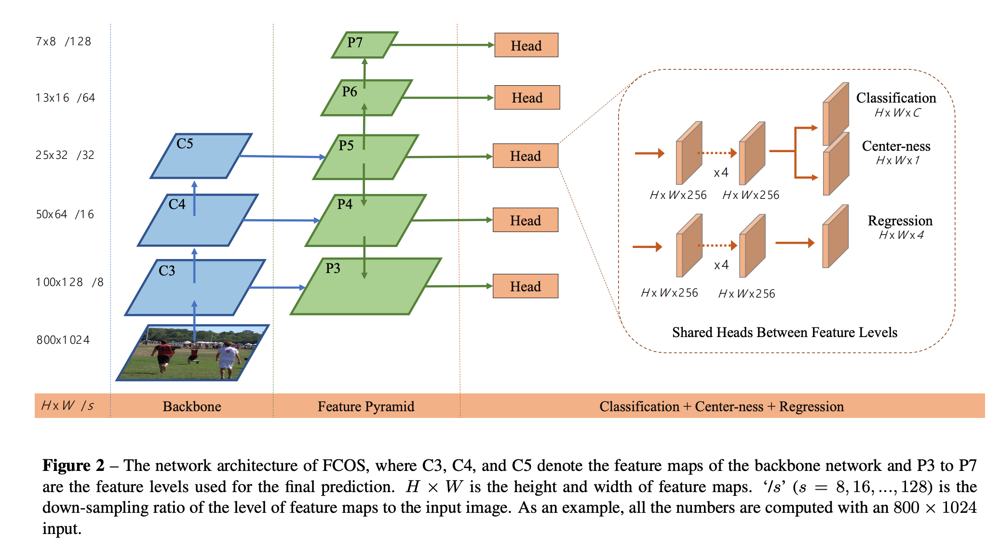
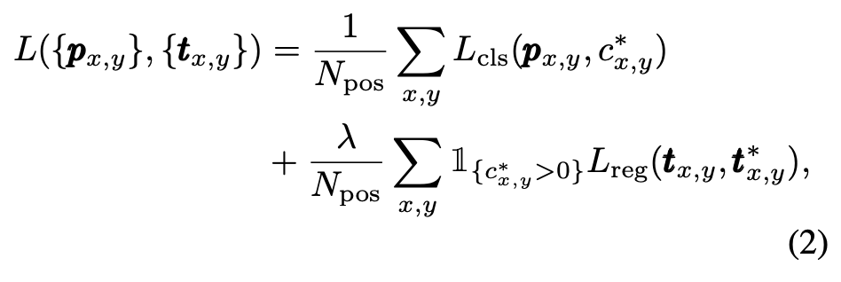
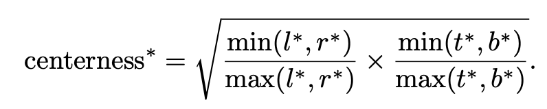
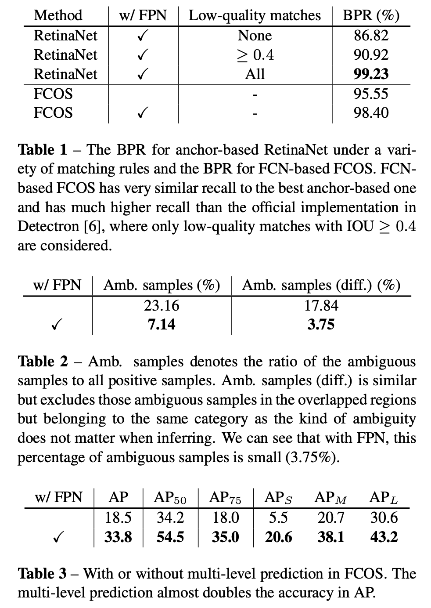
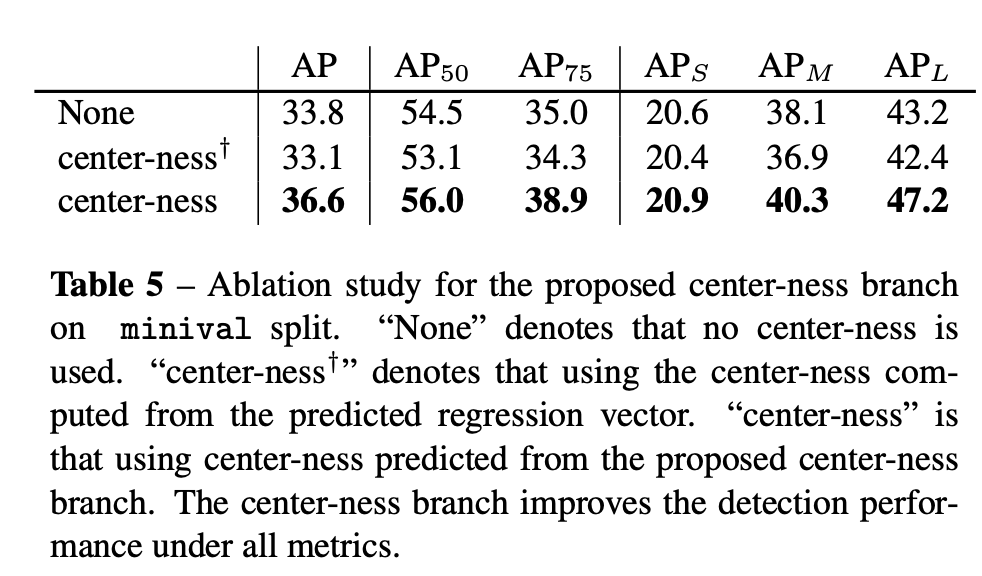
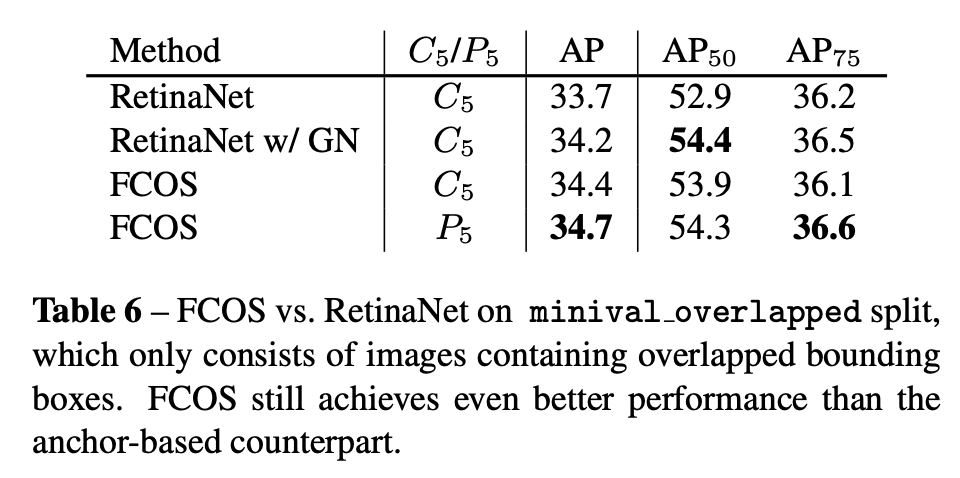
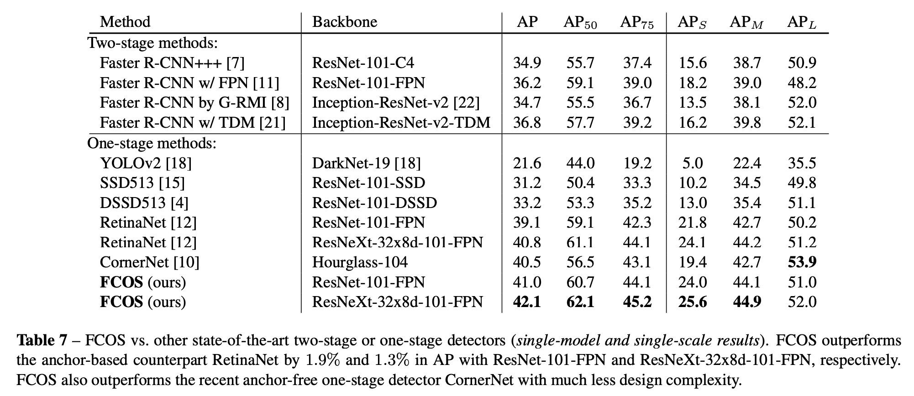

## FCOS: Fully Convolutional One-Stage Object Detection 

[(Paper)](https://arxiv.org/pdf/1904.01355.pdf) [(Code)](https://github.com/tianzhi0549/FCOS)

### 动机

利用FCN用于分割任务的思想直接使用feature map上的每一个点进行检测框的回归，而不必通过借助anchor的设计间接进行。省去anchor的设计可以带来以下几点好处：1）不需要再根据目标的特点进行anchor的**size，ratio，数量**的调整，预设好的anchor无法满足**尺度变化很大**的目标检测任务。2）可以避免由于高召回率的需要设置稠密的anchor带来的**正负样本严重失衡**的问题；也可以减少这些anchor与gt box计算IOU时带来的巨大算力消耗。但是anchor free的检测有2个担忧点：**召回率**（BPR）和重叠目标带来的**混淆**。文章中使用了FPN和center-ness 分支分别解决以上两个问题。

### 方法

1. **网络设计**

   网络直接使用了RetinaNet的骨架，只是在分类分支上多了一个center-ness branch用于确定当前点是否是检测目标的中心；而由于没有anchor，最后分类分支和回归分支输出的feature map depth也分别是C和4，不需要乘以anchor数(K)，因此相比anchor based的输出，FCOS的骨架输出可用减少K倍；而分类分支的分类器也从多分类器换成了C个二分类器。

   

2. **正样本选择**

   对于feature map上的各个点，只要这个点落到了gt bbox区域中，那么这个点就是正样本；而如果这个点多在多个bbox中，那个这个点就是**模糊样本**，目前采用**面积最小的bbox**作为这个点的回归目标。目标框的回归方式也从回归顶点坐标(x, y, x, y)到回归当前点到框的各边的距离(l, t, r, b)。相比anchor的方式，这种能够产生更多的正样本用于训练回归，因此框的定位也会更加准确。具体如下图所示：

   
   
   loss函数设计如下：$L_{cls}$为focal loss，$L_{reg}$为[UnitBox](https://arxiv.org/abs/1608.01471)使用的IOU loss,$1_{\{c^*_i>0\}}$表示$c_i >0$的时候为1，否则为0.
   
   
   
3. **基于FPN的多层预测**

   为了降低卷积stride导致分辨率下降和目标重叠带来的召回率下降的影响，这里使用了FPN结构，使**不同尺寸的目标能够在不同尺寸的feature map上检出**，从而避免上述两个问题。

   为了实现这一点，直接**限制各层feature map上能够回归的距离范围**: 如果一个点的$max(l, t, r,b) > m_i$或者$max(l, t,r,b)<m_{i-1}$，那么这个点就作为负样本，其中$m_i$表示第i层的最大距离。

   与FPN类似，这里的预测head在各层之间也是公用的，降低参数量并提高性能。但是由于之前所说的每一层回归的尺寸大小是不同的（比如[0,64],[64,128]），因此在回归计算的时候使用包含可训练的si的$exp(s_ix)$代替$exp(x)$来自动调节指数的基底。

4. **Center-ness消除低质量误检**

   到这里为止，FCOS的性能还是无法和RetinaNet抗衡，观察发现是由于有大量的远离目标区域bbox的低质量误检，因此设计了Center-ness单层分支用于预测当前点是否是目标的中心。目标点的中心度评价公式如下，其中根号是为了降低中心度随距离增大的衰减程度：

   

   由于中心度的大小在0-1之间，因此在**训练的时候使用BCE loss**将其加入到训练中；而在推测的时候直接将**中心度分数乘到分类分数**上，将偏离很远的检测框分值进行惩罚，然后用**NMS**就可以很容易去除。

### 实验

1. FCOS中FPN的在**降低混淆**上的作用远大于其在提高召回率上的作用

2. Center-ness可以显著提高精度

   

3. FCOS在重叠样本数据上表现也与RetinaNet相当，说明降混淆方法发挥作用。

   

4. FCOS与当前主流State-of-art检测器的对比，表现略优。

   

### 总结

FCOS首次将anchor-free的检测器精度提高到了主流anchor-based的检测器的精度，说明FCN对于每个点直接操作的思想在检测任务中也是可行的，而且这种方法可以避免anchor设计带来的种种问题，降低了模型的复杂性和算力要求，从发展来看前景一片大好。不过目前首先需要分析目前anchor-free的方法中限制精度提高的主要原因，从而才能进一步改善anchor-free的方法，正如文中所说：

> we encourage the community to rethink the necessity of anchor boxes in object detection, which are currently considered as the de facto standard for detection