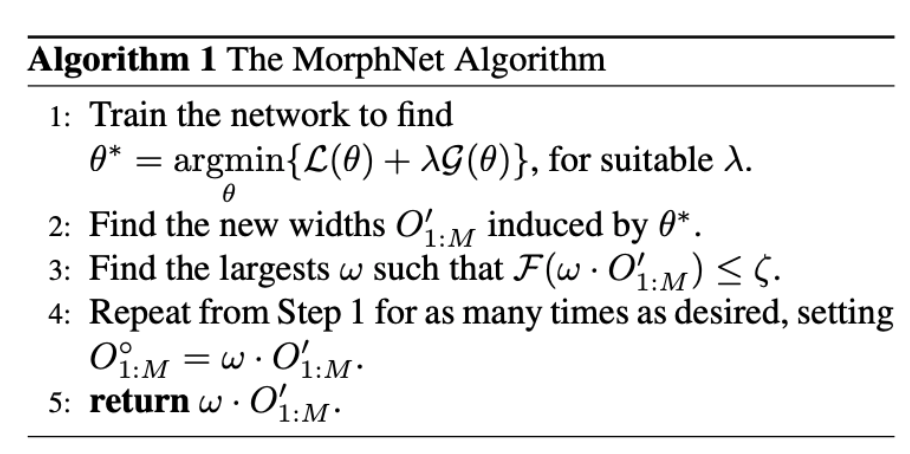
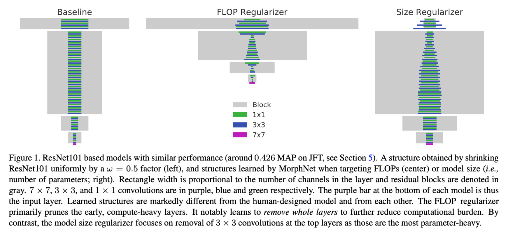
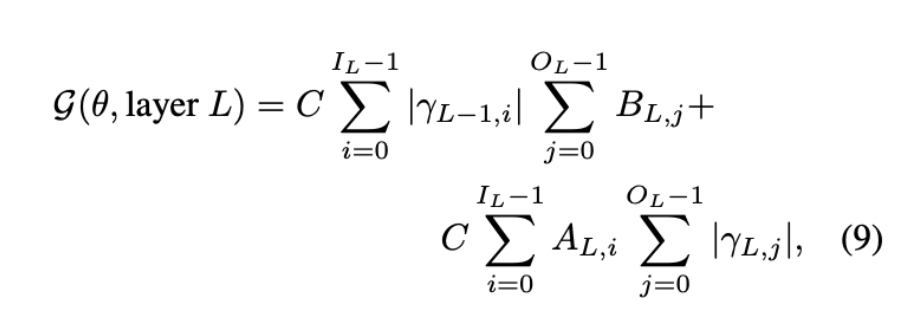
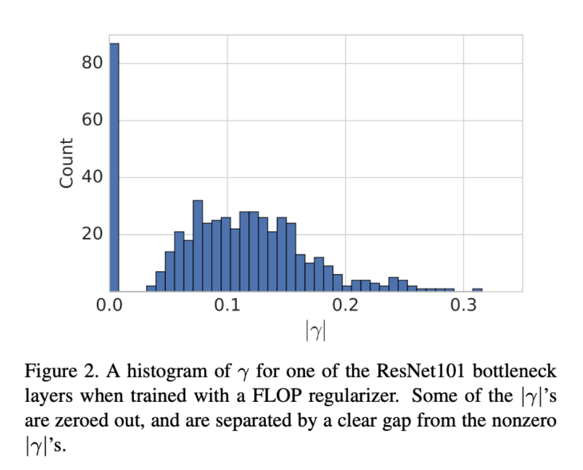
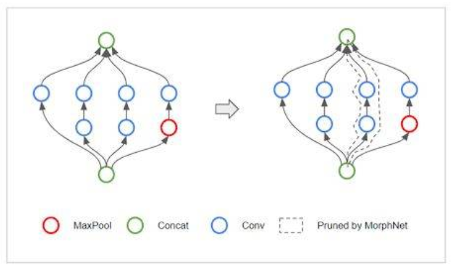
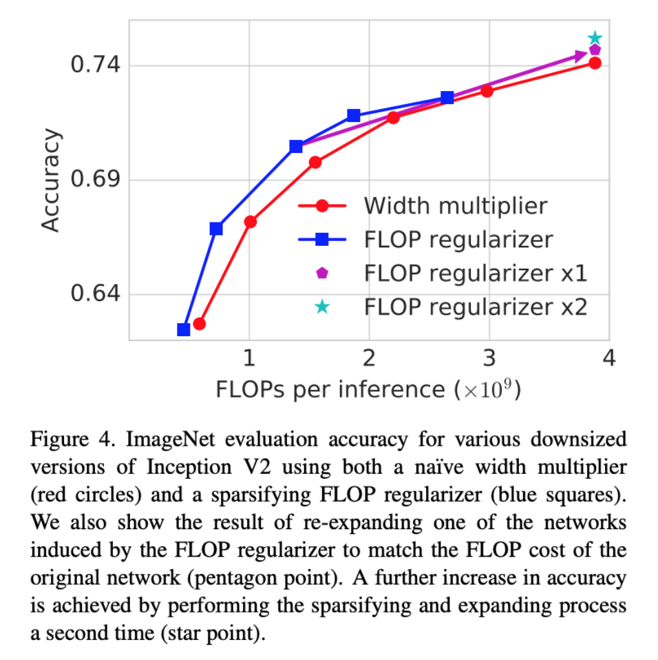
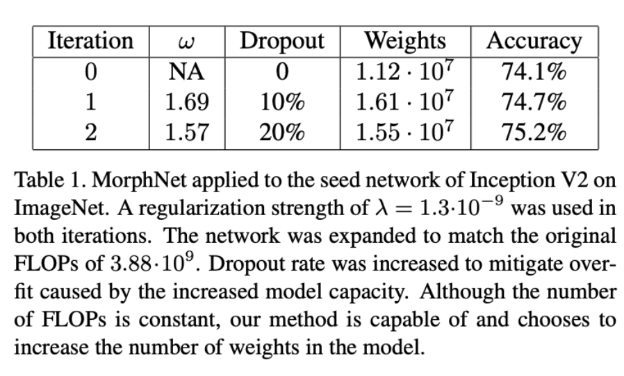
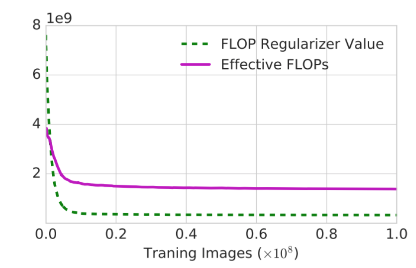
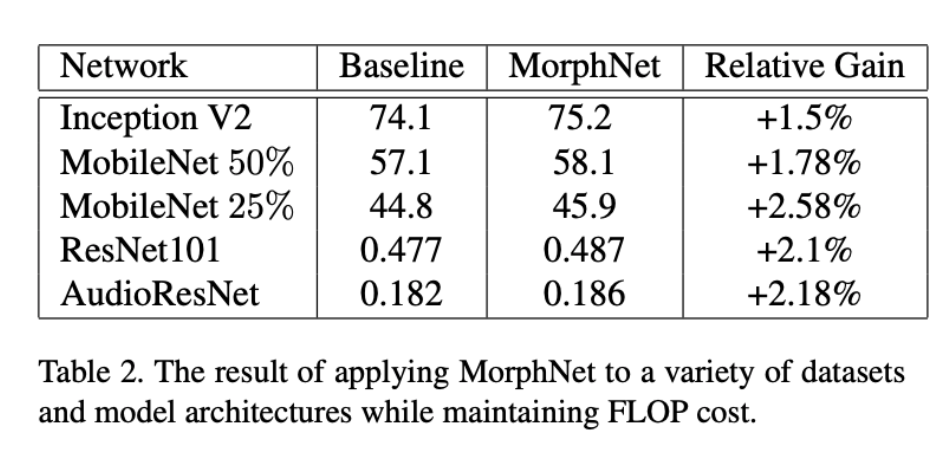
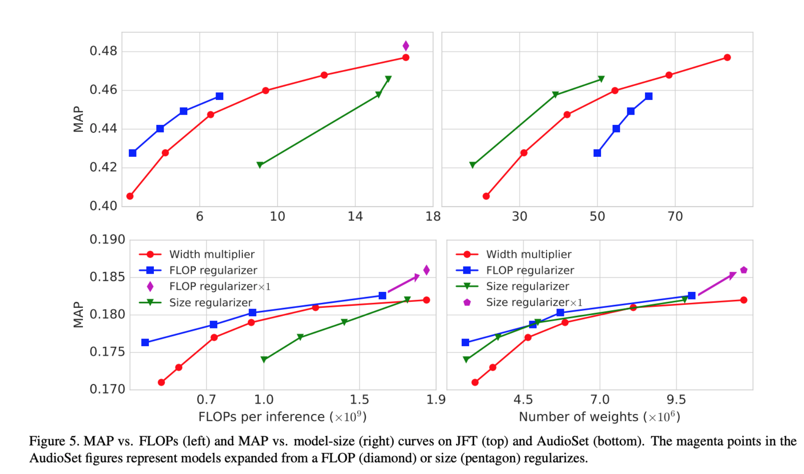

## MorphNet: Fast & Simple Resource-Constrained Structure Learning of Deep Networks

([Paper](https://arxiv.org/pdf/1711.06798.pdf))([Code](https://github.com/google-research/morph-net/tree/master/morph_net/network_regularizers))

### 动机

在计算资源受限的时候，如何才能获得性能最好的网络，NAS是一个很好的思路，但是一般需要大量时间而且对于不同任务需要从头设计；还有一种思路就是在现有的模型上一次性对架构进行改进。考虑到模型的FLOPs主要由模型的输入尺寸，模型深度和各层的通道数决定，结合模型剪枝的方法，是否可以**只对模型各层的通道数**进行针对性的缩放从而到达在限制计算资源没有增加的前提下提高模型的精度。通过本文的实验，这种反复缩放的方法确实可以提高精度，并且可以**扩展到大型网络，泛用性比较好**。

### 方法

考虑模型$O_{1:M}$为包含M层的神经网络，$I_L$和$O_L$分别为L层的输入和输出通道数，那么缩放的目标就是每一层L的输出通道数即$O_L$，如果模型资源利用为$F(O_{1:M})$，设定其上限为$\zeta$，那么任务优化的目标为$O^*_{1:M}=argmin_{F(O_{1:M})}min_{\theta}L(\theta)$。优化流程如下：在压缩阶段通过**稀疏正则化**减少通道数，此时模型精度下降；然后对网络**整体乘以**一个可学习的系数进行放大，此时模型精度提升。如此往复多次（一般为**5次**或更少）直到收敛。

**压缩阶段**

首先，模型FLOPs和模型参数量的计算方式如下：

$F(layer L) = C(w_L, x_L, y_L, z_L, f_L, g_L) · I_LO_L$

对FLOPs，$C(w, x, y, z, f, g) = 2yzfg$

对参数量，$C(w, x, y, z, f, g) = fg$

其中y，z是输出层的大小，f，g是kernel的大小，w，x是输入层的大小。

而由于稀疏正则化之后有些通道会被**归零**抑制，因此上述F可以改写成$F(layerL)=C\Sigma^{I_L-1}_{i=0}A_{L,i}\Sigma^{O_L-1}_{j=0}B_{L,j}(式1)$，其中$A_{L,i} (B_{L,j})$=1当L层的第i个是激活的（非0）。那么模型的整体算力消耗为：$F(O_{1:M})=\Sigma_{L=1}^{M}(F(layer L))$，模型的优化目标则是：$min_\theta L_\theta+\lambda F(O_{1:M}); w.r.t\ F(O_{1:M}) ≤ \zeta$

为了能够通过梯度下降进行可控的学习，上(1)式中的不连续L0范数用在BN变量$\gamma_L$用连续的L1范数进行替换：

此时$\gamma$可以决定L层神经元的数量，当$\gamma$为0的时候，神经元的数量也是0。通过这种方式就可以很有效的将层通道进行稀疏化，降低FLOPs。

**拓扑变换**

由于稀疏化会导致有些层完全被去掉，通过skip connection连接前后，但是如果两个节点之间删掉的层太多，导致同时出现多个skip connection的情况，那么此时就会导致网络的拓扑结构过于复杂。为了避免这种情况，使用**group LASSO**的方法将所有通过skip connection相连的神经元归到一组，这里$L_\infty$ norm，即使用group里面最大的$|\lambda|$。

**扩张阶段**

寻找满足$F(ω · O^◦_{1:M}) ≤ \zeta$时**最大**的$w$，然后将w乘到各通道上进行对应的通道数扩张。

### 实验

在ImageNet和JSF数据集（350M张图片，20k类），AudioSet（2M音频片段）上进行分类实验：

ImageNet上的使用稀疏化和扩张的精度实验，其中x1，x2代表缩放流程重复的次数：

正则化对FLOPs的影响

MorphNet用于各网络的提升效果：

JSH和Audioet数据集上的表现：

