## ThunderNet: Towards Real-time Generic Object Detection文章解析

这篇论文是在2019.3.28旷视和国防科大的联合文章，实现在ARM平台上的实时two-stage检测器。

论文链接：https://arxiv.org/abs/1903.11752

### 1. 检测实时性问题

重新思考目前的检测无法在边缘设备上（例如ARM芯片）无法实现又好又快的实时检测的原因：

1）two-stage detector的detection part过重(一般的head都超过10G FLOPs)，即使是light head R-CNN也是head的计算比backbone要高出不少。这种不平衡一方面会造成算力需求过高，另一方面会导致过拟合。

2）one-stage detector由于同时预测bbox和类别概率，因此计算开销小；但是由于缺乏ROI-wise的特征提取和识别，导致提取的特征比较粗糙，预测精度不高。

如果能够将two-stage detector的**backbone**和**prediction head**轻量化，就可能将two-stage detector的检测效率提升到足以满足实时性的需求的水平。

### 2. 核心思路

因此，ThunderNet中作者对上述两点进行了改进：

A. 结合DetNet的经验，以**ShuffleNetV2**轻量化骨架为蓝本针对检测任务的特性设计了SNet网络作为检测骨架

B. detection部分则是对RPN网络和prediction head进行了压缩，同时为了弥补压缩带来的网络表现力的损失引入了**context enhancement module**结合局部和全局特征来提高特征层的表达能力和**spatial attention module**引入RPN的前后景信息优化特征的分布。

### 3. 网络结构

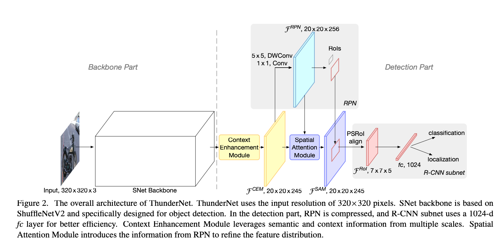

#### **输入尺寸：**

为了加速，输入尺寸为**320x320**；但是实验发现**大网络小输入尺寸**和**小网络大输入尺寸**的效果都不是最佳，输入尺寸的大小需要与网络的表现能力匹配。

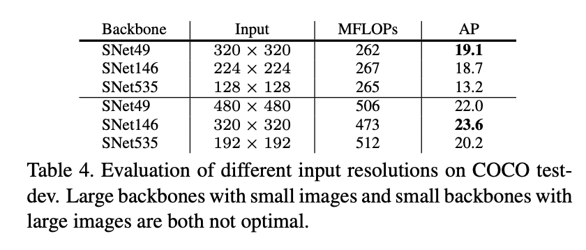

#### Backbone

对检测任务来说，骨架CNN的**感受野大小**和**对early stage及later stage feature**影响很大。前者感受野越大可以包含更多上下文信息，这对**定位**尤其重要，特别是**大目标物体**的检测；后者的话early stage feature包含更多空间信息，对**定位**影响更大；而later stage feature则辨识性更好，对**分类**影响更大。

对之前的轻量骨架分析发现：ShuffleNetV1/V2的感受野太小(121/320 pixel); ShuffleNetV2和MobileNetV2则是缺失了early stage feature。

SNet：

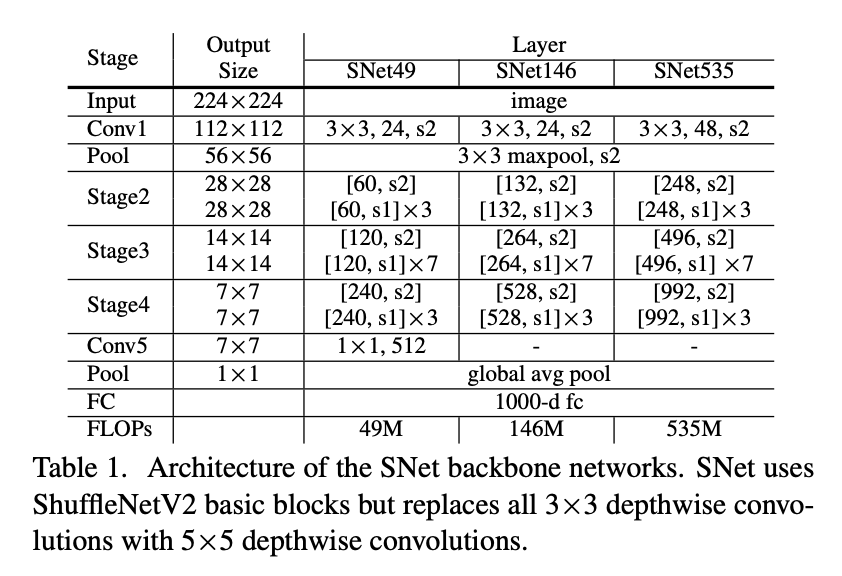

为了获得更大的感受野，SNet中将ShuffleNetV2中所有3x3 depthwise卷积替换成了**5x5 depthwise**（感受野从121pixel增加到193pixel）；此外SNet49为了更快的速度，将conv5中输出的1024维压缩到了**512**维；作者认为直接去除conv5会导致信息的损失；而保留原来的1024维的话则会陷入低级特征；而SNet535和SNet146则是移除Conv5，在早期的stage中增加channel数。

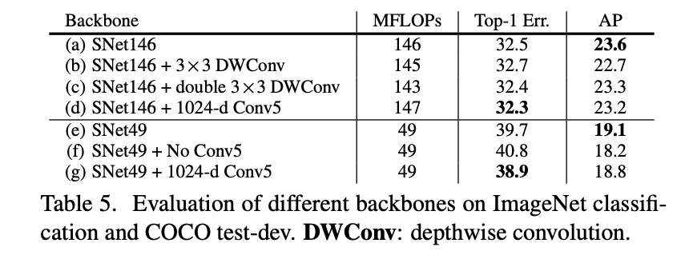

#### 压缩RPN和detection head

对于SNet来说，现有的RPN和detection head太重了，因此作者在light head R-CNN的基础上将**RPN**的256通道3x3卷积替换成了5x5 depthwise+256通道1x1卷积（计算量下降28%但是精度几乎没影响）。anchor生成包含5种大小（$32^2, 64^2,128^2,256^2,512^2​$）和5种长宽比(1:2,3:4,1:1,4:3,2:1)。此外使用**PSRoI align**进行RoI warping，并且将输出的channel从10削减一半到5，输出feature map尺寸为7x7x5；而PSRoI align之后的输出只有245d（7x7x5），因此再添加一个1024d fc。

#### Context enhancement module(CEM)

light head R-CNN利用Global convolution network (GCN)来获取更大的感受野，但是计算代价很高，因此作者基于FPN的思路设计了CEM：即将多尺度的局部特征和全局特征进行整合。在CEM中合并的特征层为C4，C5和Cglb，并且是由1x1卷积调整输出channel到245，计算开销小。

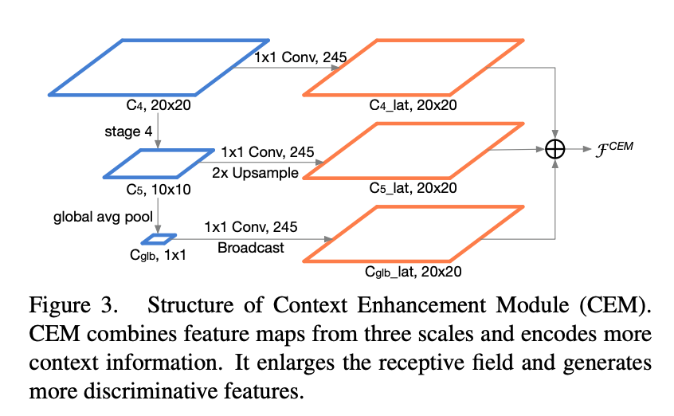

#### Spatial Attention Module (SAM)

在RoI warping中我们期望**前景**的特征很强而背景的特征很弱。对于轻量网络和小输入，这个特征分布的学习就会更加困难。因此作者设计了SAM在RoI warping之前来重新weight 特征图的分布。其核心思想是由于**RPN**是训练用来识别**前景区域**，因此RPN的中间特征可以用来区分前景特征和背景特征，因此SAM引入RPN的信息来重新优化前后景的特征分布。

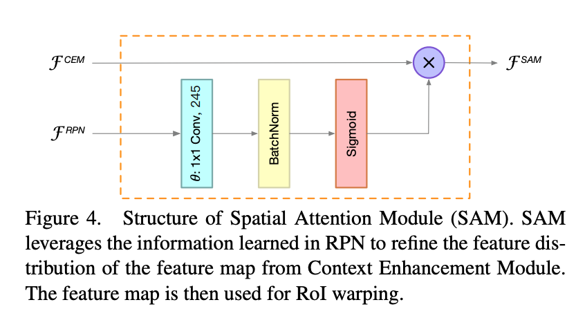

特征计算公式为：$F^{SAM}=F^{CEM}.sigmoid(\theta(F^{RPN}))​$

$\theta$函数用1x1卷积进行维度匹配；sigmoid函数用于限制值到[0,1]，然后重新weight $F^{CEM}$的特征分布。

下图为使用SAM对特征分布的优化效果：

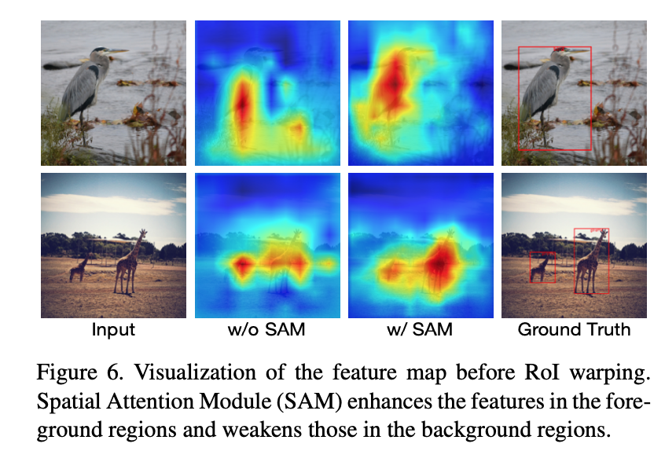

### 4. 实验结果

**注：**后处理采用了Online hard example mining和Soft-NMS。

ThunderNet和其他轻量检测网络的对比：其中SNet49达到MobileNet SSD的精度所需的算力只有其21%。

​	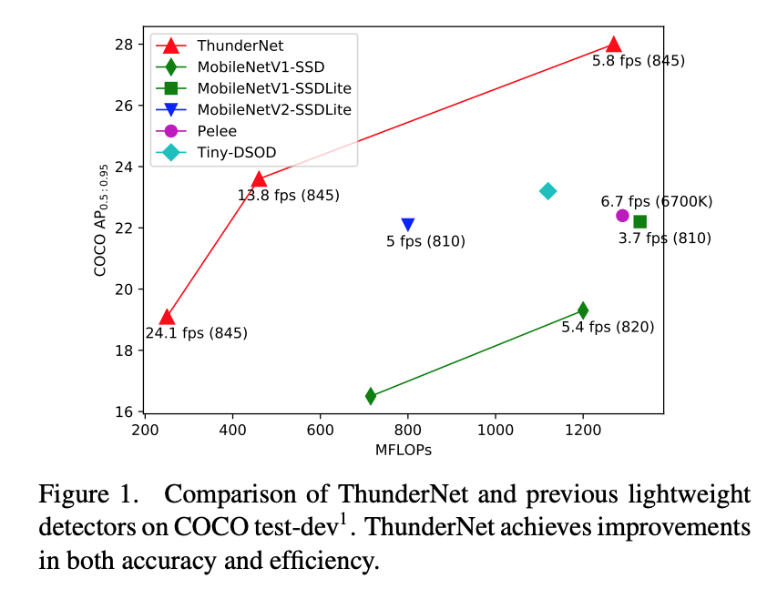

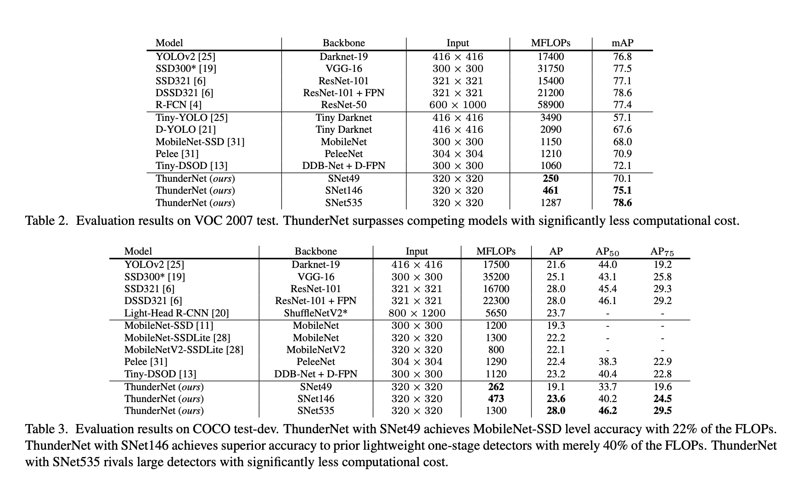

各模块的ablation test：

红框指RPN替换3x3为5x5 depthwise +1x1conv后的效果

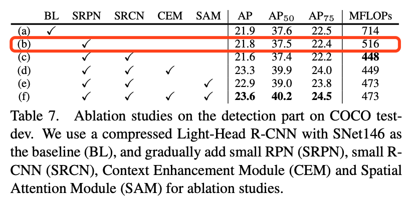

作者实验还表明使用大骨架小prediction head的效果比小骨架大prediction head的效果要好，这一点是由于小骨架带来的特征表现力太弱导致大head的能力变得多余，反而容易导致过拟合。

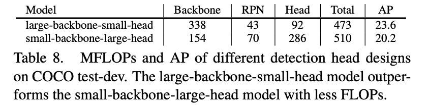

不同SNet为骨架的ThunderNet的推理速度，在骁龙845上最快可以达到24FPS/单线程。

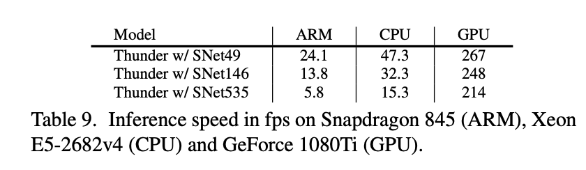