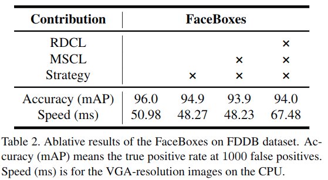
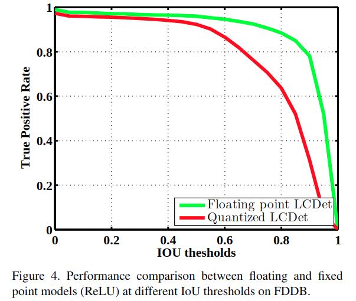
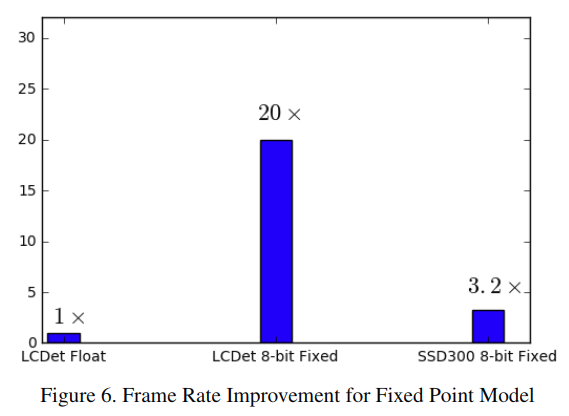

## 1. Object Detection
### 1). Finding Tiny Face (2016)
**[[paper](https://arxiv.org/abs/1612.04402)]\[[code matlab](https://github.com/peiyunh/tiny)][[code tf](https://github.com/cydonia999/Tiny_Faces_in_Tensorflow)]**

**总结:** 核心方法是 **scale-specific detection**,即使用不同大小的模板用于捕获不同大小的人脸,这里用3种模板:检测大的人脸(h>140)使用正常模板/2后的大小;检测小的人脸(h<40)使用正常模板x2的大小,其他情况使用正常模板.

此外,**large context** 和 **scale-variant** 的模板在检测小的人脸的时候起了很重要的作用;很大的receptive fields能够捕获coarse context(用于检测小物体)和hight-resolution feature(用于小物体定位).

**网络结构:**<br>


注: **低层feature** 对于检测小物体很重要,在使用小物体检测的type-A模板只用在图片大小x2后<br>

context 大小对于检测精度的影响:<br>


large receptive field对检测精度的影响:<br>


模板大小对检测精度的影响:<br>


state-of-art result:<br>


### 2). FaceBoxes: A CPU Real-time Face Detector with High Accuracy (2018)
([Paper](https://arxiv.org/abs/1708.05234)) ([Code](https://github.com/zeusees/FaceBoxes))
**总结:** 创新点是1).用 **RDCL(rapidly digested convolution layers)** 来快速收缩输入空间并降低输出维度来加快运算使之能在2.6G Hz的E52660v3上达到20FPS;2).用 **MSCL(Multi-Scale convolutional layer)** 从不同的feature map上用不同大小的anchor来捕获不同大小的人脸; 3). 用新的 **anchor densification strategy** 来平衡不同大小的anchor在相应的feature map上的密度,提高小人脸的检测率.

*RDCL*: (1). 快速收缩输入空间,前几层conv和pool的stride **很大** (conv1:4, pool1:2, conv2:2, pool2:2); (2). **合适大小的kernel**,小kernel能减少计算,但不能太小导致空间收缩时的信息损失太大; (conv1:7x7, conv2:5x5, pool:3x3) ;(3).**降低输出维度**:根据filters在低层是 **成对** 的现象设计了 **C.Relu** (参考[这篇文献](https://arxiv.org/abs/1603.05201)),可以通过连接输出与取负的输出就能实现输出维度加倍的.

*MSCL*: (1).从 **不同大小的feature map** 上取anchor; (2). 用 **Inception** 获取不同大小的感受野.


*anchor densification strategy*: anchor的ratio为 **1:1**,大小为在inception3上为32, 64, 128, conv3-2上为256, conv4-2上为512.与大的anchor相比,小anchor能够覆盖的图片区域偏小,这也导致了小脸的召回率比较差,因此这里对于小anchor设计了densification,在anchor中心周围共取n^2个.


**网络结构:**<br>


**实验结果:** 在WIDER FACE数据集上做训练. <br>


anchor densification的作用比较大:<br>


### 3). LCDet: Low-Complexity Fully-Convolutional Neural Networks for Object Detection in Embedded Systems (2017)
([Paper](https://arxiv.org/abs/1705.05922))

**总结:** 1). 用FCN层替换YOLO最后的全连接层以降低参数量和计算量; 2). 对训练好的模型的weigh进行8-bit fixed-point quantization,**不重训练**,取检测的时候正例的IoU阈值取 **45%** 效果较好.

**网络结构**:<br>


**实验结果**:<br>
quantization对检测精度的影响:<br>




总体模型的压缩和提速效果:<br>



## 2. Network Backbone
### 1). Deformable Convolutional Network (2017)
([Paper](https://arxiv.org/abs/1703.06211)), ([Code](https://github.com/msracver/Deformable-ConvNets)) <br>
**总结:** 核心是两个新模块 **deformable convolution** 和 **deformable ROI Pooling**,两者都是用来通过 **learnable offset** 来增强spatial sample的位置.这两个模块可以直接相应的正常的模块,对 **大物体检测** 和 **物体分割** 的提升效果最好.

*Deformable convolution:*<br>
通过在正常取样区域的格子增加 **2D offset (x,y)** 来达到感受野形变的效果, 而offset是通过一个额外的conv从前面几层的feature map学到的,因此是local并且adaptive的. <br>


其中2N对应N个2D offset.

  *Appendix*: 包含offset的conv层的计算方式如下:<br>
  

  BP计算如下:<br>
  

*Deformable ROI pooling*:<br>
同养的,通过在正常ROI层之后分割出的bin基础上增加 **offset** 来实现不同形状物体的adaptive定位,而offset是通过一个前面的feature map和ROI进行学习更新. <br>


  *Appendix*:包含offset的ROI pooling之后的bin的计算如下:<br>
  
  

  BP计算如下:<br>
  

*Position-Sensitive ROI pooling*:<br>
与上面类似,不过是 **fully-convolutional** 的形式,用specific postion-sensitive score map替换上面的general feature map. <br>


  *Appendix:* 公式与上面的类似,只是用Xij替换上面的X,但是学习方式完全不同,如上图中上面的分支通过conv层获取全空间分辨率的offset field.对每个class的PS ROI pooling用获取的offset fields来生成normalized的offset然后像上面那样获取实际的offset.

Deformable convolution提取feature extraction:在ResNet101, Inception-ResNet上做了实验.

**改进:**<br>
1. 与Spatial Transform Network对比, deformable ConvNets的offset不是全局而是local且dense的,更容易训练.
2. 与Active convolution相比,deformable ConvNets的offset是dynamic model output的,在每个Image的位置都不同.
3. ...

**效果:**<br>


### 2). MobileNetV2
([Paper](https://arxiv.org/pdf/1801.04381.pdf)) ([Code](https://github.com/tensorflow/models/tree/master/research/slim/nets/mobilenet))

**总结:** 核心为 **Depthwise separable convolution (同MobileNetV1)** + **Linear Bottleneck** + **Inverted residual block with skip connection between bottlenecks**

*depthwise separable convolution*: 同MobileNetV1, 可以将计算量减少1/k^2,k为depthwise卷积核的大小,一般为**3**.

*Linear Bottleneck*: 在MobileNetV1中,通过 **width multiplier** 可以减少激活空间的维度,但是如果在这时有RELU这种 **非线性层** 就会造成比较大的信息损失.
但是由于以下两点: 1. 对于RELU输出的非零值而言,RELU只是起了 **线性变换** 的作用; 2. ReLU只有在输入的manifold是在 **低维空间** 的时候才能保留输入信息的完整,所以在conv层之后插入了linear bottleneck而不是relu非线性层来避免太多信息的损失.

下图就显示了在降维之后的层如果relu之前的维度只有2-3,输出就会损失较多的信息,染过能增加到15-30,损失就会小很多.<br>


*Inverted residuals block*: 根据上面的信息,相比与常规ResNet block的中间层维度是下降的做法,Inverted residual block的中间层维度是上升了,为了使relu之后能保留输入的完整信息(输入在低维空间);并且在最后的conv层之后进行降维的那层不使用relu激活层的.<br>


block的组成:<br>


**网络结构:** MobileNetV2的结构将Bottleneck层的输入/输出domain和输入输出之间的非线性layer transformation进行了天然的分离,前者可以视为网络每个block的capacity,后者可以视为block的expressiveness.网络一开始为32d conv层,然后是19个residual Bottleneck层,这里用 **Relu6** 代替relu作为激活函数以提高在 **low-precision** 计算时的鲁棒性,此外在block内部expand的比例在5-10(由网络大小决定)


与其他网络block的比较: <br>


**实验结果:** <br>


经过MobileNetV2改造的SSD检测:<br>


### 3). NASNet: learning transferable architecture for scalable image recognition (2017)
([Paper](https://arxiv.org/abs/1707.07012)) ([Code](https://github.com/tensorflow/models/tree/master/research/slim/nets/nasnet))

**总结**: 核心为①.沿用了[NAS论文](https://arxiv.org/abs/1611.01578)中的 **controller RNN** 网络来生成不同结构的子网络进行训练,并通过子网络的训练集上面的精度来更新controller网络.②.与NAS相比设计新的 **搜索空间**,使之可以让在CIFAR数据集上训练出来的网络结构可以扩展到更大的高级数据集,比如ImageNet (比NAS使用的Reinforce rule快了7倍).③.用 **Normal Cell (用于保持维度)** 和 **Reduction Cell (用于降维)** 构成的重复block用来根据不同图片尺寸构建scalable的网络结构

*controller RNN*:<br>
由每层包含100个hidden unit的单层LSTM网络组成,包含2x5B个softmax prediction(2对应2种cell,B对应block的数量一般为5,5对应每个block的5个参数).这10B个prediction的概率乘积就是子网络的 **联合概率**.这个联合概率用于计算controller RNN的gradient,并用子网络的val accuracy进行update,使好的子网络的概率变高,差的变低.这里用的 **Proximal Policy Optimization(PPO)** 来更新而非REINFORCE rule.在实际训练的时候,子网络的工作池为450,到训练的子网络数量达到20000的时候停止训练. <br>


*normal cell和reduction cell*: <br>
通过重复堆叠由conv cell构成的block来构建网络,而网络的block内部的cell构成则是通过上面的controller RNN来生成的(**500块P100** 训练了 **4天**):每个cell接受前两个cell的输出作为输入,具体流程如下:<br>


在步骤3和4中,可选的operation有以下几种,其中包含了identity connection,所以block之间不需要像resnet之间连接block,因为是直接在block内部学习的.<br>


学习到的网络结构如下:<br>


学习到的cifar和ImageNet网络如下,体现了良好的扩展性:<br>


**实验结果:**<br>
NASNet在cifar数据集上的表现:<br>


与其他网络运算量和精度的比较:<br>


用于检测网络的效果:<br>


**网络训练细节**:详见原文Appendix部分.

### 4). AmeobaNet (Regularized Evolution for Image Classifier Architecture Search) (2018.2)
([Paper](https://arxiv.org/pdf/1802.01548.pdf)) ([Code](https://github.com/tensorflow/tpu/tree/master/models/experimental/amoeba_net))

  **总结**: 在**[异步进化算法](https://arxiv.org/pdf/1703.01041.pdf)**的基础上添加**正则化**,具体是在原来进化方法中在训练的时候将生成的子网络群中**效果最差**的子网络移除修改为将**最老**的子网络移除.网络的结构采用[这篇文章](https://arxiv.org/pdf/1703.01041.pdf)提到的方式**初始化模型**通过专家设计从**cell外部堆叠**,但是cell内部是随机的,然后通过算法学习cell的内部结构.

  

  AmeobaNet-A,B,C cell内部的结构:<br>
  

  **实验效果:** <br>
  


### 5). MobileFaceNets

  ([Paper](https://arxiv.org/pdf/1804.07573.pdf))

**关键点**： 使用 **global depth卷积层**(GDConv)作为最后一层特征输出层，避免使用全连接层（大幅增加计算量）或者使用Global Average Pooling (根据[实验结果](https://arxiv.org/abs/1801.07698)发现牺牲了特征性能，降低精度)

GDCov层计算量为**WHM** (feature map的三个维度)：

$G_m = \sum_{i,j} K_{i,j,m}.F_{i,j,m}$

**网络**： 使用**MobileNetV2**的骨架，使用**[ArcFace](https://arxiv.org/abs/1801.07698) Loss**, 激活函数为**PReLU**。


实验结果：

速度：（CPU是小米五的骁龙820）


精度：


## 3. DL deployment on embedded devices
### 1). Model Compression and Speedup with:
  **matrix factorization, weights pruning, quantization, light network** (See `deeplearning_notes/model_compression/compression_method_summary.md`)

### 2). **TenorRT3** 

([[Link](https://devblogs.nvidia.com/tensorrt-3-faster-tensorflow-inference/))([Use Doc](http://docs.nvidia.com/deeplearning/dgx/tensorrt-release-notes/overview.html#overview))<br>

  通过TensorRT可以对训练好的模型进行优化生成runtime inference engine,在生成环境中实现低延迟高效的inference.低延迟在实时性要求比较高的设备比如无人机,无人车等是很重要的;而生成环境下模型部署的关键需求包括:**高通量, 低延迟, 节能, 轻量化部署**.

  TensorRT的基本流程:<br>
  

  TensorRT可以支持多种常用框架,其构架如下:<br>
  

  以**Tensorflow**为例(使用Keras训练的模型可以参考[这篇文章](https://medium.com/@fortyq/tensorrt-becomes-a-valuable-tool-for-data-scientist-64cf1b764df2)),TensorRT可以读取tf的pb模型文件,TensorRT会将其中的graph转成UFF格式,然后解析优化之后输出并保存runtime inference engine到磁盘,具体流程如下:<br>
  
  - 1). 读取模型并解析成uff格式<br>
    ```python
    # Import TensorRT Modules
    import tensorrt as trt
    import uff
    from tensorrt.parsers import uffparser
    G_LOGGER = trt.infer.ConsoleLogger(trt.infer.LogSeverity.INFO)

    # Load your newly created Tensorflow frozen model and convert it to UFF (uff代表Universal Framework Format)
    uff_model = uff.from_tensorflow_frozen_model("keras_vgg19_frozen_graph.pb", ["dense_2/Softmax"])  # 第二个参数为graph的输出node名称

    # Create a UFF parser to parse the UFF file created from your TF Frozen model
    parser = uffparser.create_uff_parser()
    parser.register_input("input_1", (3,224,224),0)  # 输入node的name和shape(CHW格式)
    parser.register_output("dense_2/Softmax")
    ```
  - 2). 模型优化
    加载模型之后的操作是build phase, 之一过程需要在 **部署的目标平台** 上进行,因为优化会根据平台做优化,这一步一般只做一次,后面可以serialize之后方便之后的使用.

    ```python
    # Build your TensorRT inference engine
    # This step performs (1) Tensor fusion (2) Reduced precision
    # (3) Target autotuning (4) Tensor memory management
    engine = trt.utils.uff_to_trt_engine(G_LOGGER,
                                         uff_model,  # 指定需要优化的uff graph
                                         parser,
                                         1, # inference batch size
                                         1<<20,  # workspace GPU memory, 1M
                                         trt.infer.DataType.FLOAT) # target inference
    ```
    具体内容包括:<br>
    - *a). Layer/tensor fusion 和 unused layer elimination <br>*
      在推测的时候,每一层都会执行多个函数,在GPU上执行的时候,会在多个CUDA核心上启动,相比与 **CUDA内核启动** 和 **读写数据** 的开销,计算的时间是很短的.这种情况就导致了内存带宽瓶颈和GPU的利用效率地下.因此TensorRT通过 **垂直融合kernel** 来执行连续的操作,减少了层数就能减少上面提到的两个开销(比如bias+relu可以合并为一个名为CBR的kernel);会将输入数据和filter size相同的层进行水平 **融合**;此外还能通过预分配输出buffer并用strided的方式写入可以 **消除concat层**.<br>
      

      

    - *b). FP16和INT8精度校准* <br>
      大部分网络的weights训练之后都已以float32存储的,而在推测的时候可以改成float16甚至int8来降低内存和延迟,提高通量,因为此时不需要BP计算

      切换模型部署的精度直接在上面的`uff_to_trt_engine`函数中修改数据类型即可.
      ```
      For FP32, use trt.infer.DataType.FLOAT.
      For FP16 in and FP16 Tensor Cores on Volta GPUs, use trt.infer.DataType.HALF
      For INT8 inference, use trt.infer.DataType.INT8.
      ```
      但是为了减少在quantize到int8过程中的精度损失,必须进行精度校准,这需要提供 **一个代表性的训练样本**,而不需要提供全部训练集,也不用进行训练或再训练, 这是一个自动无参数的操作.

      

    - *c). Kernel auto-tuning* <br>
      在优化的时候,TensorRT会从数百个定制的kernel中进行挑选,这些kernel许多是手动调整过的,对一定范围参数(比如输入大小,filter size, tensor layout, batch size等)和相应的 **平台(GPU)** 进行过优化.

    - *d). Dynamic Tensor Memory* <br>
      TensorRT通过对每个tensor在使用期间制定内存来减少内存分配的开销来减少内存和提高内存.

      优化效果: <br>
      

  - 3). Serialize 优化后的TensorRT engine <br>
    优化的输出是runtime inference engine, 可以serialize成一个plan文件到磁盘.这个文件包含 **weights** 和 **网络执行kernel的schedule** 以及 **关于网络的信息比如决定如何bind输入和输出buffer**.
    ```python
    # Serialize TensorRT engine to a file for when you are ready to deploy your model.
    trt.utils.write_engine_to_file("keras_vgg19_b1_FP32.engine",
                                   engine.serialize())
    ```

  - 4). Runtime inference
    进过上述操作可以那个一个serialized的engine文件,在合适的运行环境加载这个engine就可以进行inference
    ```python
    from tensorrt.lite import Engine
    from tensorrt.infer import LogSeverity
    import tensorrt

    # Create a runtime engine from plan file using TensorRT Lite API
    engine_single = Engine(PLAN="keras_vgg19_b1_FP32.engine",
                           postprocessors={"dense_2/Softmax":analyze})

    images_trt, images_tf = load_and_preprocess_images()

    results = []
    for image in images_trt:
        result = engine_single.infer(image) # Single function for inference
        results.append(result)
    ```

  **注:** 目前TensorRT已经支持大部分主流的layer,具体如下: <br>
  ```
  Convolution
  LSTM and GRU
  Activation: ReLU, tanh, sigmoid
  Pooling: max and average
  Scaling
  Element wise operations
  LRN
  Fully-connected
  SoftMax
  Deconvolution
  ```
  如果需要自定义新的网络,可以通过TensorRT的Custom Layer API来构建(具体操作参考[这里](http://docs.nvidia.com/deeplearning/sdk/tensorrt-developer-guide/index.html#plugin_sample)),在inference的时候以plugin的形式进行加载.<br>
  

## 4. 3D Reconstruction
### 1). Video Based Reconstruction of 3D People Models (2018.4.16)
  ([Paper](https://arxiv.org/pdf/1803.04758.pdf))

  **总结:**  在之前技术[SMPL](http://files.is.tue.mpg.de/black/papers/BogoECCV2016.pdf)的基础上, 提出了一种能够很鲁棒的推测从**单目视频**中推测出包含**衣服,头发,纹理图和潜在骨架**高精度的3D模型的方法.而新的姿势中出现的非刚性表面变化则是完全**骨架**驱动的.核心技术是将动态身体姿势转换到一致帧,通过转换对应动态人体轮廓的**轮廓锥**来获取一致帧下的视觉外壳.

  具体步骤主要分3步: 1).**姿势重建**; 2).**一致性形状评估**; 3). **帧细化和纹理图生成**,其中第一步是建立在之前SMPL技术的基础上,而本文的贡献主要是第二点. 在通过优化后的SMPL算法获得更高时间连续和轮廓重叠的条件下估计每一帧的3D姿势,然后通过**一致形状**的充分优化来最大化解释每一帧实例的最大轮廓;由于时间变化衣服形变导致一致形状与帧轮廓会有微弱的偏移,因此在第三步中每一帧的一致形状通过**滑动窗口法**来优化偏差,然后在细化的逐帧形状的基础上计算文理图.而文章中所用的CNN视频分割方法是用的[这篇文献](https://arxiv.org/abs/1611.05198)的.

  轮廓锥: <br>
  

  纹理图生成: <br>
  

  流程中间效果: <br>
  


## 5. Datasets Released

1. Google Open Images V4 ([source](https://research.googleblog.com/2018/04/announcing-open-images-v4-and-eccv-2018.html))

   15.4M bounding-boxes for 600 categories on 1.9M images

   

   ​

