## 1. Network Architecture 

### 1). Differentiable Plasticity: training plastic neural network with back-propagation 

([Paper](https://arxiv.org/pdf/1804.02464.pdf)) ([Code](https://github.com/uber-common/differentiable-plasticity))

**核心思想：** **plastic connection** following **Hebb' rule**: 如果一个神经元反复用来激活另一个，那么这两个之间的连接就会被增强。基于这个原理（在遗传算法中很常用）在深度学习中探索了一种可以通过BP学习的plastic connection.

通过控制$a_i,_j$和$w_i,_j$的值就可以控制连接是固定的还是plastic的，这两个参数是网络的结构参数，能继承到不同的episode中，通过梯度下降进行学习；而$Hebb_i,_j$在每个episode都初始化为0，并且完全只是在当前episode中发挥作用；学习率在$\eta$在所有网络和episode中都是相同的。

但是在Equation 2中，weight decay $\eta$避免了Hebb trace的runaway positive feedback，但是如果长期缺少输入没有激活的话就是衰减到0，因此可以采用[Oja rule](http://www.scholarpedia.org/article/Oja_learning_rule)来避免：

$Hebb_i,_j(t+1)=Hebb_i,_j(t)+\eta x_j(t)(x_i(t-1)-x_j(t)Hebb_j,_j(t))$ 

**实验结果:**

1. Pattern memorization: Binary patterns

   Task: quickly memorizing sets of arbitrary high-dimensional patterns (including novel patterns never seen during training), and reconstructing these patterns when exposed to partial, degraded versions of them.

   

   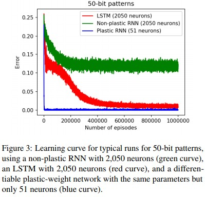

   记忆大图片的效果：

   

   每个连接使用独立的plasticity coefficient 可以提高网络的表现能力。

   

2. One-shot pattern classification: Omniglot test 

   1623种手写体，每类20个样本

   

3. Reinforcement Learning: Maze exploration task

   

### 2). Self-Attention Generative Adversarial Networks (SAGAN)

([Paper](https://www.arxiv-vanity.com/papers/1805.08318/)) 

**核心技术： ** 将**[Self-Attention](https://arxiv.org/pdf/1706.03762.pdf)**机制引入GAN. 1). use cues from **all feature location** instead of only spatially local points.; 2). discriminator可以check图片中距离较远的不同区域的highly-detailed feature之间是否互相一致。3). generator conditioning会影响GAN的表现，这里使用了[spectral normalization](https://arxiv.org/abs/1802.05957)来提高训练的dynamics;以及使用了Imbalanced learning rate for generator and discriminator updates.

**Self-Attention mechanism:** 

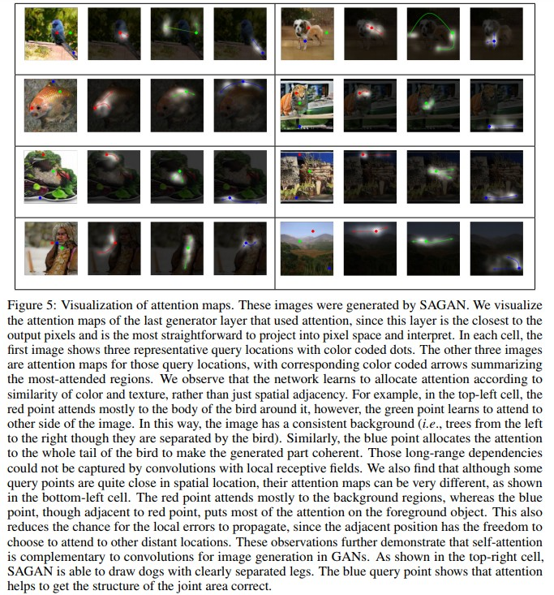

**实验结果:**

### 3）. CliqueNet: Convolutional Neural Networks with Alternately Updated Clique (2018.5， CVPR2018)

([Paper](https://arxiv.org/abs/1802.10419)) ([Code](https://github.com/iboing/CliqueNet))

**核心：** **Clique Block**。与DenseNet相比，CliqueNet的每个Chique Block只有固定通道数的特征图会传送到下一个Clique Block，从而避免DenseNet中由于复用不同层级特征图随着深度的增加导致的密集型连接路径线性增加导致的参数量剧增。

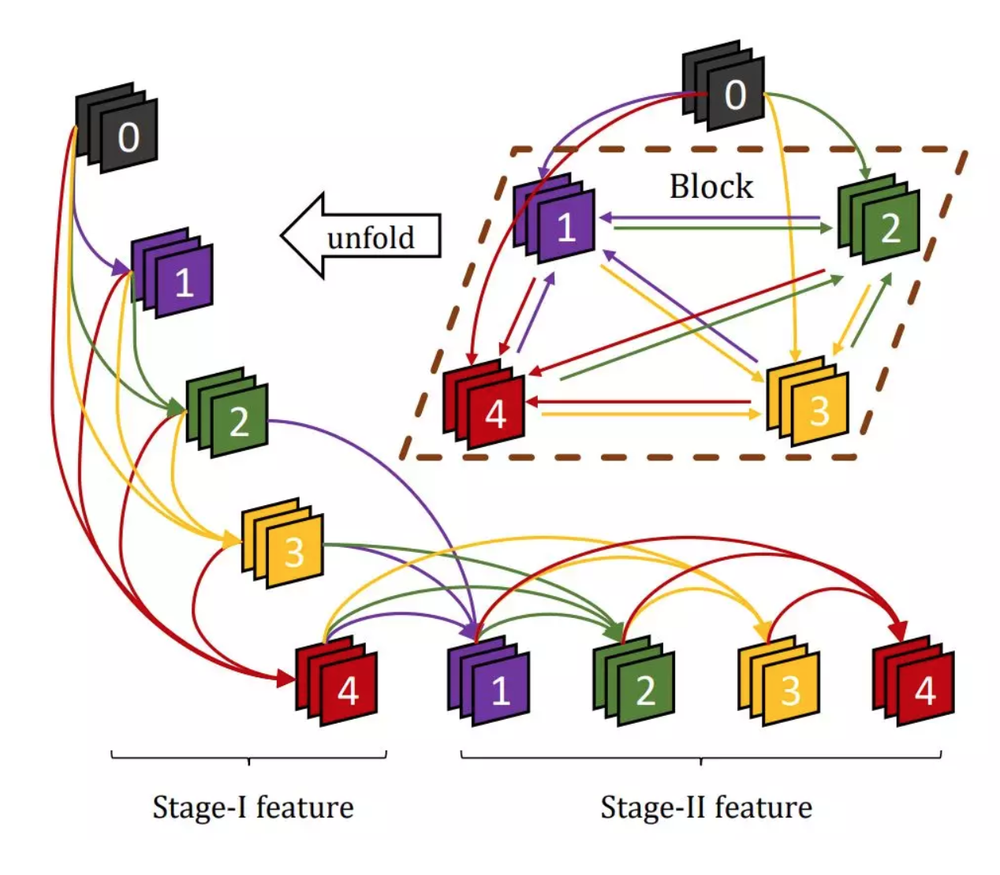

Cliquet Block的计算一般分为两个二段（更高阶的计算成本太高），第一阶段的传播通DenseNet，视为block的初始化；第二阶段的每一个卷积输入不仅包括前面层的特征图，还包括后面层级的特征图。这一部分通过循环反馈结构利用更高级视觉信息精炼出前面层级的卷集核，实现**空间注意力**的效果。由于每一个block只有第二阶段会作为下一个block的输入，因此Block的特征图维度不会超越线性增加。

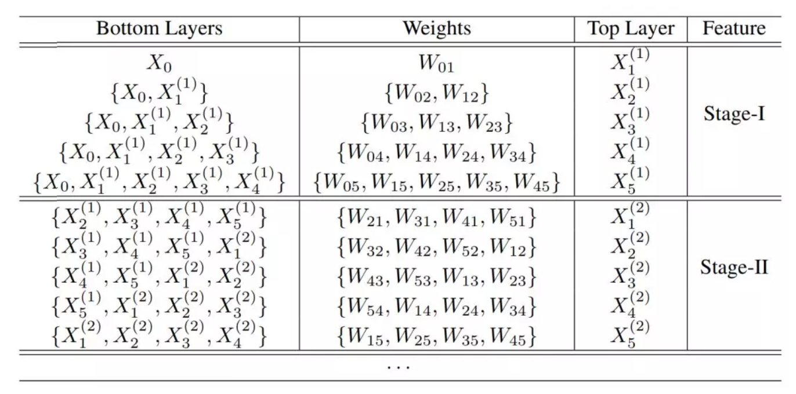

此外还通过多尺度特征策略来避免参数的快速增长：将每个Block的输入和输出特征图拼接到一起，然后global pooling的到一个向量。用所有block的最后pooling出来的这个向量进行预测。

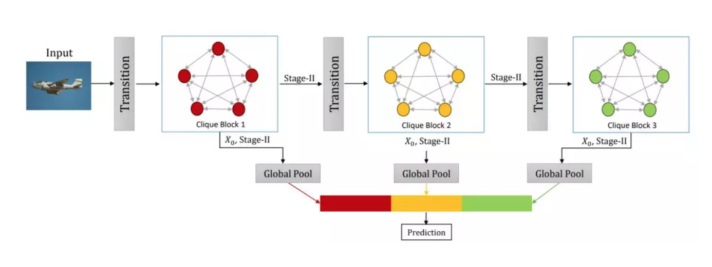

### 4) .ProjectionNet: learning efficient on-device deep networks using neural projections (2017.8)

([paper](https://arxiv.org/abs/1708.00630)) ([code](https://github.com/akosichesca/projectionnet))

核心：同时训练两个不同的网络：full trainer NN（现有的深度网络）和**projection network**，后者利用**随机投射**将输入和中间值转换成**bits**，因此其计算和存储所需的内存很小。两者通过end-to-end bp进行训练，projection net通过**学徒学习**的方式从full network中进行学习，训练完成后可以直接用projection net进行inference。

**projection network**

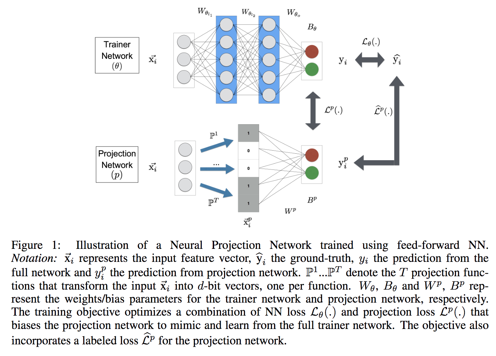

loss为(实验中 $\lambda_1$ = 1.0; $\lambda_2$ = 0.1;  $\lambda_3$= 1.0 )：

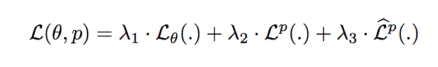

**Projection Network**: 在投射网络中，通过投射函数P将每一个输入**实例** $\vec{x_i}$ 先投射到不同的空间$\Omega_p$，然后再学习这个空间中的值与对应输出值$\vec{y_i^p}$的映射关系。当联合训练完成的时候，转换函数P和相应的projection network中W和B就被一起提取出来生成一个轻量化的模型。

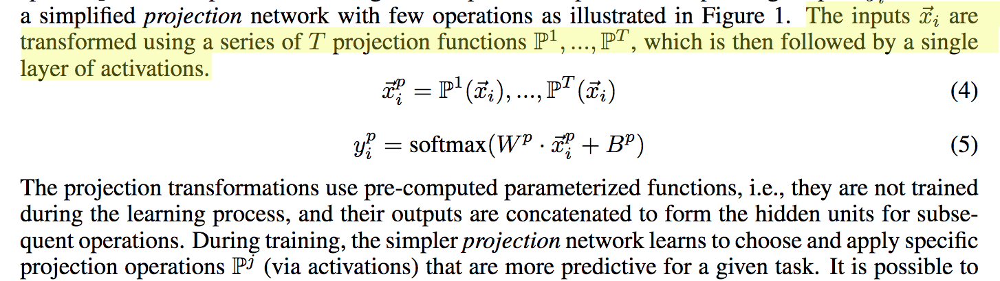

因为投射函数P的类型决定了投射空间$\Omega$ 的类型，也就直接影响了计算的效率和模型大小，因此在定义投射函数的时候，采用了修改后的LSH方法（Local Sensitive hashing）来充分利用随机投射的效率，动机是1.能够把类似的输入x或者中间层投射到临近的hiddern unit vector；2. 能够以一种有效简洁的网络表示转化输入，使结果只依赖观测到的特征（内在维度）而非所有维度（实际维度）。投射函数在**训练和inference之前**就被固定了。投射的计算如下：

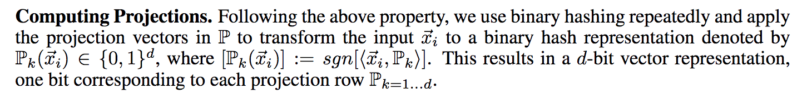

**实验结果：**

**注**： d是LSH 每个投射vector P定义的bits数；T是P中投射函数的个数。

MNIST分类：

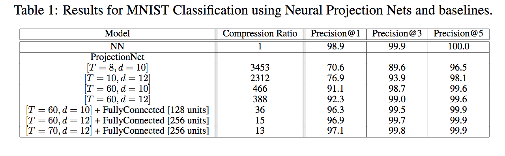

CIFAR 100分类：

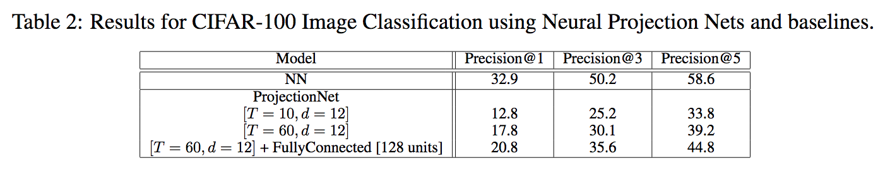

## 2. Model Compression

### 1). Google Learn2Compress service in ML Kit

([Blog](https://ai.googleblog.com/2018/05/custom-on-device-ml-models.html)) ([Apply Link](https://docs.google.com/forms/d/e/1FAIpQLSd7Uzx6eepXeF5osByifFsBT_L3BJOymIEjG9uz1wa51Fl9dA/formResponse))

**核心技术**： Learn2Compress主要包含**模型剪枝，量化，联合训练和知识蒸馏**方法，支持将**TF Lite**的模型进行内存优化和加速。

- 剪枝： 能过压缩2x的模型尺寸，并且保留97%的精度

- 量化：8-bit fixed point 量化

- 联合训练和知识蒸馏： teacher-student learning strategy： 用大的teacher网络训练一个紧凑的student网络并减少精度损失。Teacher网络可以被固定（distillation的时候）或者进行联合优化，而且一般会同时训练多个不同大小和inference效率的student网络提供选择。

  

目前该技术支持的模型包括**MobileNet， NASNet， inception，[ProjectionNet](https://arxiv.org/pdf/1708.00630.pdf)**的**分类**任务；由于功能仍然在测试阶段，因此需要申请。

**实验结果：**

**推测精度：**

**推测速度**：

### 2). AutoTVM （2018.2）

（[Learning to Optimize Tensor Programs](https://arxiv.org/abs/1805.08166)）( [TVM: An Automated End-to-End Optimizing Compiler for Deep Learning](https://arxiv.org/abs/1802.04799))

（[消息连接](https://mp.weixin.qq.com/s/YVIvdMznb3oatIXqD5a5_A)）

**核心：**通过深度学习编译器（TVM）自动优化深度学习算子性能，实现高效优化硬件代码。思路为：1.建立足够大的搜索空间，确保人工手写的优化全部包含在内；2.快速搜索这个空间，获取最优的实现。前者需要不断总结抽象手工优化的规律；后者需要利用机器学习来学习程序空间的代价估价函数然后利用这个函数来进行检索。

## 3. Face Recognition

### 1). Pose-Robust Face Recognition via Deep Residual Equivariant Mapping

([Paper](https://arxiv.org/abs/1803.00839)) ([Code](https://github.com/penincillin/DREAM))

**核心技术**：DREAM模块（深度残差等变映射）：首先假设在深度**特征空间**中，侧脸区域的特征和正脸区域的特征相关，即输入任意姿势的图像，可以通过添加残差映射函数将特征映射到正脸的特征空间上（特征等变性理论）。

DREAM模块：引入soft-gate控制机制来自适应控制残差量从而可以控制不同人脸姿势的中引入的残差量（正脸引入少而极侧脸引入较多）；此模块可以直接加入到现有的网络框架中，与主干CNN进行联合端到端的训练。

**优势**：

1. 实施简单，DREAM模块可以直接拼接到现有的模型，无需改变现有的脸部特征的维度，并且可以直接BP端到端的训练
2. 轻量，添加的参数很少，不会对模型性能造成较大的影响（ResNet18中参数量只增加0.3%，时间成本增加1.6%）。而之前常用的正脸化方法包括**3D人脸归一化**到正脸，**GAN**网络生成正脸的方法开销比较大，而且极侧脸的转化还是很困难。
3. 在不影响正脸识别效果的基础上提高极侧脸的识别率。不需要更详细的人脸数据。

**讨论：**本文认为目前的人脸识别技术在侧脸表现差的原因主要在于训练的时候**正侧脸数据不均衡**导致的。

**实验结果**：

侧脸转换成正脸的效果：

错误率：

对侧脸假阳性和假阴性样本的效果：

