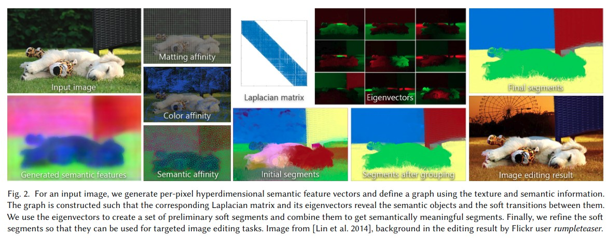
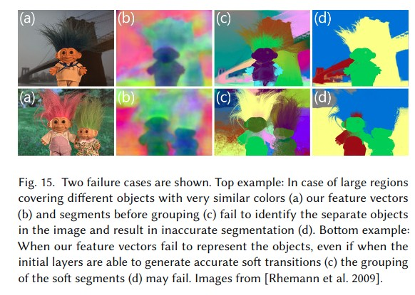

## Semi-supervised object learning strategy

#### 1. Unsupervised Hard Example Mining from Videos for Improved Object Detection (2018.8)

([paper](https://arxiv.org/abs/1808.04285))

**摘要：** 通过现有检测器在视频中检测提取isolated in time的样本即与前后帧detection没有联系的样本作为hard negative样本，同理可提取hard positive的样本。

#### 2. Online Illumination Invariant Moving Object Detection by Generative Neural Network (2018.8) 

([paper](https://arxiv.org/abs/1808.01066))

**摘要**：提出了利用**无监督**和**生成**网络的可进行online训练更新的Moving object detection （MOD）的检测器 - NUMOD。具体操作是对视频的每张图先通过网络对**背景**使用低维的representation， 然后基于光照不变representation将**前景**分解为光照变化和moving object。训练可以通过online的end-to-end的模式进行，即持续将图片输入optimizer。

NUMOD的对输入图片的前后景分离示意：

**关键点：**

1. 光照invariance先验知识

   通过对[Finlayson](https://ieeexplore.ieee.org/document/1542031/)提出的shadow free image和利用[Wiener filter](https://ieeexplore.ieee.org/document/5995621/)提取的光照invariant的图片去均值作为输入,记为 $I_i^{inv} = \Psi(I_i)$

   

2.  NUMOD框架

   **原则：** $I_i = B_i + C_i + F_i$ ，其中I为输入，B为背景，C为光照变化，F为移动物体

   

   其中net为全连接生产网络：

   

   低维representation可以通过被optimize，即通过输入图片$I_i$和光照不变图片$I_i^{inv}$ 构建背景，此项loss记为$L_{reconst} = \Sigma_i ||I_i-B_i|| + \Sigma_i ||I_i^{inv}-B_i^{inv}||$

   而S包括了光照变化和前景移动物体。对于光照不变$S_i^{inv}$，如果$I_i^{inv}$与光照无关，那么$S_I^{inv}$对应的就是实际移动物体，先验图$M_i = 1/1+e^{-(|S_i^{inv}-\sigma|)}$ ($\sigma$为$i^{inv}$的像素的标准差)用来在分离光照变化和moving shadow的时候进行限制，即Mi中**大**的值表示对应的像素包含在真实的移动物体中，而**小**的值则表示光照变化。由于光照变化包含在正式变化正交的亚空间中，所以满足以下限制：

   $M_i^T|C_i|=0; (1-M_i)^T|F_i|=0; s.t. S_i = F_i + C_i$ 其中Ci为光照变化，Fi为移动物体。

   分解的loss为$L_decomp = \Sigma_iM^T|C_i|+\Sigma_i(1-Mi)^T|F_i|$ 

   在end-to-end的训练过程中为了避免过拟合添加正则化loss： $L_reg=\lambda（1/2||W^1||_2^2+1/2||W^2||_2^2）$

   optimize的loss为$L=L_{reconst}+L_{decomp}+L_{reg}$, 对序列中的每一张图单独进行处理。后处理的时候通过阈值t来获取F的binary mask bi：$b_i(x,y)=1,if |F_i(x,y)|\ge 2t;0,if|F_i(x,y)|\lt2t$, t为Fi中像素的标准差。

3. Online mode

   NUMOD支持batch和online两种训练模型，batch的时候使用序列中N张图片做维护batch进行参数更新；而online模式的时候，首先用最初的M张图片optimize网络，然后冻结W1和W2，连续输入若干张图来对网络进行fintune来optimize U1， U2和C参数，此时$L_{online}=L_{reconst}+L_{decomp}$

**实验结果：**

注：评价指标为F-measure：$2 * Recall * Precision / (Recall + Precision)$

#### 3. Few-Example Object Detection with Model Communication (2018.8)

([Paper](https://arxiv.org/pdf/1706.08249.pdf))

**摘要**: 首先使用少量样本（3张）作为seed训练检测器，然后不停在模型训练和**选择高置信度样本**之间迭代。在训练的时候，容易的样本首先被生成提升初始的weak检测器；随着分类器的识别能力的提升，难度较大但是可靠的样本被选择出来进一步提升模型的识别能力。此外，为了提高选择出来的样本的准确性和召回率，避免训练时的local minimum，使用了**多个模型**作为ensemble。**self-paced learning** and **multi-modal learning**.

**关键点**：

使用单个模型下的训练流程：

使用多个模型：

MSPLD模型optimize可以用以下公式表示：

其中$w^j$表示第j个检测器的参数，$V_{i,c}^j$表示在第i张图中的bounding box是否被判断为第c个class用于训练第j个检测器，值为{0, 1}。$y_i^{uj}$表示用第j个检测器在第i张没有标注的图片上生成的pseudo bounding box。i, j, c分别是图片，模型，类别的index。$V^j$是u x C矩阵，表示第j个检测器的所有$V_{i,c}^j$。$\lambda$是SPL（self-paced learning）模型的正则项，允许可能选择高分的图片。$\gamma$是多模型的的正则化项。內积正则项$(V^i)^TV^j$表示$V^i$和$V_j$每一对选择权重，表达一个基本原则：不同检测模型在图片上是共享pseudo-annotation 置信度的common knowledge，即不同模型一般在图像上会同时标注正确或同时错误。Ls表示最开始的multi-task loss。对于没有标注的图片的loss： $L_c=Ls,if第c个class出现在y_i中；\infin, if otherwise$. F*表示多模型融合的结果，会包含大量noise，因此需要用根据一些先验经验选取可信的pseudo-object，即$y^u\in\Psi_y$，这里采用NMS。

Optimize的时候用**alternative optimization strategy (AOS) **，按**$y^{u1},v^1,w^1,...,v^j,y^{uj},w^j,y^{u1},v^1,w^1,...$**的顺序依次进行更新。

算法更新流程如下:

**实验结果**

$\lambda$的选择对模型的影响：

PASCAL数据集不同类的mAP:

不同初始模型训练时的样本量的影响：

缺陷：

复杂图片无法提取准确的bounding box以及遗漏：

## Object Detection Architecture

#### 4. Dual Refinement Network for Single-Shot Object Detection (2018.8)

（[Paper](https://arxiv.org/abs/1807.08638)）

**摘要：**在[RefineDet](https://arxiv.org/pdf/1711.06897.pdf)基础上进行优化，结合了一步检测和两步检测的优点提出Dual-RefineDet。按anchor-offset检测过程中加入**anchor-refinement**和**feature offset refinement**，检测头部使用了**multi-deformable head，**使用不同大小感受域进行检测从而来充分利用物体的上下文信息。在voc2007数据集上测试320x320大小的输入的mAP是81.3%，TITAN X下FPS为42.3，

**关键点：**

SSD， RefineDet, Dual-RefineDet检测流程的差异：

Dual-RefineNet的具体网络结构：

与RefineDet相似的是在anchor refinement的时候使用了**ARM**（anchor-refinement module）和**ODM**（object detection module）。不同的是ARM以金字塔特征hierarchy作为输入，只回归坐标作为refined anchor。并且使用了hard-negative mining来避免class imbalance。

**Anchor-Offset Detection**

SSD方式的检测中anchor和feature的位置通常可能不太准确：

Anchor Refinement: refined anchor $a_r = (W_{ar} * f_{arm} +b_{ar})\oplus a_o$,其中$f_{arm}$为金字塔特征hierarchy,$a_o$为原始anchor，$\oplus$代表anchor decoding operation。

Deformable Detection Head: $P_{po}=\Sigma_{p\in R} w(p).f_{odm}(p+\Delta p)$，其中P是预测的category probability或坐标；$p_n$表示感受野R中的位置，$p_0$是中心；$f_{odm}$表示ODM特征;$\Delta p$是feature offset，使感受野R能够fit refined anchor。

Feature Offset Refinement: $\Delta p = W_{fr} * (W_{ar}*f_{arm}+b_{ar})+b_{fr}$ ，每个$(W_{ar}*f_{arm}+b_{ar})$中的spatial element都是refined anchor的坐标prediction。

anchor-offset detection可以表示为：

$P_{local}=(W_{loc}*(f_{odm}, \Delta p)+b_{loc})\oplus a_r$

$P_class = (W_{conf}*(f_{odm}, \Delta p)+b_{conf})$

**Multi-Deformable Head**

受[CoupleNet](https://arxiv.org/abs/1708.02863)启发，更多的semantic information和潜在的object relation对高质量的检测是很重要的。这里设计了Multi-Deformable Head用来描述原始的，缩小的，扩大的region-level feature，缩小的用于捕获物体的local信息，扩大的用于捕获上下文信息。

multi-deformable head 可以表示为：

$P_{local} = \Sigma_{l=1}^L(W_{loc_l}*(f_{odm}, \Delta p_l)+b_{loc_l})\oplus a_r$

$P_{class} = \Sigma_{l=1}^L W_{conf_l}*(f_{odm}, \Delta p_l)+b_{conf_l}$

训练的loss为：$L = 1/N_{arm} * L_{loc-arm} + 1/N_{odm}(L_{loc-odm}+L_{conf})$，其中N为ARM和ODM中的positive box的数量；$L_{loc} = \Sigma_{i=1}^NsmoothL1(p_i-g_i^*)$，g*是第i个正例anchor的gt坐标；$L_{conf}=-\Sigma_{i=1}^N(log(c_i^{cls})-\Sigma_{k=1}^{\delta N}log(c_k^0))$，其中k是通过hard negative mining选择出来的negative anchor，这样做是为了避免极端的前后景class不均衡，$\delta$是控制正负样本的比例，这里为3。

**实验结果**

feature offset refinement, deformable detection head, multi-deformable head对模型提升的效果：

不同multi-deformable head感受野大小对模型提升的效果：

#### 5. Backtracking Spatial Pyramid Pooling (SPP)-based Image Classifier for Weakly Supervised Top-down Salient Object Detection (2018.8)

([Paper](https://arxiv.org/pdf/1611.05345.pdf))

**摘要**： 提出一种只使用binary label表示目标object是否在图片中的**弱监督学习**的top-down saliency的框架。首先，通过**backtracking策略**来计算**每个图片区域**对基于CNN的分类分值的**概率贡献**。然后从一系列的fast **bottom-up (BU)** saliency方式生成的saliency map中选择与**top-down (TD)** saliency map最相配的。Top-down 和bottom-up saliency map相结合，其中高saliency的feature用于训练线性SVM分类器用于评估feature saliency。之后可以用进一步对saliency map进行multi-scale superpixel-averaging处理来refine combined saliency map。

TD saliency 和 BU saliency的区别：

TD saliency可以视为一种**focus-of-attention**机制；而BU saliency则是指示不太可能属于物体的区域。

流程：

1） 使用CNN图片分类器和backtracking机制生成TD saliency map

首先用VGG16预训练权重提取图片feature到**relu5_3层**，图片**不进行crop/resize**，用SPPnet中**多尺度空间金字塔max-pooling**获取**固定长度**的feature，然后用二元线性SVM代替全连接层训练分类器。特征$u_m$是指relu5_3层的特征。

然后对分类器进行**backtracking**进行saliency 估计。上图中$F^{-1}$函数是多尺度空间金字塔的逆运算。特征$u_m$的saliency计算方式为:$S_\Tau(u_m) = \beta (W^TF(\vec{0}..., u_m,...,\vec{0}))$ ，if$\ m \in \Omega$ ； 0， otherwise。其中$\Omega$为所有对分类分值有**正向贡献**的特征集合。

2）基于策略选择合适的BU saliency map然后与TD saliency map整合

理想情况下，**属于物体的feature对分类器分值有正向贡献（$\in\Tau^+$）而属于背景的feature则为负($\in \Tau^-$)**。 基于此设计的用于选择最合适BU map的objective function为$B(t) = {\Sigma_{\forall i\in \Tau^+}w_i(\hat{z_i}-\tilde{z_i}) - \Sigma_{\forall i\in \Tau^-}|w_i|(\hat{z_i}-\tilde{z_i})*(1-\mu_t)}$。选择到合适的BU map之后直接相乘获取combined saliency map **H**。

3）使用combined saliency map训练更加细致的feature saliency model，**注：**这里的feature是指VGG16 relu5_3 feature map层上每个点对应的feature。

用relu5_3的feature训练feature saliency model，对于feature 在对应combined saliency map H上大于0.5的作为正值，而只有在B-cSSP和BU saliency map都认为是negative feature（wi < 0）的作为负值，然后用线性SVM训练分类是否为saliency。

4）使用saliency model推测获取TD map

在推测的时候，combined saliency H和feature saliency model先对输入图片进行处理，然后用multi-scale superpixel averaging处理，这是为了saliency值在低分辨率的saliency map上upsample到原始输入图片大小的时候保持稳定。最后分类器的分值进行整合获取最终每个像素的saliency值。对于**object依赖**的saliency：$Scateg(O) = Spix(O) . \hat{\Phi}(O)$ ，其中Spix是之前获得的saliency map，而$\hat{\Phi}(O)$是归一化0-1之后的object O检出的分值。而对于**object独立的**saliency则是：$Sind(x, y) = max_{i\le j \le nc}{Scateg(j) (x, y)}$，其中nc是所有的category的类目数。

**实验结果:**

与其他saliency评估方法的比较:

使用上述各步骤之后的saliency变化：

不同步骤对于最后评估精度提升的效果：

不同category independent saliency评估方法的效果比较：

saliency map的应用：

#### 6. Deep Regionlets for Object Detection (2018.8)

([Paper](https://arxiv.org/pdf/1712.02408v3.pdf))

**摘要**：将传统检测方式中能够处理**物体形变和多比例**的regionlet方法和深度学习集合设计出一种end-to-end的检测方法deep regionlets framework。这是一种**two-stage detector**，具体包括**region selection network (RSN)** 和**deep regionlet learning module**，前者用用选择潜在的检测bounding bx proposal用于提取特征；后者在前面proposal的基础上进行**local feature的选择和变形**来应对local variation。此外还在regionlet learning module中设计了gating network进行soft regionlet的选择和pooling。

regionlet的定义：

网络结构：

RSN用来预测转换系数在给定候选bounding box的基础上进行region选择，bounding box是通过**RPN**网络输出的。regionlet是在RSN输出的region上进行学习获得的。

通过仿射变换能够生成任意形状的region，因此RSN就是进行仿射变换系数$\Theta = [\theta_1, \theta_2,\theta_3;\theta_4,\theta_5,\theta_6]； \theta \in [-1, 1]$的预测。

region通过仿射变换的进行大小和形变如下：

regionlet在仿射变换后的region上进行学习，regionlet的特征与原始region的特征的计算如下：

其中$U_{nm}^c$为输入feature上位置（n，m）在channel c上的值，输出feature map的大小为HxW，$(x_p^s, y_p^s)$为输入feature map上的空间位置。

Gating network用于作为soft regionlet selector给regionlet赋予不同的权重并生成regionlet的feature representation。结构为一层**fc层+sigmoid激活函数**。上述feature V经过gating network获取权重并与feature相乘作为最终的feature map。

为了避免从小的region上提取相同数量的regionlet导致的该region的regionlet representation不紧凑有效，在size 为（H, W）的feature map V上面先进行**pooling**操作。

**实验结果**

deep regionlet learning中不同部分对于检测效果的影响：

Global RSN表示只使用global region进行预测；Offset only RSN类似与deformable ROI pooling。non-gating表示选择非矩形region。

不同region学习数量和regionlet学习数量对于检测结果的影响：

不同检测方式在PASCAL VOC数据集上的表现：

#### 7. Semantic Soft Segmentation (2018.8) 

([Paper](http://cfg.mit.edu/sites/cfg.mit.edu/files/sss_3.pdf))

**摘要**: 设计了semantic soft segments（sss），这是一组对应图片中有semantic意义的不同区域的层，在不同的物体之间有精确的soft transition。此方法是一种**class-agnostic**的分割方法，提出了embed 图片texture和color以及通过神经网络输出的semantic信息的图结构。soft segment通过仔细构建的**Laplacian矩阵**完全自动的特征值分解来生成，而这个Laplacian矩阵代表图片中每个像素对属于同一个segment的可能性。通过对spectral matting的扩展使之在构建此矩阵的时候不光使用low level的**局部颜色分布外**还包括**非局部的颜色特征**以及high-level的语义信息。

soft segment的图片formation model：$(R, G, B)_{input} = \Sigma_i\alpha_i(R, G, B)_i, \Sigma_i\alpha_i=1$，其中$\alpha \in [0, 1]$，0为完全透明，1为完全不透明。

**注：** soft segmentation是指将图片分解成多个segments，而每个pixel可以属于不止一个segment。

semantic feature vector 计算流程：

**Spectral matting**

使用局部颜色分布来构建Laplacian矩阵L用于捕获局部区域（5x5）每对pixel的local color affinity。 L中**小的**特征值相关的特征向量在生成高质量matt的有重要影响，每个soft segment是**对应L最小的特征值的K个特征向量的线性组合**，使matting sparsity最大化，使partial opacity出现降至最低。通过一下energy function来计算：

$arg\ min_{\{y_i\}} \Sigma_{i, p}|\alpha_{ip}|^\gamma + |1-\alpha_{ip}|^\gamma; with\ \alpha_i = Ey_i; subject to:\ \Sigma_i\alpha_{ip}=1$

其中$\alpha_{ip}$是第i个segment第p个pixel的$\alpha$值，E是包含L最小特征值的K个特征向量矩阵，$y_i$是构成soft-segments的特征向量的线性权重。

L的计算可以通过pixel对之间的affinity进行计算，pixel对有正的affinity的值相似，0值表示两者独立，负值则值不同。

$L = D^{-1/2}(D-W)D^{-1/2}$

W是包含所有像素对affinity的方阵，D是对应的度矩阵。

**Nonlocal Color Affinity**

这里设计了基于over-segmentation的采样实现更远距离的color affinity用于segment评估。具体来说通过SLIC生成2500个**superpixel**，所有superpixel在半径为图片大小20%的半径以内，然后对每个superpixel进行affinity评估。这样的好处就是每个superpixel值取一个样，sparsity还是很高，计算量小。color affinity的计算如下：

$W_{s,t}^C= (erf(a_c(b_c-||c_s - c_t||))+1)/2$

其中$c_s$和$c_t$是superpixel的平均颜色，在[0, 1]，erf是高斯error function，$a_c$和$b_c$是超参，用控制affinity衰减的速度和变成0的阈值。

**Semantic affinity**

使用神经网络（**DeepLab-ResNet-101**）生成各物体每个pixel的feature vector，属于同一物体的两个pixel生成的feature vector很接近，与其他区域的pixel的很远。Semantic affinity也是在**superpixel**上生成的，一方面可以增加稀疏性，另一方面可以降低取到transition region不靠谱的pixel时的影响。与color affinity不同的是semantic affinity**只取临近的superpixel**用于构建连接体。计算方式如下：

$w_{s,t}^S=erf(a_s(b_s-||\tilde{f_s}-\tilde{f_t}||))$

**构建层**

使用上述affinity构建Laplacian矩阵：

$L = D^{-1/2}(D-(W_L+\sigma_S W_S+\sigma_C W_C))D^{-1/2}$

然后提取L最小的100个特征值的特征向量，然后通过feature vector而非eigenvector进行k-means聚类构建中间层，首先生成40层，然后进一步减少到5层。由于5层是局限在限定数量的eigenvector导致稀疏性不是最优的，会在层中生成许多semi-transparent的区域。如下图：

因此为了提高层的稀疏性，将之前eigenvector的线性组合的限制进行放松。

$E = E_L+E_S+E_F+\lambda E_C$

逐项进行放松，放松后的公式具体参见文章3.4。

添加限制后的效果如下图:

**实验结果：**

与其他分割方式的比较：

不同affinity的效果：

与soft color segment的对比：

false case：

物体颜色相似；large transition时不可靠的semantic feature vector。

## Industry Implementation

1. Tensorflow v1.8支持AMD GPU: [Project Link](https://rocm.github.io/ROCmInstall.html)

2. Google Dataset Search engine: [Link](https://toolbox.google.com/datasetsearch)
3. Open datasets by Skymind: [Link](https://skymind.ai/wiki/open-datasets)

## 玄学

#### Brain-Score: Which Artificial Neural Network for Object Recognition is most Brain-Like?

（[Paper](https://www.biorxiv.org/content/early/2018/09/05/407007.full.pdf+html))

