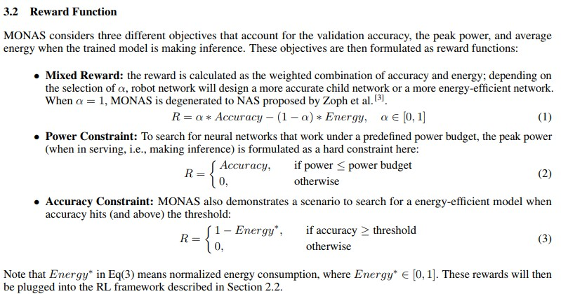

# 1. AutoML

#### 1. SEARCHING TOWARD PARETO-OPTIMAL DEVICE-AWARE NEURAL ARCHITECTURES (2018.8)

([Paper](https://arxiv.org/pdf/1808.09830.pdf))

**摘要：**multi-object NAS方法汇总（multi主要是值算法评估的对象不止accuracy，还包括模型复杂度，计算耗时，设备等因素）以及两种方法MONAS和DPPNet的比较。

NAS的问题可以归纳为两部分: **搜索空间**和**搜索算法**。

**搜索空间**：所有网络可能的**结构（深度，宽度，连接）**和**参数(kernel, filter, op)**

**搜索算法**：主要有基于**RL**和**进化算法**两类。

不同NAS算法的比较：

**RL**： 主要有3部分：agent， environment， reward。目标是学习action policy是agent和environment的交互有最大的长期reward。在NAS中agent的action就是选择子网络，而validation performance作为reward。之前主要的RL方向研究集中在**如何设计action 空间**和**如何更新action policy**（方法有policy gradient， proximal policy optimization， Q-learning）。由于搜索空间的高位性，RL法需要的计算量十分巨大（2000GPU day，现在已经优化到2250GPU day）

**进化算法**：主要集中在搜索**网络结构**，连接权重通过BP进行更新。主要步骤为1.初始化多个网络，根据模型质量选择一个或多个作为parent；2.复制parent生成child的时候加入随机变化操作；3.child训练完评估效果，选择效果较好的加入parent中；4. 反复迭代。

**搜索加速**：由于子模型训练需要大量时间，为了加速NAS的训练需要进行加速，主要分为两大类：

1）**Improved proxy**：子模型特征与最终训练的精度有关，因此可以用这些特征预测子模型的表现，对于表现差的子模型就可以提前结束训练或抛弃从而加速训练。研究发现**FLOPs**和**模型大小**与子模型精度负相关。也有研究用训练过程的模型的参数和validation curve来训练回归模型预测最终的精度。

2）**weight-sharing**：设法将parent的参数共享给child避免从头训练。

**multi-objective NAS**：除了考虑模型的精度，还考虑设备可用性，因此reward函数需要评估以下指标：inference latency, energy consumption, power consumption, memory usage, and floating-point operations (FLOPs)。下面比较两种多目标NAS的方法：

**MONAS**：建立在two-stage RL框架基础上。在generation stage，用一个RNN作为robot network生成CNN所用的参数；在evaluation stage，用上述超参训练子网络。子网络的accuracy和能耗作为robot网络的reward。

MONAS的reward设计如下：

**DPP-Net**: DPP-Net搜索时预定义了cell的数量，每个cell有多层，搜索的时候按Norm-Conv-Norm-Conv（反复）的顺序在cell里面添加层。

搜索算法：

**实验结果**：

DPP-Net与其他NAS方法的效果比较：CIFAR10和ImageNet

#### 2. Neural Architecture Search: A survey (2018.8)

([Paper](https://arxiv.org/pdf/1808.05377.pdf))

Search space: use cell-based search space instead of searching whole network architecture.

#### 3. Finding Better Topologies for Deep Convolutional Neural Networks by Evolution (2018.9)

([paper](https://arxiv.org/pdf/1809.03242.pdf))

**摘要：** 利用进化算法进行网络结构优化，引入了**knowledge inheritance和knowledge learning**的概念来降低计算成本。通过这个研究发现了 影响结构性能的关键因素：**深度**和**节点之间的连接性**，已经在人为设计的网络中广泛应用。

步骤：1）设计初始网络拓扑结构（source, sink, conv node）；2）变化（conv节点通道加倍，增加conv节点，添加连接，删去连接，连接中插入节点）+ 繁殖； 3）选择； 4）进化

选择的过程中引入knowledge inheritance 和knowledge learning的概念来降低搜索计算成本。knowledge是指除网络结构以外的影响单个模型性能的因素，可以分为inheritable knowledge和learnable knowledge，前者是指可以从进化分支前面遗传下来的，包括权重，bias等（**其实就是用parent的参数初始化**）；而后者是从整个进化群体收集到的信息，包括learning rate和batch size等。

**实验结果：**

#### 4. Reinforced Evolutionary Neural Architecture Search (2018.8)

([Paper](https://arxiv.org/pdf/1808.00193.pdf))

# 2. Industry Implementation

#### 1. TensorRT 

#### 2. DeepStream

#### 3. Movidius 

