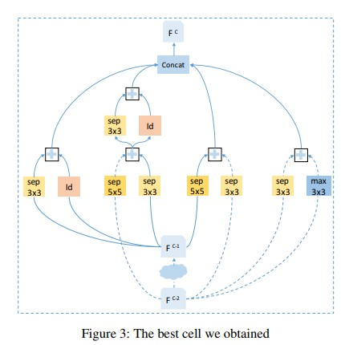

# 1. AutoML

#### 1. SEARCHING TOWARD PARETO-OPTIMAL DEVICE-AWARE NEURAL ARCHITECTURES (2018.8)

([Paper](https://arxiv.org/pdf/1808.09830.pdf))

**摘要：**multi-object NAS方法汇总（multi主要是值算法评估的对象不止accuracy，还包括模型复杂度，计算耗时，设备等因素）以及两种方法MONAS和DPPNet的比较。

NAS的问题可以归纳为两部分: **搜索空间**和**搜索算法**。

**搜索空间**：所有网络可能的**结构（深度，宽度，连接）**和**参数(kernel, filter, op)**

**搜索算法**：主要有基于**RL**和**进化算法**两类。

不同NAS算法的比较：

**RL**： 主要有3部分：agent， environment， reward。目标是学习action policy是agent和environment的交互有最大的长期reward。在NAS中agent的action就是选择子网络，而validation performance作为reward。之前主要的RL方向研究集中在**如何设计action 空间**和**如何更新action policy**（方法有policy gradient， proximal policy optimization， Q-learning）。由于搜索空间的高位性，RL法需要的计算量十分巨大（2000GPU day，现在已经优化到2250GPU day）

**进化算法**：主要集中在搜索**网络结构**，连接权重通过BP进行更新。主要步骤为1.初始化多个网络，根据模型质量选择一个或多个作为parent；2.复制parent生成child的时候加入随机变化操作；3.child训练完评估效果，选择效果较好的加入parent中；4. 反复迭代。

**搜索加速**：由于子模型训练需要大量时间，为了加速NAS的训练需要进行加速，主要分为两大类：

1）**Improved proxy**：子模型特征与最终训练的精度有关，因此可以用这些特征预测子模型的表现，对于表现差的子模型就可以提前结束训练或抛弃从而加速训练。研究发现**FLOPs**和**模型大小**与子模型精度负相关。也有研究用训练过程的模型的参数和validation curve来训练回归模型预测最终的精度。

2）**weight-sharing**：设法将parent的参数共享给child避免从头训练。

**multi-objective NAS**：除了考虑模型的精度，还考虑设备可用性，因此reward函数需要评估以下指标：inference latency, energy consumption, power consumption, memory usage, and floating-point operations (FLOPs)。下面比较两种多目标NAS的方法：

**MONAS**：建立在two-stage RL框架基础上。在generation stage，用一个RNN作为robot network生成CNN所用的参数；在evaluation stage，用上述超参训练子网络。子网络的accuracy和能耗作为robot网络的reward。

MONAS的reward设计如下：

**DPP-Net**: DPP-Net搜索时预定义了cell的数量，每个cell有多层，搜索的时候按Norm-Conv-Norm-Conv（反复）的顺序在cell里面添加层。

搜索算法：

**实验结果**：

DPP-Net与其他NAS方法的效果比较：CIFAR10和ImageNet

#### 2. Neural Architecture Search: A survey (2018.8)

([Paper](https://arxiv.org/pdf/1808.05377.pdf))

Search space: use cell-based search space instead of searching whole network architecture.

#### 3. Finding Better Topologies for Deep Convolutional Neural Networks by Evolution (2018.9)

([paper](https://arxiv.org/pdf/1809.03242.pdf))

**摘要：** 利用进化算法进行网络结构优化，引入了**knowledge inheritance和knowledge learning**的概念来降低计算成本。通过这个研究发现了 影响结构性能的关键因素：**深度**和**节点之间的连接性**，已经在人为设计的网络中广泛应用。

步骤：1）设计初始网络拓扑结构（source, sink, conv node）；2）变化（conv节点通道加倍，增加conv节点，添加连接，删去连接，连接中插入节点）+ 繁殖； 3）选择； 4）进化

选择的过程中引入knowledge inheritance 和knowledge learning的概念来降低搜索计算成本。knowledge是指除网络结构以外的影响单个模型性能的因素，可以分为inheritable knowledge和learnable knowledge，前者是指可以从进化分支前面遗传下来的，包括权重，bias等（**其实就是用parent的参数初始化**）；而后者是从整个进化群体收集到的信息，包括learning rate和batch size等。

**实验结果：**

#### 4. Reinforced Evolutionary Neural Architecture Search (2018.8)

([Paper](https://arxiv.org/pdf/1808.00193.pdf))

**摘要：** RENAS是使用reinforced mutation进行变化的进化算法，具体是通过引入mutation controller来学习微小调整的影响并以此做出相应的调整。通过这种方法使模型population朝合适的方向进化，并且由于child的大部分参数都是从parent继承，计算量大幅下降（CIFAR 10， TitanXp x 4 1.5天完成搜索）。

**步骤：**

**搜索空间：**将网络分解成cell和block， cell由block叠加而成，block的结构如下图b。

每个block可以用{IN1, IN2, OP1, OP2, A}定义。{IN1, IN2}的输入可以是cell中前面block的输出或者是前**一个或两个**cell的输出。搜索的内容就是**每个block的结构和block如何连接构成cell。**对于网络来说，还包括cell的数量和第一层的filter个数，这两个参数在搜索的时候先固定，等搜索完成的时候再进行调整后重新搜索。

**搜索策略**: 进化框架为tournament selection。reinforced mutation包括Encoder, Mutation router, IN-mutator, OP-mutator。

Encoder：是双向RNN网络，跟在一层embedding 层之后用于学习cell每个部分的效果，也就是Encoder学习到的hidden state {$H_{IN1}, H_{IN2}, H_{OP1}, H_{OP2}, H_A$}。根据hidden state决定哪个block的哪个部分需要被调整，通过softmax分类器的注意力机制进行采样。

Mutation-router：决定每个block需要被调整的部分。输入为Encoder的输出H，输出为需要改变的部分，通过fc+softmax决定。

IN-mutator：用新的IN改变原来的输入。输入的候选为所有当前cell的之前的block输出和前两个cells输出的hidden state，通过上面类似的操作选择替换的输入。

OP-mutator： 类似与IN-mutator用新的OP代替原来的OP。

**训练流程**：

如图一所示，子网络通过Controller进行相应部分的调整，其余部分直接从parent继承，然后进行fine-tune。

**实验结果：**

搜索到的最佳cell结构：

CIFAR 10和ImageNet的实验结果：

搜索效率：

搜索稳定性：

#### 5. DARTS: Differentiable Architecture Search (2018.6)

来自CMU和DeepMind

([Paper](https://arxiv.org/abs/1806.09055)) ([Code](https://github.com/quark0/darts ))

**摘要：**与之前的RL和进化算法在**离散不可微的空间**进行搜索不同，本方法将搜索空间松弛为连续的，可以用梯度下降进行有效的搜索，需要的计算资源大幅下降。不需要controller， hypernetworks或performance predictor，而且通用性较好，适合CNN和RNN网络的搜索。

**步骤**：

**搜索空间**:搜索cell结构作为最后网络的block。将搜索的结构以N个节点的有向非循环图表示，节点代表feature， 边代表运算。由于op可以包含特殊的**0操作**表示断开两个节点的连接，因此搜索问题缩减到搜索op。

**Continuous Relaxation and Optimization**： 为了使搜索空间连续，用softmax来relax进行特定op的选择。relax之后目标就是联合学习模型结构$\alpha$和权重w，下一步就梯度下降来optimize validation loss。优化的目标是使val loss $Lval(W, \alpha)$ 最小，并且$W=argmin_w Ltrain(w, \alpha)$。

**Approximation**：为了解决上述优化bilevel optimization问题，使用approximate iterative optimization过程使w和$\alpha$进行迭代优化。对于$\xi$,如果为0，使用一级近似（效果较差但是速度快）；如果大于0，使用二级近似。

在获得连续的结构encoding $\alpha$之后，对每个中间节点保留通过softmax计算的最强的k个predecessor，CNN中k为2，RNN中k为1；而对于op，则使用argmax选择。

**实验结果：**

搜索到效果最好的cell结构:

不同数据集上的表现（**包含所需GPU time**）

#### 6. Efficient Neural Architecture Search via Parameter Sharing (2018.2)

来自Google Brain，Jeff Dean

([Paper](https://arxiv.org/pdf/1802.03268.pdf))

**摘要：** ENAS通过一个controller从大的计算图中搜索最佳的子图来进行网络结构搜索。controller通过policy gradient进行训练，使validation set得到的reward最大化，然后用选出的子图进行训练。通过子网络的**参数共享**使ENAS需要的计算量大幅下降，与NAS相比，计算量减少1000倍。

**步骤：**

将搜索空间用**有向非循环图**表示，其中节点表示局部计算，边代表信息流向。由于节点计算的参数互相独立，因此如果此节点**没有调整**，那么就可以将此节点的参数从parent**继承**给child。

ENAS搜索的基本单元为cell，通过cell的叠加生成最终网络。RNN的cell和CNN的cell搜索以下分别介绍：

**RNN的cell和controller设计**

搜索空间为N个node的DAG。ENAS的controller是**一个RNN决定哪条边会被激活以及每个node的计算内容**。相比于之前的方法固定RNN的拓扑结构，controller能够使ENAS自己设计RNN结构。

controller是一个包含**100个hidden单元的LSTM**，通过softmax决定对应节点的操作。

ENAS中需要学习的参数有两个controller LSTM的参数$\theta$和子网络的共享参数w，两者通过在训练的过程中**交替学习**。由于参数共享，因此更新w的时候的梯度是通过**蒙特卡洛估计**（如下公式）取多个模型的loss结果进行计算的（不过实验结果发现用单个子网络的结果进行更新的效果做好）。

$\triangledown_wE_{m~\pi(m;\theta)}|L(m;w)|\approx1/M\Sigma^M_{i=1}L(m_i,w)$

最后使用训练好的policy生成几个子网络，然后用从验证集上取的一个minibatch样本进行评估，选择reward最高的子网络进行从头训练。

**CNN的cell和controller设计**

CNN搜索的controller和RNN类似，决定**与前面哪一个节点连接以及使用哪种计算**。为了简化搜索，CNN的cell分为Conv cell和reduction cell两种。

每个cell的**前两个节点**作为cell的输入节点接受前两个cell的输出，cell中剩下的node通过controller RNN决定这个节点的输入**来自哪两个之前的节点以及对应的操作**。

**实验结果**

ENAS搜索到的在对应数据集上效果最好的RNN和CNN的cell结构：

CIFAR 10上表现最好的网络结构：

ENAS与其他RNN网络在Penn treebank上的比较：

ENAS与其他CNN网络在CIFAR10上的比较：

# 2. Industry Implementation

#### 1. TensorRT 

#### 2. DeepStream

#### 3. Movidius 

