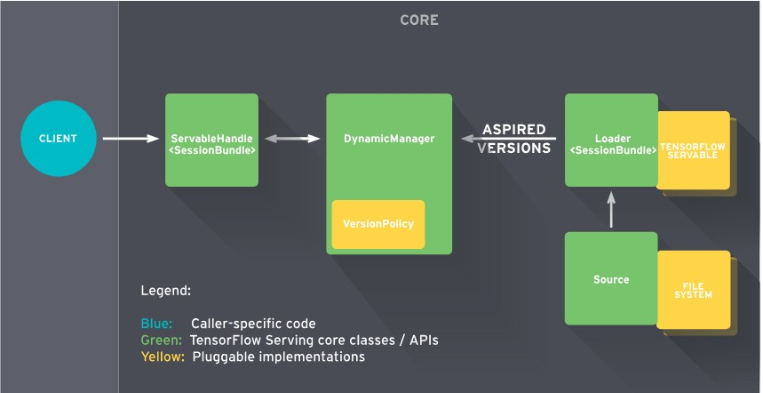
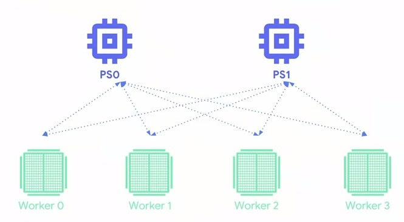

## TensorFlow (r1.8) at Google I/O 2018

([Session List Link](https://www.youtube.com/watch?v=OmofOvMApTU&list=PLQY2H8rRoyvwbjR168CUXNJEugeHg6nKB))

### 1.  TensorFlow for JavaScript

([Video Link](https://www.youtube.com/watch?v=OmofOvMApTU&list=PLQY2H8rRoyvwbjR168CUXNJEugeHg6nKB)) ([Homepage](https://js.tensorflow.org/))

Supports JS for model training and deployment. 

**Advantages of In-browser ML**:

- No driver / install
- Interactive 
- Sensors
- Data stay in device client

**Ability**:

- Author models directly in browser
- Import pre-trained model for inference
- Re-train imported models

**Pipeline:**


- **Save:** [Keras model](https://js.tensorflow.org/tutorials/import-keras.html) or [TF SavedModel model](https://github.com/tensorflow/tfjs-converter) format accepted.
- **Convert**: [tfjs-converter](https://github.com/tensorflow/tfjs-converter)
  - Including graph optimization
  - Optimize weights for browser caching
  - 32+ tf/keras layer and 90+ tf ops support

**Framework**


**Performance**


**[Demos](https://js.tensorflow.org/): **

[Emoji Scavenger Hunt](https://emojiscavengerhunt.withgoogle.com/) (IOS/Andorid)

[Human Pose Estimation](https://storage.googleapis.com/tfjs-models/demos/posenet/camera.html) 


### 2. TensorFlow in production: TF extended, TF Hub, and TF serving

#### 1). TensorFlow Hub

([Homepage](https://www.tensorflow.org/hub/))

A Library to foster publication, discovery and consumption of **reusable** parts of machine learning module. 

**Module Features**

- each contains **weights** and **graph**
- **composable, reusable (common signature), retrainable**

**Module usage**

instantiating a module through **file path ** or **URL**

```python
import tensorflow_hub as hub 
m = hub.Module("path/to/a/module_dir", trainable=True, tags={"train"}) # file path
features = m(images)
logits = tf.layers.dense(features, NUM_CLASSES)
prob = tf.nn.softmax(logits)
```

or after setting `TFHUB_CACHE_DIR` and then create a module from URL.

```shell
export TFHUB_CACHE_DIR=/my_module_path
```

```python
m = hub.Module("https://tfhub.dev/google/progan-128/1") 

```

model uploaded name rules:

- tfhub.dev: repository url
- google: module publisher
- progan-128: module name
- 1: module version

Integrated with TensorFlow estimator:

```python
review = hub.text_embedding_column("review", "http://tfhub.dev/google/universal-sentence-encoder/1") 
features = {"review": np.array(["an argula masterpiece", "inedible shoe leather", ...])}
labels = np.array([[1], [0], ...])
input_fn = tf.estimator.input.numpy_input_fn(features, labels, shuffle=True)
estimator = tf.estimator.DNNClassifier(hidden_units, [review])
estimator.train(input_fn, max_steps=100)
```


**Available Modules**

- **Industry standard**: Inception, ResNet and inception-ResNet
- **Efficient**: MobileNet
- **Cutting edge**: NASNet and PNASNet (NASet-Large cost 62000+ GPU hours)


#### 2). TensorFlow Serving

([Homepage](https://www.tensorflow.org/serving/architecture_overview))

Flexible, high-performance serving system for machine learning model deployment . 

**Features**

- **Multiple models:** simultaneously; dynamic model loading/unloading
- **Isolation: ** loading/serving threads for low latency during model version transition. 
- **High throughput: ** Dynamic request batching, performance conscious design.


**Architecture**



- **Servables**: object that client use to perform computation
  - **Not** manage their own life cycle; 
  - Including TensorFlow **SavedModelBundle**  and lookup table for **embedding** or **vocabulary** lookups.
  - **Versions:** one or more **versions** of a servable could be loaded concurrently (support for **gradual rollout** and **experiment**)
  - **Streams:** a sequence of versions of a servable sorted by increasing version number. 
  - **Models:** represents as one or more servables. a composite model is either **multiple independent servables** or **single composite servable**. A large lookup table could be sharded into many TensorFlow serving instances. 
- **Loaders:** manage a servable's life cycle; **Standardize** APIs for loading and unloading a servable independent of specific learning algorithm.
- **Sources: **Plugin modules that find and provide servables. 
  - provide zero or more servable stream. For each stream a Source supplies **one Loader** instance for **each version** of servable.
  - discover servables from **arbitrary storage system** (RPC etc)
- **Aspired Versions: ** a set of servable versions that should be **loaded** and **ready**. When a **Source** gives a new list of aspired versions to the **Manager**, it supercedes the previous list for that servable stream. The Manager unloads any previously loaded versions that no longer appear in the list.
- **Managers: ** handle the full lifecycle of Servables: **loading, serving, unloading** servable. Listen to **Sources** and track all versions; **Postpone** loading if not ready or unloading until newer version loaded.

**NEW** distributed serving use-case:


**REST** API: seamlessly serve ML in web/mobile [RESTful](https://savvyapps.com/blog/how-to-build-restful-api-mobile-app) microservices.

#### 3). TensorFlow Extended

([Homepage](https://www.tensorflow.org/tfx/))

TF Extended (TFX) is tensorflow-based general-purpose machine learning platform.

**Features**

- **flexible**: continuous training and updating -> higher accuracy and faster convergence.

  

- **Portable: **

  - with TF

  - with [Apache Beam](https://beam.apache.org/): batch and streaming data processing

    

  - with Kubernetes/[Kubeflow](https://github.com/kubeflow/kubeflow): deployment of machine learning.

    

- **Scaleable :** local <-> cloud

- **Interactive:** visualization

**Architecture**


**Tools released**

- [TensorFlow Transform](https://www.tensorflow.org/tfx/transform/): consistent in-graph transformation in training and serving
- [TensorFlow Model Analysis](https://www.tensorflow.org/tfx/model_analysis/): scaleable, sliced and full-pass metrics. 
- TensorFlow Serving
- *Facets*: visualization of datasets

**Pipeline**


1. use **Facet** to analyze data.

2. use `tf.Transform` for feature transformation

   

3. train with TensorFlow Estimator

   

4. Analyze model with TensorFlow Model Analysis: slice metrics.

   

5. serving with TF serving

   

### 3. TensorFlow High-Level API

#### 1). [Colab](https://colab.research.google.com/)

([Tutorial](https://medium.com/deep-learning-turkey/google-colab-free-gpu-tutorial-e113627b9f5d))

An easy way to learn and use TensorFlow.

[Workshops](https://github.com/tensorflow/workshops): some exercises

2). **APIs**

- `tf.keras`
- `tf.data`: easy input pipelines
- [Eager execution](https://github.com/tensorflow/tensorflow/tree/master/tensorflow/contrib/eager): **imperative interface** to TensorFlow with one command: `tf.enable_eager_execution()`

### 4. TensorFlow Lite for mobile developers

([Homepage](https://www.tensorflow.org/mobile/tflite/))

**Feature**

- **Cross-platform**

  

  

- **Light**: core interpreter size: **75k** ; with all ops: **400k**

**Architecture**


- **Converter**

  - FlatBuffer based
  - faster to mmap
  - few dependencies
  - **pre-fused** activation and biases
  - weights truncation 

- **Interpreter Core**

  - static memory plan
  - static execution plan
  - fast load-time

- **operation kernels**

  - specifically optimized kernels optimized for NEON or ARM

- **Hardware acceleration delegation**

  - Direct GPU integration

  - Android neural network API HVX

    

    

- **Quantized Training**

  - Fine-tune weights
  - Estimate quantization parameters
  - 

**ML Kit**: newly announced machine learning SDK exposed to both on device and cloud powered API.

ops and model support:

- ~50 common op
- allow custom ops
- now only **limited to inference ops**
- support models: **MobileNet, InceptionV3, ResNet50, SqueezeNet, DenseNet, InceptionV4, SmartReply,** **quantized version** of  **MobileNet, InceptionV3**

Usage:


**Pipeline**


- convert to TF Lite format:  

  - use **frozen graphdef** or **SavedModel** and avoid unsupported operators; write **custom operators** for any missing functionality. 

    visualize model to check

    ```python
    from tf.contrib.lite import convert_savedmodel
    convert_savedmodel.convert(saved_model_dir="/path/to/model", output_tflit="model.tflite")
    ```

- write custom op

  ```c++
  TfLiteRegistration reg = {
      .invoke = [](TfLiteContext* context, TfLiteNode node) {
          TfLiteTensor* a = &context->tensors[node->inputs->data[0]];
          a->data.f[0] = M_PI;
          return kTfLiteOk;
      }
  }
  ```

- C++ API

  - load model

    ```c++
    std::unique_ptr<tflit::FlatBufferModel> model = tflite::FlatBufferModel::BuildFromFile("model.tflite")
    ```

  - register ops

    ```c++
    tflite::ops::builtin::NeededOpsResolver minimal_resolver;
    ```

  - builder interpreter

    ```c++
    std::unique_ptr<tflite::Interpreter> interpreter;
    tflite::InterpreterBuilder(model, minimal_resolver)(&interpreter);
    ```

  - execution

    ```c++
    // feed input
    int input_indxe = interpreter->inputs()[0]:
    float *intput = interpreter->typed_tensor<float>(input_index);
    // ... fill in the input
    
    // run inference
    interpreter.Invoke();
    // read output
    //...
    ```

- Python API

- Java API

- Android APP gradle file

- iOS CocoaPods


### 5. Distributed TensorFlow training

([Homepage](https://www.tensorflow.org/deploy/distributed)) ([DistributionStrategy](https://github.com/tensorflow/tensorflow/blob/r1.8/tensorflow/contrib/distribute/README.md))

#### 1) Data parallelism 

**Async parameter server**



**Sync parameter server**


**Sync Allreduce Architecture**: next round computation wait until all worker received updated gradients.


**Ring Allreduce Architecture**: Fast


Use **parameter** server if a number of less-powerful devices such as **CPU**; use **Sync AllReduce** if fast devices with strong communication links., like **GPU and TPU**. 

**PS:** basic explanation (Source: https://www.oreilly.com/ideas/distributed-tensorflow)

1). batch of training in data parallelism


2). Asynchronous and synchronous training with SGD


3). 

***Input pipeline bottleneck***


**Solution: ** `tf.data.Dataset` API.;parallelize file reading and data transforming; prefetch (`dataset.prefetch(buffer_size=1)`) to decouple the time of data produced and consumed (prepare data when accelerator is still training).

**initial**


**parallelization**


```python
def input_fn(batch_size):
    files = tf.data.Dataset.list_files(file_pattern)
    dataset = tf.data.TFRecordDataset(files, num_parallel_reads=40) # num of cpus
   	dataset = dataset.shuffle(buffer_size=10000)
    dataset = dataset.repeat(NUM_EPOCHES)
    dataset = dataset.map(parser_fn, num_parallel_calls=40)
    dataset = dataset.batch(batch_size)
    dataset = dataset.prefetch(buffer_size=1)
    return dataset
```

**Fused transformed ops**


```python
dataset = dataset.apply(tf.contrib.data.shuffle_and_repeat(buffer_size=1000, NUM_EPOCHES))
dataset = dataset.apply(tf.contrib.data.map_and_batch(parser_fn, batch_size)
)

```

***Multi machine distributed training***

use **Estimator** `train_and_evalute` API which use **async parameter server** approach. 

####2). Model parallelism


#### 3). scaling to multiple-gpu in TensorFlow

```python
distribution = tf.contrib.distribute.MirroredStrategy() # mirrored strategy for multi GPU distribution
run_config = tf.estimator.RunConfig(train_distribute=distribution)

classifier = tf.estimator.Estimator(
model_fn=model_function,
model_dir=model_dir,
config=run_config)
classifer.train(input_fn=input_function)
```

**Mirrored Strategy**:

Implement Sync Allreduce Architecture and model parameters mirrored across devices.

- no change to model/training loop
- no change to input function (**require `tf.data.Dataset` API**)
- seamless checkpoint with summary


TPU, Keras API, multi machine Mirrored-strategy is in working.


