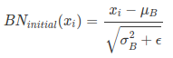
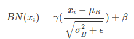

# How to use batch normalization in TensorFlow
## 1. Definition of batch normalization
Batch Normalization is raised up in this [paper](http://arxiv.org/abs/1502.03167). It aims to solve **covariate shift**([Shimodaira, 2000](http://citeseerx.ist.psu.edu/viewdoc/download?doi=10.1.1.370.4921&rep=rep1&type=pdf)) problem (example could be found in this [post](http://sahilsingh.org/batch-normalization-in-deep-neural-networks.html)) and saturating non-linearities (tanh/relu/...):
> Changes in model parameters during learning change the distributions of the outputs of each hidden layer. This means that later layers need to adapt to these (often noisy) changes during training.

BN means applying batch normalization of input to the activation function of each neuron (sigmoid/relu), so that input to activation function across each training batch has **a mean of 0 and variance of 1.** ==> σ(Wx+b) to σ(BN(Wx+b)). Based on this deifinition, BN function could be written in following format：<br>

<br>But this operation will restrict input to a **normal distribution**, thus limiting the representational power of layer. So allowing the network to **undo** BN, we multiply a **scale** parameter γ and **shift** parameter β (ϵ is used to avoid mathematic error). Both γ and β could be learnt. So the final BN transform format is: . (In actual deployment of BN in `tf.layers.batch_normalization()` also have **momentum** parameter to control moving average -- some kind of learning rate. See [here](https://www.tensorflow.org/api_docs/python/tf/layers/batch_normalization).)

## 2. Distinct behaviour of BN in training and validation/predict
In all:
```
Training

Normalize layer activations according to mini-batch statistics.
During the training step, update population statistics approximation via moving average of mini-batch statistics.
Testing

Normalize layer activations according to estimated population statistics.
Do not update population statistics according to mini-batch statistcs from test data.
```

At test time, use BN will cause inputs to activation function always will be 0 for **single example**, and we will get same prediction all the time. To fix this, use **population mean** and **population variance**  stored at each BN step during training. It will be best to estimate pop mean and pop var after the weights are trained for weights are converged at the end of training.

## 3. Batch normalization in tensorflow
In Tensorflow, the approach to estimate pop mean and pop var is to use **exponential moving average** (simple average over sampling: `pop_mean * decay + batch_mean * (1 - decay)`).

Here is the simplified example to wrapper `tf.nn.batch_normalization()` for usage at train and test stage:
```python
def batch_norm_wrapper(inputs, is_training, decay = 0.999):

    scale = tf.Variable(tf.ones([inputs.get_shape()[-1]]))
    beta = tf.Variable(tf.zeros([inputs.get_shape()[-1]]))
    pop_mean = tf.Variable(tf.zeros([inputs.get_shape()[-1]]), trainable=False)
    pop_var = tf.Variable(tf.ones([inputs.get_shape()[-1]]), trainable=False)

    if is_training:
        batch_mean, batch_var = tf.nn.moments(inputs,[0])
        train_mean = tf.assign(pop_mean,
                               pop_mean * decay + batch_mean * (1 - decay))
        train_var = tf.assign(pop_var,
                              pop_var * decay + batch_var * (1 - decay))
        with tf.control_dependencies([train_mean, train_var]):
            return tf.nn.batch_normalization(inputs,
                batch_mean, batch_var, beta, scale, epsilon)
    else:
        return tf.nn.batch_normalization(inputs,
            pop_mean, pop_var, beta, scale, epsilon)
```

Tensorflow provides `tf.GraphKeys.UPDATE_OPS` collections make it easy to access pop mean and var update operations. **So add them as dependency of your training operation manually**.

Tensorflow provided multiple `batch_normalization` layers for network framework construction, include `tf.nn.batch_normalization`, `tf.contrib.slim.batch_norm`, `tf.layers.batch_normalization` and so on. For simplicity, using last one is a good choice.

In general, **remove layers bias** (BN already has terms for scaling and shifting) and **add BN before non-linear activation**. <br>
#### 1). BN layer using `tf.layers.batch_normalization`
Basic steps: <br>
- Added the is_training parameter to the function signature so we can pass that information to the batch normalization layer.
- Removed the bias and activation function from the dense layer.
- Used `tf.layers.batch_normalization` to normalize the layer's output. Notice we pass is_training to this layer to ensure the network updates its population statistics appropriately.
- Passed the normalized values into a ReLU activation function.
- Moved the creation of **train_opt** inside a with `tf.control_dependencies`... statement. This is necessary to get the normalization layers created with `tf.layers.batch_normalization` to **update their population statistics**, which we need when performing inference.

In tensroflow [official document](https://www.tensorflow.org/api_docs/python/tf/layers/batch_normalization) about `tf.layers.batch_normalization`:<br>
> Note: when training, the moving_mean and moving_variance need to be updated. By default the update ops are placed in tf.GraphKeys.UPDATE_OPS, so they need to be added as a dependency to the train_op.

```python
update_ops = tf.get_collection(tf.GraphKeys.UPDATE_OPS)
with tf.control_dependencies(update_ops):
    train_op = optimizer.minimize(loss)
```

In Estimator model architecture, BN layers should be wrapped like this: <br>
```python
def model_fn(features, labels, mode):
    # ...  neural network layers ...
    logits = tf.layers.dense(Y4, 200, use_bias=False)
    bn = tf.layers.batch_normalization(logits,
        axis=1,
        center=True,
        scale=False,
        training=(mode == tf.estimator.ModeKeys.TRAIN))
    Y5 = tf.nn.relu(bn)
    # ...  more neural network layers ...
```
where scale is **False** if activation function is **not scale-dependent**. (**sigmoid: True; relu: False**)

#### 2). BN layer using `tf.nn.batch_normalization`
This is a much lower api in Tensorflow, so using it would be a more labrious. But in some case, you have to use this, like **BN in RNN/LSTM**, because higher API doesn't fully support it. Here is steps to build BN layers in model: <br>
- Added the is_training parameter to the function signature so we can pass that information to the batch normalization layer.
- **Removed the bias** and activation function from the dense layer.
- Added gamma, beta, pop_mean, and pop_variance variables.
- Used **tf.cond** to make handle training and inference differently.
- When training, we use `tf.nn.moments` to calculate the **batch mean and variance**. Then we update the population statistics and use `tf.nn.batch_normalization` to normalize the layer's output using the **batch statistics**. Notice the with tf.control_dependencies... statement - this is required to force TensorFlow to run the operations that update the population statistics.
- During inference (i.e. when not training), we use `tf.nn.batch_normalization` to normalize the layer's output using the **population statistics** we calculated during training.
- Passed the normalized values into a ReLU activation function.

```python
def bn_layer(x, scope, is_training, epsilon=0.001, decay=0.99, reuse=None):
    """
    Performs a batch normalization layer

    Args:
        x: input tensor
        scope: scope name
        is_training: python boolean value
        epsilon: the variance epsilon - a small float number to avoid dividing by 0
        decay: the moving average decay

    Returns:
        The ops of a batch normalization layer
    """
    with tf.variable_scope(scope, reuse=reuse):
        shape = x.get_shape().as_list()
        # gamma: a trainable scale factor
        gamma = tf.get_variable("gamma", shape[-1], initializer=tf.constant_initializer(1.0), trainable=True)
        # beta: a trainable shift value
        beta = tf.get_variable("beta", shape[-1], initializer=tf.constant_initializer(0.0), trainable=True)
        moving_avg = tf.get_variable("moving_avg", shape[-1], initializer=tf.constant_initializer(0.0), trainable=False)
        moving_var = tf.get_variable("moving_var", shape[-1], initializer=tf.constant_initializer(1.0), trainable=False)
        if is_training:
            # tf.nn.moments == Calculate the mean and the variance of the tensor x
            avg, var = tf.nn.moments(x, np.arange(len(shape)-1), keep_dims=True)
            avg=tf.reshape(avg, [avg.shape.as_list()[-1]])
            var=tf.reshape(var, [var.shape.as_list()[-1]])
            #update_moving_avg = moving_averages.assign_moving_average(moving_avg, avg, decay)
            update_moving_avg=tf.assign(moving_avg, moving_avg*decay+avg*(1-decay))
            #update_moving_var = moving_averages.assign_moving_average(moving_var, var, decay)
            update_moving_var=tf.assign(moving_var, moving_var*decay+var*(1-decay))
            control_inputs = [update_moving_avg, update_moving_var]
        else:
            avg = moving_avg
            var = moving_var
            control_inputs = []
        with tf.control_dependencies(control_inputs):
            output = tf.nn.batch_normalization(x, avg, var, offset=beta, scale=gamma, variance_epsilon=epsilon)

    return output


def bn_layer_top(x, scope, is_training, epsilon=0.001, decay=0.99):
    """
    Returns a batch normalization layer that automatically switch between train and test phases based on the
    tensor is_training

    Args:
        x: input tensor
        scope: scope name
        is_training: boolean tensor or variable
        epsilon: epsilon parameter - see batch_norm_layer
        decay: epsilon parameter - see batch_norm_layer

    Returns:
        The correct batch normalization layer based on the value of is_training
    """
    #assert isinstance(is_training, (ops.Tensor, variables.Variable)) and is_training.dtype == tf.bool

    return tf.cond(
        is_training,
        lambda: bn_layer(x=x, scope=scope, epsilon=epsilon, decay=decay, is_training=True, reuse=None),
        lambda: bn_layer(x=x, scope=scope, epsilon=epsilon, decay=decay, is_training=False, reuse=True),
    )
```

#### 3). BN layers using `tf.contrib.layers.batch_norm` (not recommended for layers is core api in TF1.4)
```python
def BatchNorm(inputT, is_training=True, scope=None):
    # Note: is_training is tf.placeholder(tf.bool) type
    return tf.cond(is_training,  
                lambda: batch_norm(inputT, is_training=True,  
                                   center=False, updates_collections=None, scope=scope),  
                lambda: batch_norm(inputT, is_training=False,  
                                   updates_collections=None, center=False, scope=scope, reuse = True))
```

### References
1. explanation of BN:
  - http://sahilsingh.org/batch-normalization-in-deep-neural-networks.html
  - ***[recommended]***: https://r2rt.com/implementing-batch-normalization-in-tensorflow.html
2. git issues/discussions about tf BN
  - ***[recommended]*** https://github.com/tensorflow/tensorflow/issues/1122
  - https://github.com/tensorflow/tensorflow/issues/10118
  - https://github.com/tensorflow/tensorflow/issues/4361
3. BN usage in TensorFlow
  - https://github.com/udacity/cn-deep-learning/blob/master/tutorials/batch-norm/Batch_Normalization_Solutions.ipynb
  - http://ruishu.io/2016/12/27/batchnorm/
  - ***[estimator example]*** https://github.com/martin-gorner/tensorflow-mnist-tutorial/blob/master/README_BATCHNORM.md
  - https://github.com/martin-gorner/tensorflow-mnist-tutorial/blob/master/mlengine/trainer/task.py
4. QA
  - https://stackoverflow.com/questions/43234667/tf-layers-batch-normalization-large-test-error
  - https://stackoverflow.com/questions/40879967/how-to-use-batch-normalization-correctly-in-tensorflow
