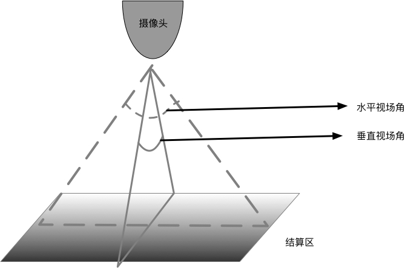

### 无人店结算区装修规格参考

以目前采用的[摄像头型号](https://detail.tmall.com/item.htm?spm=a230r.1.14.6.5ad34e70Q8znhI&id=564261605896&cm_id=140105335569ed55e27b&abbucket=19&skuId=3728676734825)感光面积为**1/4‘’**，焦距为**2.8mm**，此款摄像头的水平方向视场角为59.4879，垂直方向视场角46.3971。

假设摄像头安装位置为**正中间上方，**摄像头安装高度，房间长度/房间宽度和检测到行人高度的之间关系的计算方法如下：

**房间长度 : (摄像头安装高度 - 检测到行人的高度)  <= 1.1428:1**

**房间宽度 : (摄像头安装高度 - 检测到行人的高度) <= 0.8571:1**

**注：**检测到行人的高度是指行人检测器能够检测到行人状态时行人在摄像头图像中人体部分的高度。比如高度为1m的人下半部分进入画面被检测到的时候此时的检测到行人高度即为1m。

根据上述公式计算出不同安装高度下的无检测死角的结算区大小：

| 摄像头高度(m) | 检测行人高度(m) | 结算区长度(m) | 结算区宽度(m) |
| ------------- | --------------- | ------------- | ------------- |
| 4             | 1.8             | 2.51          | 1.89          |
| 4             | 1               | 3.43          | 2.57          |
| 3             | 1.8             | 1.37          | 1.03          |
| **3**         | 1               | **2.29**      | **1.71**      |
| 2.4           | 1.8             | 0.69          | 0.51          |
| **2.4**       | 1               | **1.6**       | **1.2**       |

**注：**目前的行人检测算法对部分人体的检测在**50%**以上时不经过微调也能取得较好的效果，因此这里推荐按检测到高度**1m**人体时的结算区大小；但是如果实际上线之前有时间采集实际图像进行算法模型微调的话，结算区大小在上述条件下还可以进行合适的放大，但至少保持**0.5m**高人体的检测。

---

**附：**

如果摄像头采用相对更大感光面积的型号，比如**1/3''**的，此时的结算区面积大小计算方式如下：

**房间长度 : (摄像头安装高度 - 检测到行人的高度)  <= 1.7143:1**

**房间宽度 : (摄像头安装高度 - 检测到行人的高度) <= 1.2857:1**

则相同高度下无检测死角的结算区大小为：

| 摄像头高度(m) | 检测行人高度(m) | 结算区长度(m) | 结算区宽度(m) |
| ------------- | --------------- | ------------- | ------------- |
| 4             | 1.8             | 3.77          | 2.83          |
| 4             | 1               | 5.14          | 3.86          |
| 3             | 1.8             | 2.06          | 1.54          |
| **3**         | 1               | **3.43**      | **2.57**      |
| 2.4           | 1.8             | 1.03          | 0.77          |
| **2.4**       | 1               | **2.4**       | **1.8**       |

