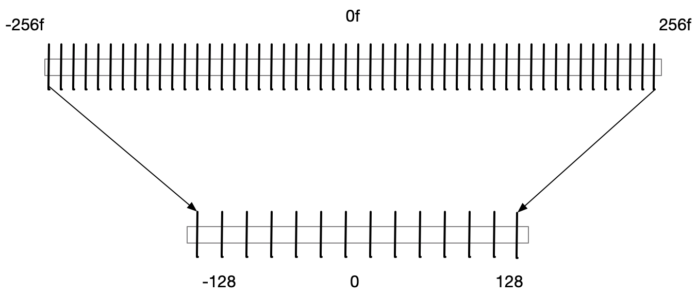
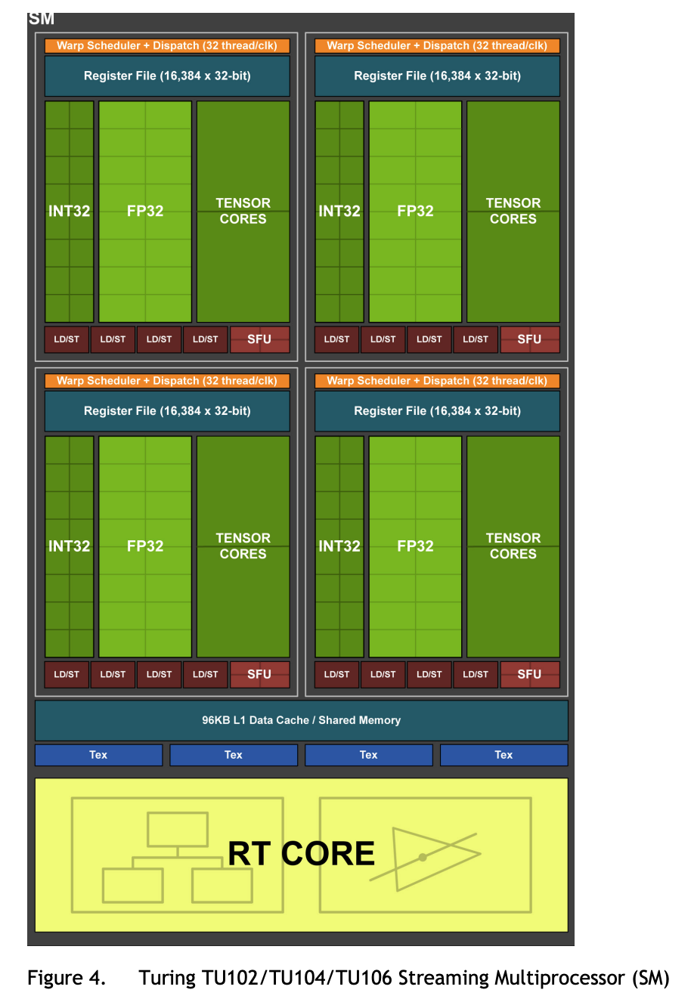
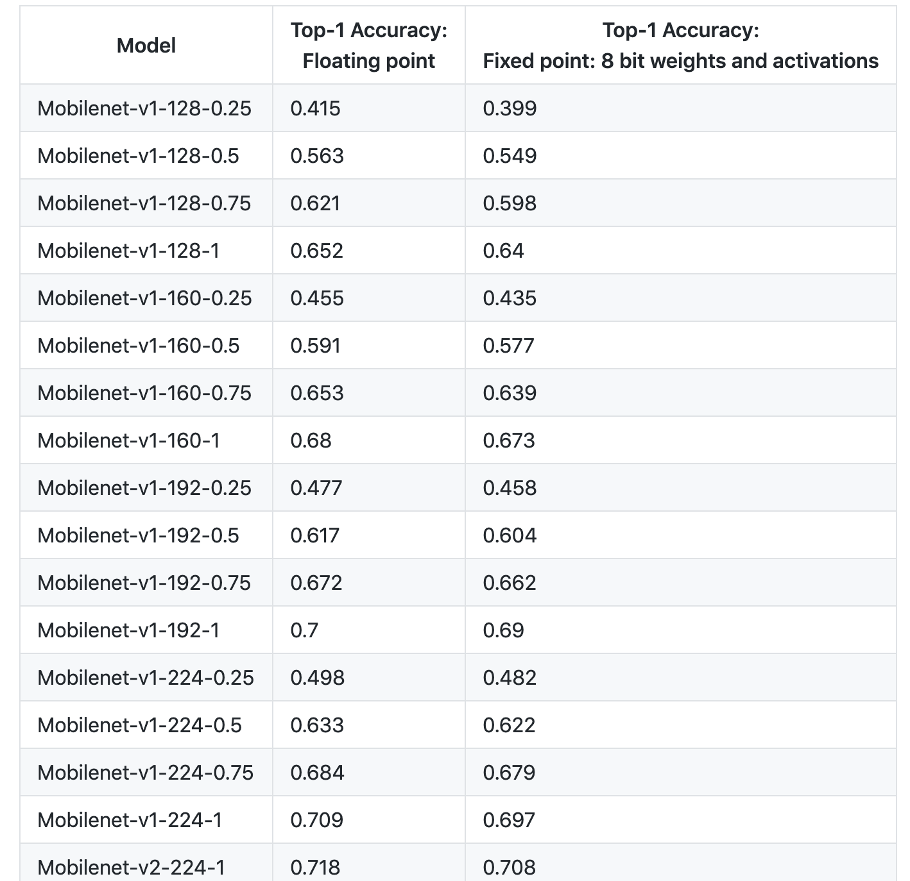

# 8-bit 量化

**本文基本参考自这篇文章：[8-Bit Quantization and TensorFlow Lite: Speeding up mobile inference with low precision](https://heartbeat.fritz.ai/8-bit-quantization-and-tensorflow-lite-speeding-up-mobile-inference-with-low-precision-a882dfcafbbd)**

首先来一段keras dalao Francois Chollet的鸡汤：

> - make it possible
> - make it work
> - make it efficient
> - make it dependable and invisible
> - move on to next layer and think about it again

这段鸡汤已经把8-bit量化的需求和阶段已经说得很清楚了：**提升算法效率**

## What is 8 bit

目前DL中大部分都是用32bit float类型进行计算的，bit位数的多少直接限制了数据类型能够表达的数据范围，比如float 32的数据是由1bit表示符号，8bit表示整数部，23位表示分数部组成。

| num bits | Min value           | Max value          |
| -------- | ------------------- | ------------------ |
| 8 bit    | -128 (-2^7)         | 128 (x^7)          |
| 16 bit   | -32768 (-2^15)      | 32768(2^15)        |
| 32 bit   | –2147483648 (-2^31) | –2147483648 (2^31) |

用更低位的数值类型意味着更小的数据表示范围和更稀疏的数值，量化的时候就会造成数值精度损失。比如要把float数值**量化**到int类型，那么首先小数部分会损失，而那些超过int类型能够表达的范围的值也会被压缩到int能够表达的最大或最小值。

## Why 8 bit？

那么既然会有精度损失那为啥现在int8运算越来越流行，主要原因就是**快**跟**省**了。

- 快：低bit位的数值计算一般会比高bit的要快。虽然现代计算芯片上浮点型的计算已经并不比int类型慢，但是这主要是设计了专用的float计算核，而现在很流行的ai芯片和一些嵌入式芯片上一般并不会设计很多的float计算核，因此对float数值的计算算力很低。

  下图就是Nvidia RTX2080ti的芯片架构([ref](https://www.nvidia.com/content/dam/en-zz/Solutions/design-visualization/technologies/turing-architecture/NVIDIA-Turing-Architecture-Whitepaper.pdf))

  

- 省：从32bit压缩到8bit，最直接的就是**内存**能够减少1/4。同时，从RAM中读取数据的时间也会缩短；也能降低运算能好。

这也就说明了为什么现在越来越多的ai芯片专门针对int8计算进行优化并提供很大的int8算力，比如RK3399 pro搭载的NPU提供3T int8算力。

## Why 8 bit works?

那么为什么int8在DL模型中能够应用呢？不是有数值精度损失么？主要原因有两个：

1. **训练好的DNN网络时出了名的对噪声和扰动鲁棒性强。**
2. **大部分训练好的权重都落在一个很小的区间内。**

一般正常操作的话，8 bit量化只会造成很低的精度损失，而且这个损失是可以通过微调重训练进行弥补的。比如在Han等人在[这篇文章](https://arxiv.org/abs/1510.00149)里对AlexNet其中一层的权重进行分析：

左图是实际权重，大部分分布在-0.1到0.1的范围内，而右图是进行了4bit量化后的权重数值分布，4bit能够最大表示16个数值，因此大部分权重都有塌缩，能够保持原来的值的只有16个值。那么如果进行8bit的量化，最大能够保持256个值，对原始权重的保留会更加完整，量化造成的数值损失会很小。

虽然目前已经有文章开始研究直接用低精度的数值进行训练，比如[这个](https://arxiv.org/abs/1706.02379)，但是需要替换乘法操作，训练非常复杂，而且效果也暂时不够好，还是处于实验阶段。这主要是目前的SGD等算法需要不断积累小非常小的梯度值进行权重更新。

## How 8 bit works？

那么如何用int类型来表示float类型呢？最简单的方式就是**乘一个系数把float类型的小数部分转换成整数部分，然后用这个转换出来的整数进行计算，计算结果在还原成float**。类似的，量化具体需要以下几点：

1. 量化的变换必须是**线性**的，这样才能确保计算结果能够映射会原始值
2. 量化必须能够**保持0.f**的精度，这是因为0在DNN中作用很大，如果原始的0映射到量化后的值变成了其他值并出现了精度损失，那个在计算过程中就会引入偏差。

因此对于实际值和量化值的映射关系，一般可以用以下公式表示：

$r= (r_{max}-r_{min})/(2^B-1)-0*(q-z)$

其中，r表示实际值；q表示量化的比特数，比如int8量化就是8；z表示量化后的0点值。

具体的映射关系如下:

从公式中可以看到，量化的重要一点就是要确定合适的$r_{max}$和$r_{min}$.对于训练好的模型就行post-training 量化来说，这点比较容易，只需要统计冻存的所有权重参数即可。

### Post training quantization

一般来说，冻好的模型中典型的conv层包含以下参数：

- weights tensor
- input tensor
- forward pass operator
- output tensor

对**输出**来说，大部分层**输出**的值都只会落在一个很窄的区间内，因此对output进行量化就需要利用在在训练的时候统计大部分输入得到的输出来进行统计确定合适的最大和最小值。

但是对于operation来说，直接利用之前的量化方式需要注意一点：由于计算包括乘法，因此有可能会有计算结果的值溢出量化值（比如int8）所能表达的范围(**overflow**)。因此这里常用的方法是**首先将结果用较大数值空间的量化值（比如int32）进行存储，然后再量化到8 bit**。采用int32至少可以完全覆盖原始float类型运算的结果而不担心溢出。

此外，对于一些操作，其逻辑需要改变。比如ReLU，量化后需要比较的值是quantize(0)而不是原来的0.f。

如上图所示，权重，输入首先进行量化，其中输入的量化范围是需要训练数据作为参考；而输出进行两步量化，来兼容计算过程可能出现的溢出。

#### Fake Quantization in TFLite

在Tensorflow中，量化是通过fake quantization node来进行的。对于大模型来说，冗余参数比较多，直接量化的影响比较小；但是对于小模型来说，冗余参数就比较少了，直接量化导致的 精度损失可能会比较大。在fake quantizaiton中，训练过重就就会模拟评估量化带来的round effect在inference的时候的影响，因此在训练过程中量化值还是会议float类型保存，并可以通过反向传播进行调整。具体quantization aware training可以查看[这里](https://github.com/tensorflow/tensorflow/tree/master/tensorflow/contrib/quantize).

此外，就如之前所说的fake quantizaiton node会记录计算和输出值的范围用于量化。

#### Result

[下表](https://github.com/tensorflow/tensorflow/tree/master/tensorflow/contrib/quantize#quantized-accuracy-results)记录了量化造成的精度损失，总体来看还是非常小的。

## What's next

到这位置，只是介绍了8bit量化在TF上的实现原理和方式。而现在学术界对于量化有很多新的研究包括：quantized training, non-linear quantization, binary quantization, networks without multipliers等等，在不久的将来希望能够出现无损且高效的量化手段，这将极大收益训练和推测。