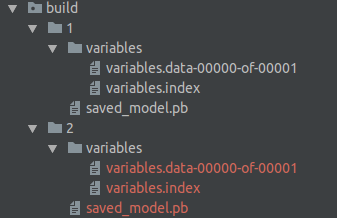

# TensorFlow 高级接口使用简介（estimator, keras， data, experiment）
TensorFlow 1.4正式添加了`keras`和`data`作为其核心代码（从contrib中毕业），加上之前的`estimator` API，现在已经可以利用Tensorflow像keras一样方便的搭建网络进行训练。`data`可以方便从多种来源的数据输入到搭建的网络中（利用`tf.features`可以方便的对结构化的数据进行读取和处理，比如存在`csv`中的数据，具体操作可以参考这篇[文档](https://developers.googleblog.com/2017/11/introducing-tensorflow-feature-columns.html)）；`keras`在搭建网络的时候，可以很大程度上避免由于Session和Graph的重用出现的一系列问题（不过现在`tf.keras`与原版的keras还是有不少区别的地方，因此使用的时候也是会遇上一些意外的问题）；而`estimator`提供了类似与`sklearn`中模型训练的语法，非常好上手，而且默认定义了多种常用的任务，在自定义`model_fn`的时候也能让人对训练过程更加清晰，而且`estimator`提供了`export_savedmodel`函数很方便将训练好的ckpt模型文件转成pb文件并结合 **docker** 和 **tensorflow serving** 进行灵活稳定的模型部署和更新。

## 1. `tf.data` 进行数据流操作（TFRecords）
在`keras`中有`keras.preprocessing.image.ImageDataGenerator()`类和`.flow_from_directory()`函数可以很容易将保存在 **文件夹** 下面的数据进行读取；也可以用`.flow()`函数将数据直接从np.array中读取后输入网络进行训练（具体可以查看[官方文档](https://keras.io/preprocessing/image/)）。在使用图片并以文件夹名作为分类名的训练任务时这个方案是十分简单有效的，但是Tensorflow官方推荐的数据保存格式是 **TFRecords**，而keras官方不支持直接从tfrecords文件中读取数据（`tf.keras`也不行，但是这个[issue](https://github.com/tensorflow/tensorflow/issues/8787)中提供了一些PR是可以的，keras作者不太推荐就是了），所以这里就可以用`data`类来处理从TFRecords中的数据（也可以用之前常用的`tf.train.batch()`或`tf.train.shuffle_batch()`来处理训练数据）。

Tensorflow官方提供了详细的文档来介绍`data`的机制和使用方法（看[这里](https://www.tensorflow.org/programmers_guide/datasets)），而对于TFRecords类型数据，主要利用 `tf.data.Iterator()`来抽取数据，这里简单说下从TFRecords中提取数据的方法：<br>
**以下代码为官方代码**

```python
def dataset_input_fn():
  filenames = ["/var/data/file1.tfrecord", "/var/data/file2.tfrecord"]
  dataset = tf.data.TFRecordDataset(filenames) # 制定提取数据的tfrecords文件

  # Use `tf.parse_single_example()` to extract data from a `tf.Example`
  # protocol buffer, and perform any additional per-record preprocessing.
  def parser(record):   # 对tfrecords中的数据进行解析的操作
    keys_to_features = {
        "image_data": tf.FixedLenFeature((), tf.string, default_value=""),
        "date_time": tf.FixedLenFeature((), tf.int64, default_value=""),
        "label": tf.FixedLenFeature((), tf.int64,
                                    default_value=tf.zeros([], dtype=tf.int64)),
    }
    parsed = tf.parse_single_example(record, keys_to_features)

    # Perform additional preprocessing on the parsed data.
    image = tf.image.decode_jpeg(parsed["image_data"])
    image = tf.reshape(image, [299, 299, 1])
    label = tf.cast(parsed["label"], tf.int32)

    return {"image_data": image, "date_time": parsed["date_time"]}, label

  # Use `Dataset.map()` to build a pair of a feature dictionary and a label
  # tensor for each example.
  dataset = dataset.map(parser)  # 一般就用map函数对输入图像进行预处理，而预处理函数可以包含在上面用于解析的parser函数
  dataset = dataset.shuffle(buffer_size=10000)  # 在训练的时候一般需要将输入数据进行顺序打乱提高训练的泛化性
  dataset = dataset.batch(32)  # 单次读取的batch大小
  dataset = dataset.repeat(num_epochs)   # 数据集的重复使用次数，为空的话则无线循环
  iterator = dataset.make_one_shot_iterator()  

  # `features` is a dictionary in which each value is a batch of values for
  # that feature; `labels` is a batch of labels.
  features, labels = iterator.get_next()  
  return features, labels  
  # return {"input": features, labels}  # 对于estimator的输入前者为dict类型，后者为tensor
```
**注:** `dataset.make_one_shot_iterator()`是最简单的Iterator类，不需要明确的initialization，并且目前这是唯一能够在estimator中容易使用的iterator。对于需要重新使用的Dataset类（比如结构相同的训练和测试数据集），一般是需要用 **reinitializable iterator** ，不过在estimator中由于上述问题，现在一般的做法是对训练集和验证集单独写两个pipeline用`make_one_shot_iterator`来处理数据流。

### 参考


## 2. Dataset + Keras
通过data处理TFRecords数据流，我们就可以使用keras来进行训练了。
```python
def architecture(input_shape=(_PATCH_SIZE, _PATCH_SIZE, 3)):
    """
    Model architecture
    Args:
        input_shape: input image shape (not include batch)

    Returns: an keras model instance
    """
    base_model = Xception(include_top=True,
                          weights=None,   # no pre-trained weights used
                          pooling="max",
                          input_shape=input_shape,  # modify first layer
                          classes=_NUM_CLASSES)
    base_model.summary()
    return base_model


def train(source_dir, model_save_path):
    """
    Train patch based model
    Args:
        source_dir: a directory where training tfrecords file stored. All TF records start with train will be used!
        model_save_path: weights save path
    """
    if tf.gfile.Exists(source_dir):
        train_data_paths = tf.gfile.Glob(source_dir+"/train*tfrecord")
        val_data_paths = tf.gfile.Glob(source_dir+"/val*tfrecord")
        if not len(train_data_paths):
            raise Exception("[Train Error]: unable to find train*.tfrecord file")
        if not len(val_data_paths):
            raise Exception("[Eval Error]: unable to find val*.tfrecord file")
    else:
        raise Exception("[Train Error]: unable to find input directory!")
    (images, labels) = dataset_input_fn(train_data_paths)
    model_input = keras.Input(tensor=images, shape=(_PATCH_SIZE, _PATCH_SIZE, 3), dtype=tf.float32, name="input")  # keras model的输入需要为keras.Input类型，但是直接使用tensorflow tensor类型也是可以的
    base_model = architecture()
    model_output = base_model(model_input)
    model = keras.models.Model(inputs=model_input, outputs=model_output)
    optimizer = keras.optimizers.RMSprop(lr=2e-3, decay=0.9)
    model.compile(optimizer=optimizer,
                  loss=focal_loss,
                  metrics=['accuracy'],
                  target_tensors=[labels])   # 1
    tensorboard = tf.keras.callbacks.TensorBoard(log_dir=model_save_path)
    model_checkpoint = tf.keras.callbacks.ModelCheckpoint(filepath=model_save_path+"/saved_model.h5")
    model.fit(steps_per_epoch=8000, epochs=_EPOCHS, callbacks=[tensorboard, model_checkpoint])


def evaluate(source_dir, weights_path):
    """
    Eval patch based model
    Args:
        source_dir: directory where val tf records file stored. All TF records start with val will be used!
        weights_path: model weights save path
    """
    # load model
    base_model = architecture()
    base_model.load_weights(weights_path)
    # load test dataset
    if tf.gfile.Exists(source_dir):
        val_data_paths = tf.gfile.Glob(source_dir+"/val*.tfrecord")
        if not len(val_data_paths):
            raise Exception("[Eval Error]: unable to find val*.tfrecord file")
    else:
        raise Exception("[Train Error]: unable to find input directory!")
    (images, labels) = input_fn(source_dir)
    probs = base_model(images)
    predictions = tf.argmax(probs, axis=-1)
    accuracy_score = tf.reduce_mean(tf.equal(probs, predictions))
    print("Accuracy of testing images: {}".format(accuracy_score))
```
**注:** 对于#1来说，根据keras model的compile函数的文档：
> target_tensors: By default, Keras will create placeholders for the model's target, which will be fed with the target data during training. If instead you would like to use your own target tensors (in turn, Keras will not expect external Numpy data for these targets at training time), you can specify them via the target_tensors argument. It can be a single tensor (for a single-output model), a list of tensors, or a dict mapping output names to target tensors.

定义了target tensor 之后就不需要再从外部输入数据了（fit的时候）。

而使用这种方式训练得到的的模型文件为h5,如果想要转换成用于tensorflow service的模型，需要用以下方式进行：a). fchollet提供的[keras式写法](https://blog.keras.io/keras-as-a-simplified-interface-to-tensorflow-tutorial.html)<br>
```python
# @1
from keras import backend as K

K.set_learning_phase(0)  # all new operations will be in test mode from now on

# serialize the model and get its weights, for quick re-building
config = previous_model.get_config()
weights = previous_model.get_weights()

# re-build a model where the learning phase is now hard-coded to 0
from keras.models import model_from_config
new_model = model_from_config(config)
new_model.set_weights(weights)
# @2
from tensorflow_serving.session_bundle import exporter

export_path = ... # where to save the exported graph
export_version = ... # version number (integer)

saver = tf.train.Saver(sharded=True)
model_exporter = exporter.Exporter(saver)
signature = exporter.classification_signature(input_tensor=model.input,
                                              scores_tensor=model.output)  # 分类
model_exporter.init(sess.graph.as_graph_def(),
                    default_graph_signature=signature)
model_exporter.export(export_path, tf.constant(export_version), sess)
```
或者tensorflow[官方的写法](https://github.com/tensorflow/serving/blob/master/tensorflow_serving/g3doc/serving_basic.md):
```python
import os
import tensorflow as tf
import keras.backend as K

def save_model_for_production(model, version, path='prod_models'):
    K.set_learning_phase(0)
    if not os.path.exists(path):
        os.mkdir(path)
    export_path = os.path.join(
        tf.compat.as_bytes(path),
        tf.compat.as_bytes(str(get_new_version(path=path, current_version=int(version)))))
    builder = tf.saved_model.builder.SavedModelBuilder(export_path)

    model_input = tf.saved_model.utils.build_tensor_info(model.input)
    model_output = tf.saved_model.utils.build_tensor_info(model.output)

    prediction_signature = (
        tf.saved_model.signature_def_utils.build_signature_def(
            inputs={'inputs': model_input},
            outputs={'output': model_output},
            method_name=tf.saved_model.signature_constants.PREDICT_METHOD_NAME))

    with K.get_session() as sess:
        builder.add_meta_graph_and_variables(
            sess=sess, tags=[tf.saved_model.tag_constants.SERVING],
            signature_def_map={
                'predict':
                    prediction_signature,
            })

        builder.save()
```

### 参考
- fchollet的[mnist example](https://github.com/keras-team/keras/blob/master/examples/mnist_tfrecord.py)
- https://stackoverflow.com/questions/46135499/how-to-properly-combine-tensorflows-dataset-api-and-keras
- https://blog.keras.io/keras-as-a-simplified-interface-to-tensorflow-tutorial.html

## 3. Dataset + estimator
可以用`tf.layers`函数来代替keras搭建网络，而且可以提供更丰富的layer。
```python
def xception():
    def tf_xception(features, classes=2, is_training=True):
    """
    The Xception architecture written in tf.layers
    Args:
        features: input image tensor
        classes: number of classes to classify images into
        is_training: is training stage or not

    Returns:
        2-D logits prediction output after pooling and activation
    """
    x = tf.layers.conv2d(features, 32, (3, 3), strides=(2, 2), use_bias=False, name='block1_conv1')
    x = tf.layers.batch_normalization(x, training=is_training, name='block1_conv1_bn')
    x = tf.nn.relu(x, name='block1_conv1_act')
    x = tf.layers.conv2d(x, 64, (3, 3), use_bias=False, name='block1_conv2')
    x = tf.layers.batch_normalization(x, training=is_training, name='block1_conv2_bn')
    x = tf.nn.relu(x, name='block1_conv2_act')

    residual = tf.layers.conv2d(x, 128, (1, 1), strides=(2, 2), padding='same', use_bias=False)
    residual = tf.layers.batch_normalization(residual, training=is_training)

    x = tf.layers.separable_conv2d(x, 128, (3, 3), padding='same', use_bias=False, name='block2_sepconv1')
    x = tf.layers.batch_normalization(x, training=is_training, name='block2_sepconv1_bn')
    x = tf.nn.relu(x, name='block2_sepconv2_act')
    x = tf.layers.separable_conv2d(x, 128, (3, 3), padding='same', use_bias=False, name='block2_sepconv2')
    x = tf.layers.batch_normalization(x, training=is_training, name='block2_sepconv2_bn')

    x = tf.layers.max_pooling2d(x, (3, 3), strides=(2, 2), padding='same', name='block2_pool')
    x = tf.add(x, residual, name='block2_add')

    residual = tf.layers.conv2d(x, 256, (1, 1), strides=(2, 2), padding='same', use_bias=False)
    residual = tf.layers.batch_normalization(residual, training=is_training)

    x = tf.nn.relu(x, name='block3_sepconv1_act')
    x = tf.layers.separable_conv2d(x, 256, (3, 3), padding='same', use_bias=False, name='block3_sepconv1')
    x = tf.layers.batch_normalization(x, training=is_training, name='block3_sepconv1_bn')
    x = tf.nn.relu(x, name='block3_sepconv2_act')
    x = tf.layers.separable_conv2d(x, 256, (3, 3), padding='same', use_bias=False, name='block3_sepconv2')
    x = tf.layers.batch_normalization(x, training=is_training, name='block3_sepconv2_bn')

    x = tf.layers.max_pooling2d(x, (3, 3), strides=(2, 2), padding='same', name='block3_pool')
    x = tf.add(x, residual, name="block3_add")

    residual = tf.layers.conv2d(x, 728, (1, 1), strides=(2, 2), padding='same', use_bias=False)
    residual = tf.layers.batch_normalization(residual, training=is_training)

    x = tf.nn.relu(x, name='block4_sepconv1_act')
    x = tf.layers.separable_conv2d(x, 728, (3, 3), padding='same', use_bias=False, name='block4_sepconv1')
    x = tf.layers.batch_normalization(x, training=is_training, name='block4_sepconv1_bn')
    x = tf.nn.relu(x, name='block4_sepconv2_act')
    x = tf.layers.separable_conv2d(x, 728, (3, 3), padding='same', use_bias=False, name='block4_sepconv2')
    x = tf.layers.batch_normalization(x, training=is_training, name='block4_sepconv2_bn')

    x = tf.layers.max_pooling2d(x, (3, 3), strides=(2, 2), padding='same', name='block4_pool')
    x = tf.add(x, residual, name="block4_add")

    for i in range(8):
        residual = x
        prefix = 'block' + str(i + 5)

        x = tf.nn.relu(x, name=prefix + '_sepconv1_act')
        x = tf.layers.separable_conv2d(x, 728, (3, 3), padding='same', use_bias=False, name=prefix + '_sepconv1')
        x = tf.layers.batch_normalization(x, training=is_training, name=prefix + '_sepconv1_bn')
        x = tf.nn.relu(x, name=prefix + '_sepconv2_act')
        x = tf.layers.separable_conv2d(x, 728, (3, 3), padding='same', use_bias=False, name=prefix + '_sepconv2')
        x = tf.layers.batch_normalization(x, training=is_training, name=prefix + '_sepconv2_bn')
        x = tf.nn.relu(x, name=prefix + '_sepconv3_act')
        x = tf.layers.separable_conv2d(x, 728, (3, 3), padding='same', use_bias=False, name=prefix + '_sepconv3')
        x = tf.layers.batch_normalization(x, training=is_training, name=prefix + '_sepconv3_bn')

        x = tf.add(x, residual, name=prefix+"_add")

    residual = tf.layers.conv2d(x, 1024, (1, 1), strides=(2, 2), padding='same', use_bias=False)
    residual = tf.layers.batch_normalization(residual, training=is_training)

    x = tf.nn.relu(x, name='block13_sepconv1_act')
    x = tf.layers.separable_conv2d(x, 728, (3, 3), padding='same', use_bias=False, name='block13_sepconv1')
    x = tf.layers.batch_normalization(x, training=is_training, name='block13_sepconv1_bn')
    x = tf.nn.relu(x, name='block13_sepconv2_act')
    x = tf.layers.separable_conv2d(x, 1024, (3, 3), padding='same', use_bias=False, name='block13_sepconv2')
    x = tf.layers.batch_normalization(x, training=is_training, name='block13_sepconv2_bn')

    x = tf.layers.max_pooling2d(x, (3, 3), strides=(2, 2), padding='same', name='block13_pool')
    x = tf.add(x, residual, name="block13_add")

    x = tf.layers.separable_conv2d(x, 1536, (3, 3), padding='same', use_bias=False, name='block14_sepconv1')
    x = tf.layers.batch_normalization(x, training=is_training, name='block14_sepconv1_bn')
    x = tf.nn.relu(x, name='block14_sepconv1_act')

    x = tf.layers.separable_conv2d(x, 2048, (3, 3), padding='same', use_bias=False, name='block14_sepconv2')
    x = tf.layers.batch_normalization(x, training=is_training, name='block14_sepconv2_bn')
    x = tf.nn.relu(x, name='block14_sepconv2_act')
    # replace conv layer with fc
    x = tf.layers.average_pooling2d(x, (3, 3), (2, 2), name="global_average_pooling")
    x = tf.layers.conv2d(x, 2048, [1, 1], activation=None, name="block15_conv1")
    x = tf.layers.conv2d(x, classes, [1, 1], activation=None, name="block15_conv2")
    x = tf.squeeze(x, axis=[1, 2], name="logits")
    return x


def model_fn(features, labels, mode, params):
    """
    Model_fn for estimator model
    Args:
        features (Tensor): Input features to the model.
        labels (Tensor): Labels tensor for training and evaluation.
        mode (ModeKeys): Specifies if training, evaluation or prediction.
        params (HParams): hyper-parameters for estimator model
    Returns:
        (EstimatorSpec): Model to be run by Estimator.
    """
    # check if training stage
    if mode == tf.estimator.ModeKeys.TRAIN:
        is_training = True
    else:
        is_training = False
    # is_training = False   # 1
    input_tensor = features["input"]
    logits = xception(input_tensor, classes=_NUM_CLASSES, is_training=is_training)
    probs = tf.nn.softmax(logits, name="output_score")
    predictions = tf.argmax(probs, axis=-1, name="output_label")
    onehot_labels = tf.one_hot(tf.cast(labels, tf.int32), _NUM_CLASSES)
    # provide a tf.estimator spec for PREDICT
    predictions_dict = {"score": probs,
                        "label": predictions}
    if mode == tf.estimator.ModeKeys.PREDICT:
        predictions_output = tf.estimator.export.PredictOutput(predictions_dict)
        return tf.estimator.EstimatorSpec(mode=mode,
                                          predictions=predictions_dict,
                                          export_outputs={
                                              tf.saved_model.signature_constants.DEFAULT_SERVING_SIGNATURE_DEF_KEY: predictions_output
                                          })
    # calculate loss
    # loss = focal_loss(onehot_labels, logits, gamma=1.5)
    gamma = 1.5
    weights = tf.reduce_sum(tf.multiply(onehot_labels, tf.pow(1. - probs, gamma)), axis=-1)
    loss = tf.losses.softmax_cross_entropy(onehot_labels, logits, weights=weights)
    accuracy = tf.metrics.accuracy(labels=labels,
                                   predictions=predictions)
    if mode == tf.estimator.ModeKeys.TRAIN:
        lr = params.learning_rate
        # train optimizer
        optimizer = tf.train.RMSPropOptimizer(learning_rate=lr, decay=0.9)
        update_ops = tf.get_collections(tf.GraphKeys.UPDATE_OPS)
        with tf.control_dependencies(update_ops):
          train_op = optimizer.minimize(loss, global_step=tf.train.get_global_step())
        tensors_to_log = {'batch_accuracy': accuracy[1],
                          'logits': logits,
                          'label': labels}
        logging_hook = tf.train.LoggingTensorHook(tensors=tensors_to_log, every_n_iter=1000)  
        return tf.estimator.EstimatorSpec(mode=mode,
                                          loss=loss,
                                          train_op=train_op,
                                          training_hooks=[logging_hook])
    else:
        eval_metric_ops = {"accuracy": accuracy}
        return tf.estimator.EstimatorSpec(mode=mode,
                                          loss=loss,
                                          eval_metric_ops=eval_metric_ops)


def get_estimator_model(config=None, params=None):
    """
    Get estimator model by definition of model_fn
    """
    est_model = tf.estimator.Estimator(model_fn=model_fn,
                                       config=config,
                                       params=params)
    return est_model


def train(source_dir, model_save_path):
    """
    Train patch based model
    Args:
        source_dir: a directory where training tfrecords file stored. All TF records start with train will be used!
        model_save_path: weights save path
    """
    if tf.gfile.Exists(source_dir):
        train_data_paths = tf.gfile.Glob(source_dir+"/train*tfrecord")
        val_data_paths = tf.gfile.Glob(source_dir+"/val*tfrecord")
        if not len(train_data_paths):
            raise Exception("[Train Error]: unable to find train*.tfrecord file")
        if not len(val_data_paths):
            raise Exception("[Eval Error]: unable to find val*.tfrecord file")
    else:
        raise Exception("[Train Error]: unable to find input directory!")
    train_config = tf.estimator.RunConfig()
    new_config = train_config.replace(model_dir=model_save_path,
                                      save_checkpoints_steps=1000,
                                      keep_checkpoint_max=5)
    params = tf.contrib.training.HParams(
        learning_rate=0.001,
        train_steps=5000,
        min_eval_frequency=1000
    )
    est_model = get_estimator_model(config=new_config,
                                    params=params)
    # define training config
    train_spec = tf.estimator.TrainSpec(input_fn=lambda: input_fn(data_path=train_data_paths,
                                                                  batch_size=_BATCH_SIZE,
                                                                  is_training=True),
                                        max_steps=_MAX_STEPS)

    eval_spec = tf.estimator.EvalSpec(input_fn=lambda: input_fn(data_path=val_data_paths,
                                                                batch_size=_BATCH_SIZE),
                                      steps=100,
                                      throttle_secs=900)
    # train and evaluate model
    tf.estimator.train_and_evaluate(estimator=est_model,
                                    train_spec=train_spec,
                                    eval_spec=eval_spec)


def evaluate(source_dir, model_save_path):
    """
    Eval patch based model
    Args:
        source_dir: directory where val tf records file stored. All TF records start with val will be used!
        model_save_path: model save path
    """
    # load model
    run_config = tf.contrib.learn.RunConfig(model_dir=model_save_path)
    est_model = get_estimator_model(run_config)
    # load test dataset
    if tf.gfile.Exists(source_dir):
        val_data_paths = tf.gfile.Glob(source_dir+"/val*.tfrecord")
        if not len(val_data_paths):
            raise Exception("[Eval Error]: unable to find val*.tfrecord file")
    else:
        raise Exception("[Train Error]: unable to find input directory!")
    accuracy_score = est_model.evaluate(input_fn=lambda: input_fn(val_data_paths,
                                                                  batch_size=_BATCH_SIZE,
                                                                  is_training=False))
    print("Accuracy of testing images: {}".format(accuracy_score))
```
**注:**
- **BN layer in estimator:** : ~~对于问题#1，在包含BN层的网络，正常情况下都是需要明确指定是否处于training状态（BN在训练和其他状态的计算方式是不同的），但是在 **1.4.1** 版本下，使用estimator进行训练的时候是正常（`is_training=True`），但是在evaluation的时候（`is_training=False`）输出的精度是初始化状态，并且随着`train_and_evaluate()`的多次调用，eval loss会变得很大。这应该是一个bug（具体问题可查看issue[13895](https://github.com/tensorflow/tensorflow/issues/13895)）, [16455](https://github.com/tensorflow/tensorflow/issues/16455)。而参考tensorflow官方给出的给予estimator的[resnet example](https://github.com/tensorflow/tensorflow/blob/master/tensorflow/examples/learn/resnet.py)中的BN layer在train stage的时候并没有设置`is_training=True`，所以这里把is_training关闭了，这样操作训练是正常的。~~ 这个错误是由于Tensorflow `tf.layers.batch_normalization()`函数调用方式不对导致的，根据这个函数的[官方文档]（https://www.tensorflow.org/api_docs/python/tf/layers/batch_normalization）：
> Note: when training, the moving_mean and moving_variance need to be updated. By default the update ops are placed in tf.GraphKeys.UPDATE_OPS, so they need to be added as a dependency to the train_op.

  需要明确手动添加update_ops作为dependency到update_ops:
  ```python
  update_ops = tf.get_collection(tf.GraphKeys.UPDATE_OPS)
  with tf.control_dependencies(update_ops):
    train_op = optimizer.minimize(loss)
  ```
  此外，**输入的图片的channel需要为3**
- **TensorHook for logging:** 在使用 **tensorhook** 打印训练日志的时候需要明确指`tf.logging`的verbosity level: `tf.logging.set_verbosity(tf.logging.INFO)`
- estimator自定义model_fn的时候需要根据model_fn的使用状态返回不同的EstimatorSpec，model_fn的定义需要符合以下格式，具体可以查看官方[文档](https://www.tensorflow.org/extend/estimators)： <br>
```python
def model_fn(features, labels, mode, params):
   # Logic to do the following:
   # 1. Configure the model via TensorFlow operations
   # 2. Define the loss function for training/evaluation
   # 3. Define the training operation/optimizer
   # 4. Generate predictions
   # 5. Return predictions/loss/train_op/eval_metric_ops in EstimatorSpec object
   return EstimatorSpec(mode, predictions, loss, train_op, eval_metric_ops)
```
model_fn有三种mode:`tf.estimator.ModeKeys.TRAIN`，`tf.estimator.ModeKeys.EVAL`， `tf.estimator.ModeKeys.PREDICT`，其中第一个必须要返回的为`loss`和`training_op`, 第二个是`loss`，第三个是`prediction`。
- **tf.metrics.accuracy:** 一般情况下EVAL的时候model_fn会返回`eval_metric_ops`，这个是一个dict，其值为`tf.metrics`的返回值（以`tf.metrics.accuracy()`为例，返回值如下）：
> accuracy: A `Tensor` representing the accuracy, the value of `total` divided by `count`.<br>
update_op: An operation that increments the `total` and `count` variables appropriately and whose value matches `accuracy`.

  但是这个函数在estimator模型中使用的时候有点反直觉：
  > tf.metrics.accuracy is not meant to compute the accuracy of a single batch. It returns both the accuracy and an update_op, and update_op is intended to be run every batch, which updates the accuracy.

  所以在上面代码中对每个batch算accuracy的时候算的是update_op而非accuracy，更多关于`tf.metrics.accuracy()`的讨论可以看这俩个issue：[15115](https://github.com/tensorflow/tensorflow/issues/15115), [9498](https://github.com/tensorflow/tensorflow/issues/9498)

### Export saved model
**Freeze model/export savedmodel for Tensorflow Serving**
使用estimator进行训练的一大好处就是进行分布式部署的扩展很容易，而部署需要的模型结构为(具体看[这里](https://github.com/tensorflow/tensorflow/blob/master/tensorflow/python/saved_model/README.md#components))：<br>

从训练的ckpt模型文件freeze从pb（protobuf）模型文件，estimator提供了`export_savedmodel`来帮助快速进行操作。<br>
```python
def serving_input_receiver_fn():
    """
    Build serving inputs
    """
    inputs = tf.placeholder(dtype=tf.string, name="input_image")
    feature_config = {'image/encoded': tf.FixedLenFeature(shape=[], dtype=tf.string)}
    tf_example = tf.parse_example(inputs, feature_config)
    patch_images = tf.map_fn(_preprocess_image, tf_example["image/encoded"], dtype=tf.float32)
    patch_images = tf.squeeze(patch_images, axis=[0])
    receive_tensors = {'example': inputs}
    features = {"input": patch_images}
    return tf.estimator.export.ServingInputReceiver(features, receive_tensors)


def save_serving_model():
    session_config = tf.ConfigProto(gpu_options=tf.GPUOptions(allow_growth=True))
    config = tf.estimator.RunConfig(model_dir=MODEL_WEIGHTS_PATH, session_config=session_config)  # session_config is used for configuration of session
    model = get_estimator_model(config=config)
    model.export_savedmodel(export_dir_base=SERVING_MODEL_SAVE_PATH, serving_input_receiver_fn=serving_input_receiver_fn)
```
如果需要在预测的时候调整sess的参数（ConfigProto），可以通过`tf.estimator.RunConfig`配置`session_config`的参数然后再输入到`tf.estimator.Estimator()`的config参数（如上面所示）。

### predict
一般通过export_savedmodel方式输出的模型是用tensorflow serving封装服务进行预测：<br>
```bash
# start tensorflow serving
$ bazel-bin/tensorflow_serving/model_servers/tensorflow_model_server --port=9000 --model_name=your_model_name --model_base_path=/your/model/base/path
```

```python
server = "localhost:9000"

def serving_predict(face_img):
    """
    Get prediction based on given face image
    Args:
        face_img: input image file
    Returns:
        anti-spoof detection result of given face
    """
    host, port = server.split(":")
    channel = implementations.insecure_channel(host, int(port))
    stub = prediction_service_pb2.beta_create_PredictionService_stub(channel)
    # creating request
    request = predict_pb2.PredictRequest()
    request.model_spec.name = "face_anti_spoof"
    request.model_spec.signature_name = "predict_images"
    # parse face img for serving
    with open(face_img, "rb") as f:
        serialized = f.read()
    example = tf.train.Example(features=tf.train.Features(feature={"image/encoded": bytes_feature(serialized)}))
    serialized = example.SerializeToString()
    request.inputs['inputs'].CopyFrom(tf.contrib.util.make_tensor_proto(serialized, shape=[1]))
    # predict results
    content = stub.Predict(request, timeout=5)
    labels = content.outputs["label"].int64_val
    prob = np.sum(labels) / len(labels)
    if prob > 0.5:
        label = LABELS[1]
    else:
        label = LABELS[0]
        prob = 1 - prob
    info = {"label": label, "prob": prob}
    return info
```
具体关于tensorlfow serving的用法会在之后的文章里面展开。

而生成的pb文件也可以直接加载不通过tensorflow serving来进行预测，不过由于estimator的`export_savedmodel`输出的pb文件中模型的保存格式为`tf.saved_model`类，所以加载模型用`tf.saved_model.loader`模块进行操作会比较方便（`sess.restore()`加载这个pb模型很容易报错= =）：
```python
def load_graph(trained_model):
    session_config = tf.ConfigProto()
    session_config.gpu_options.allow_growth = True
    sess = tf.Session(config=session_config)
    meta_graph_def = tf.saved_model.loader.load(sess, [tf.saved_model.tag_constants.SERVING], trained_model)
    # signature = meta_graph_def.signature_def
    # signature_key = tf.saved_model.signature_constants.DEFAULT_SERVING_SIGNATURE_DEF_KEY
    # print(signature[signature_key])
    return sess
sess = load_graph(model_path)

def predict_pb(image):
    """
    Predict input face is real or not using model stored in save_model.pb generated by estimator export_savedmodel
    Args:
        image: input image file
    """
    assert tf.gfile.Exists(image), "Input image file not found!"
    with open(image, "rb") as f:
        image_bytes = f.read()
    example = tf.train.Example(features=tf.train.Features(feature={"image/encoded": bytes_feature(image_bytes)}))
    serialized = example.SerializeToString()
    input_tensor = sess.graph.get_tensor_by_name("input_image:0")
    labels = sess.graph.get_tensor_by_name("output_label:0")
    scores = sess.graph.get_tensor_by_name("output_score:0")
    (labels, scores) = sess.run([labels, scores], feed_dict={input_tensor: [serialized]})
    return labels, scores
```

### 参考
1. estimator tutorial
- https://www.tensorflow.org/versions/r1.5/get_started/custom_estimators
- https://developers.googleblog.com/2017/12/creating-custom-estimators-in-tensorflow.html
- https://www.tensorflow.org/extend/estimators
- https://www.damienpontifex.com/2017/09/19/mnist-with-tensorflow-experiments-and-estimators/
2. estimator example
- https://github.com/tensorflow/models/blob/master/official/mnist/mnist.py
- https://github.com/tensorflow/tensorflow/blob/master/tensorflow/examples/learn/resnet.py
- https://github.com/tensorflow/models/blob/master/samples/outreach/blogs/blog_custom_estimators.py
- https://github.com/tensorflow/tensorflow/blob/master/tensorflow/examples/learn/iris_custom_model.py
3. discussion
- https://github.com/tensorflow/tensorflow/issues/1122
- https://github.com/tensorflow/tensorflow/issues/15115
- https://github.com/tensorflow/tensorflow/issues/9498
4. tf.layers
- https://www.tensorflow.org/tutorials/layers
- https://www.tensorflow.org/api_docs/python/tf/layers
5. BN layer
- http://ruishu.io/2016/12/27/batchnorm/
- https://github.com/tensorflow/tensorflow/issues/4361
6. export & load saved model and predict
- https://stackoverflow.com/questions/43667018/locally-load-saved-tensorflow-model-pb-from-google-cloud-machine-learning-engin
- https://stackoverflow.com/questions/33759623/tensorflow-how-to-save-restore-a-model
- https://stackoverflow.com/questions/46513923/tensorflow-how-and-why-to-use-savedmodel
- https://stackoverflow.com/questions/46098863/how-to-import-an-saved-tensorflow-model-train-using-tf-estimator-and-predict-on
- https://www.tensorflow.org/api_docs/python/tf/saved_model/loader
- https://github.com/tensorflow/tensorflow/blob/master/tensorflow/python/saved_model/README.md
- https://github.com/tensorflow/serving/blob/master/tensorflow_serving/example/inception_saved_model.py
- https://github.com/tensorflow/serving/issues/478
7. estimator gpu options setting
- https://github.com/tensorflow/tensorflow/issues/9831
- https://github.com/tensorflow/tensorflow/issues/13458
-

## 4. keras + estimator + dataset
大部分与上面相同，只是用`keras.estimator.model_to_estimator()`函数直接将keras model直接转换成estimator model而不用自己定义model_fn，这种方式对于模型训练十分简单友好，但是在使用Tensorflow estimator的`export_savedmodel()`函数的时候会报错，原因是缺少`export_outputs`（在自定义model_fn的时候好像也并没有需要明确定义export_outputs变量，非常微妙的报错），而用官方的做法转化模型的时候又会报 **BN层参数没有初始化** 的错误（Attempting to use uninitialized value bn_xx）（又是BN层， 跟之前一样可能是由于graph重用引起的错误），因此用这种方式训练的模型暂时还没有找到转化成Tensorflow serving所需的模型的方法。
```python
def model_fn(model_dir=".", input_shape=(_PATCH_SIZE, _PATCH_SIZE, 3)):
    """
    Convert keras model to estimator model
    Args:
        model_dir: absolute model save directory
        input_shape: input image shape (not include batch)

    Returns: an estimator model instance
    """
    with K.name_scope("model"):
        base_model = tf.keras.applications.Xception(include_top=True,
                              weights=None,   # no pre-trained weights used
                              pooling="max",
                              input_shape=input_shape,  # modify first layer
                              classes=_NUM_CLASSES)
        base_model.summary()
        model_input = keras.Input(shape=input_shape, dtype=tf.float32, name="input_1")
        model_output = base_model(model_input)
        model = keras.models.Model(inputs=model_input, outputs=model_output)
        optimizer = keras.optimizers.RMSprop(lr=2e-3, decay=0.9)
        model.compile(optimizer=optimizer,
                      loss=focal_loss,
                      metrics=['accuracy'])
        if model_dir == ".":
            model_dir = os.path.dirname(os.path.abspath(__file__))
        elif not model_dir.startswith("/"):  # relative path to abs path
            model_dir = os.path.join(os.path.dirname(os.path.abspath(__file__)), model_dir)
        if not os.path.exists(model_dir):
            os.makedirs(model_dir)
        # define training config
        run_config = tf.estimator.RunConfig(save_checkpoints_steps=2000,
                                            keep_checkpoint_max=5)
        # convert keras model to estimator model
        est_model = keras.estimator.model_to_estimator(model, model_dir=model_dir, config=run_config)
        return est_model
```

### 参考
- https://www.dlology.com/blog/an-easy-guide-to-build-new-tensorflow-datasets-and-estimator-with-keras-model/
- https://cloud.google.com/blog/big-data/2017/12/new-in-tensorflow-14-converting-a-keras-model-to-a-tensorflow-estimator
- https://github.com/tensorflow/tensorflow/issues/14198

## 5. estimator + experiment + datasets
在1.4中estimator model有`train_and_evaluate()`函数进行开始模型的train和evaluate，也可以直接用`model.train()`和`model.evaluate()`函数（类似keras model的fit和evaluate函数）；不过可以用`tf.contrib.learn.Experiment()`来代替（需要定义experiment类，比较麻烦）。大部分与estimator model相同，需要定义`experiment_fn`如下：
```python
from tensorflow.contrib.learn import learn_runner

def experiment_fn(run_config, params):
    """
    Create an experiment to train and evaluate the model
    Args:
        run_config: configuration for estimator
        params: Hparams object returned by tf.contrib.training.HParams
    Returns:
        Experiment object
    """
    if tf.gfile.Exists(FLAGS.train_data_dir) and tf.gfile.Exists(FLAGS.val_data_dir):
        train_data_paths = tf.gfile.Glob(FLAGS.train_data_dir+"/train*tfrecord")
        val_data_paths = tf.gfile.Glob(FLAGS.val_data_dir+"/val*tfrecord")
        if not len(train_data_paths):
            raise Exception("[Train Error]: unable to find train*.tfrecord file")
        if not len(val_data_paths):
            raise Exception("[Eval Error]: unable to find val*.tfrecord file")
    else:
        raise Exception("[Train Error]: unable to find input directory!")
    estimator = get_estimator_model(config=run_config, params=params)

    def train_input_fn():
        return input_fn(data_path=train_data_paths, batch_size=_BATCH_SIZE, is_training=True)

    def eval_input_fn():
        return input_fn(data_path=val_data_paths, batch_size=_BATCH_SIZE, is_training=False)

    experiment = tf.contrib.learn.Experiment(
        estimator=estimator,
        train_input_fn=train_input_fn,
        eval_input_fn=eval_input_fn,
        train_steps=params.train_steps,
        min_eval_frequency=params.min_eval_frequency,
    )
    return experiment


def run_experiment():
    """
    Run the training experiment
    """
    params = tf.contrib.training.HParams(
        learning_rate=0.002,
        n_classes=_NUM_CLASSES,
        train_steps=5000,
        min_eval_frequency=100
    )
    run_config = tf.contrib.learn.RunConfig(model_dir=FLAGS.save_dir,
                                            save_checkpoints_steps=1000,
                                            keep_checkpoint_max=5)
    experiment = experiment_fn(run_config=run_config, params=params)
    experiment.train_and_evaluate()
    # learn_runner.run(
    #     experiment_fn=experiment_fn,  # first class function
    #     run_config=run_config,
    #     schedule='train_and_evaluate',
    #     hparams=params
    # )
```

### 参考
- https://medium.com/onfido-tech/higher-level-apis-in-tensorflow-67bfb602e6c0
