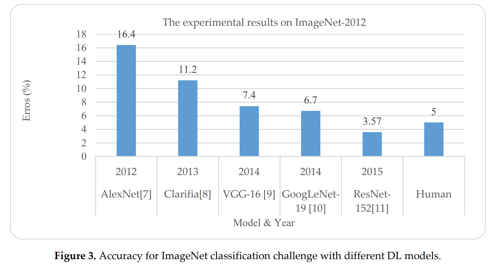
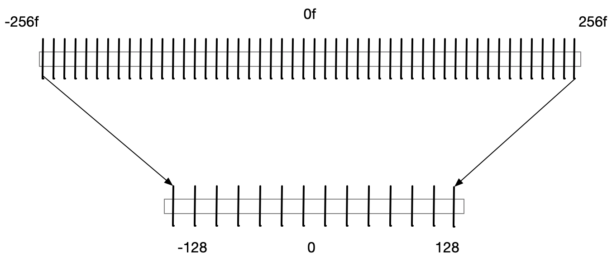
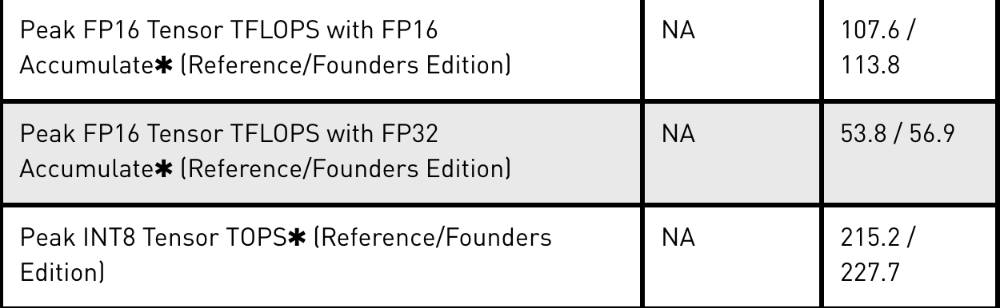
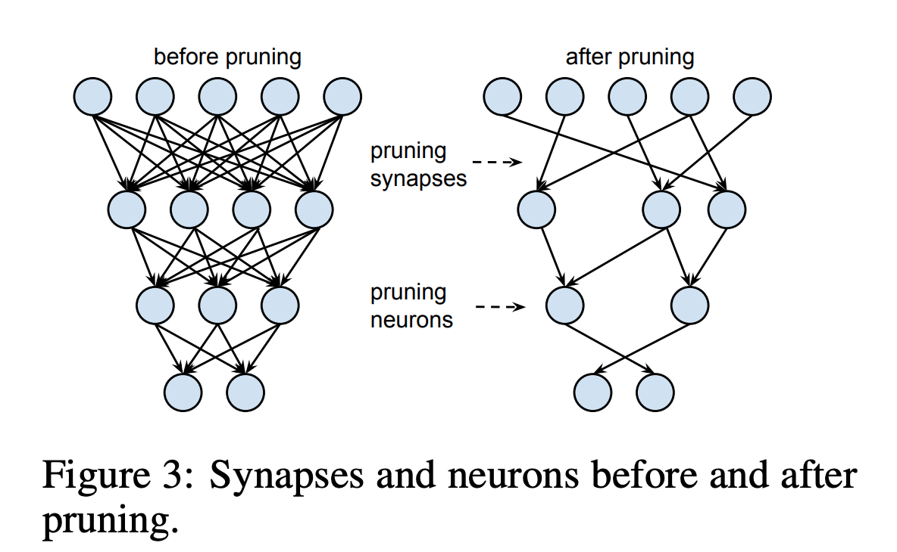
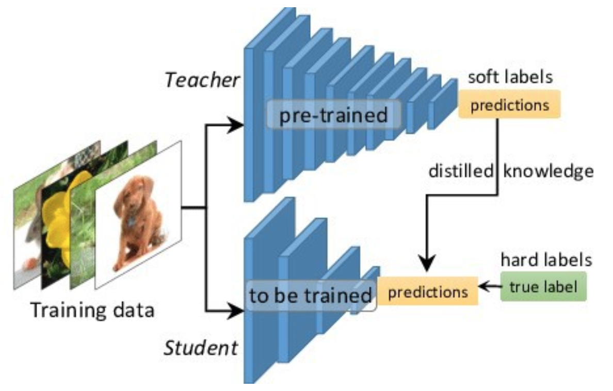
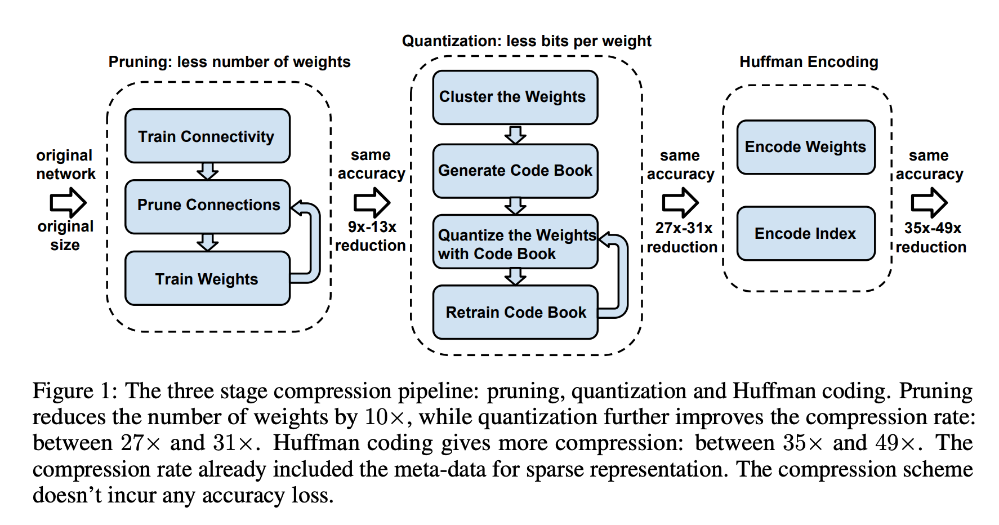

# 模型加速科普

自从2012年深度学习先驱Geoffrey Hinton的弟子Alex Krizhevsky凭借深度神经网络以巨大优势赢得当年ImageNet图像分类挑战赛之后，这一人工智能联结主义学派的代表深度神经网络便在学术和工业界引发了一场深度学习的巨大浪潮。学术界为了追求更好的性能研究更强大也更复杂的网络结构，网络的层数从AlexNet的5层卷积层扩展到了ResNet的上千层，而模型的复杂化带来的效果也是非常显著的，在图像识别领域，2015年的ResNet152的识别准确率就已经超过人类水平了。而在其他例如语音识别，自然语言处理，机器翻译等领域上，深度学习也去的了巨大的成功。

(来源：[A State-of-the-Art Survey on Deep Learning Theory and Architectures]( https://www.mdpi.com/2079-9292/8/3/292/pdf-vor)：2012-2015 ImageNet竞赛冠军模型的识别错误率)

## 为啥要做模型加速

回答这个问题，首先需要了解到深度学习是怎么成功的：为什么深度神经网络在现在这个时代能成功而不是在上世纪80，90年代呢？相比于之前，主要的突破来自以下几个方面：一是诸如随机梯度下降之类的优化算法的改进，二是越来越大的标注数据集，三是引入能够满足模型训练和推理巨大算力需求的GPU这种高性能计算硬件。尤其是最后一条，基本说的就是英伟达老黄家生产的核弹级GPU和与之配套的CUDA高性能计算库，Intel家的集显基本没啥存在感。

（来源：来着I卡好基友微软Azure的["助攻"](https://azure.microsoft.com/en-ca/blog/gpus-vs-cpus-for-deployment-of-deep-learning-models/): 不同模型在CPU和GPU上的图像分类任务的表现）

但是昂贵的GPU（不了解行情的出门左拐卡吧和图吧）集群，比如40K刀的DGX集群可以了解下，在让老黄赚的彭满钵满的同时也让一票立志AI改变世界的工业界和学术界人士非常不开心，因为工业界的应用对成本非常敏感，毕竟是要用来赚钱恰饭的嘛。因此，像google这种有能耐的大厂一般扭头开发自家的AI芯片（TPU）从源头上省钱，而更多没能力任性的软件公司只能要么趁某某电商搞秒杀活动的时候像黄牛一样屯点显卡，要么就想着法把各种租的买的卡上提高下利用率榨点油水，巴不得能像挖矿一样把卡跑满，然后还得经常接受来自各方dalao的灵魂拷问："贵司有多少张显卡来训练模型和部署服务呀（笑）？"。因此，回到问题上来，模型加速的对应的第一个问题就是工业界最关心的**效率**问题：**如何将算法能够稳定高效地部署到硬件上使之能够产生最大的价值。**

进行模型加速的第二个目标就是**快**！很多场景对速度的要求是非常高的：最容易联想到的场景就是深度神经网络图像处理技术密集使用的无人驾驶，在这种刹车慢个0.5s都会造成重大事故的场景下，对模型的推理速度永远是要求极高的（可以想象下顶着2秒高ping玩吃鸡的感觉来帮助理解下，是不是特别容易成盒）。另一个场景是在**移动设备**上在移动应用中注入AI能力，这是在移动互联网遇到AI时的必然反应。现在比较著名的应用有各家推出的人工智障语音服务助手，Siri，小爱同学啥的。在现在这种出门会忘记钥匙但不会忘记手机的年代，手机这种本来不是作为生产力工具的设备承受了它这个年纪不该有的压力：在这种弱鸡设备上，用户表示在不加钱的前提下低延迟实时的高性能模型和数据不上传本地运行的隐私安全我都想要。因此，模型加速的第二个目标就是**如何在性能受限的设备上部署能够满足需要的模型**。加速后的模型的参数和计算量更小从而可以有效降低计算和存储开销，能够部署到移动端这种性能受限的设备上。关于移动端性能，这里说组数据：移动端常见的ARM芯片的A72大核的算力大概是30G FLOPs，而桌面端大家认为很弱鸡的Intel酷睿i3的算力是1000G，也就说如果要把在服务器端进行推理的模型拿来放在移动端上去运行，这个加速比例至少是30倍以上。嗯，好南啊。

## 如何进行模型加速

模型加速的一般是对**已经训练好**的深度模型进行精简来得到**轻量且准确率相当**的模型。这里有一个重要的**前提**：**深度神经网络并不是所有的参数都在模型中发挥作用，大部分参数其实是冗余的，只有一小部分对模型的性能产生关键作用**。根据这一前提条件，目前工业界主要通过以下几种方式对模型进行加速：包括不会改变网络机构的**权值量化，知识蒸馏，紧凑型神经网络的设计**和会改变网络的**网络剪枝**。学术界和工业界对着几个方向的研究侧重点略优差异：前者对经凑型神经网络的设计更感兴趣，毕竟是从源头上解决问题的方法；而后者对剪枝量化这种偏向工程实现的更关注，毕竟加速效果稳定可控。这里主要简单讲下我们在生产中比较常用的几种方式：1) 权值量化；2）知识蒸馏； 3）网络剪枝。至于轻量化的紧凑神经网络，这个涉及的内容太多，以后有机会再讲。

### 1. 权值量化

量化的思路简单概括下就是**把相近的值变成一个数**。最常用的量化方式就是INT8量化，即把神经网络里面的原来用精度浮点数（FP32）存储的权值和计算中间值用整形（INT8）表示。计算机中的值都是用二进制存储的，FP32是用32bit来存储，INT8是用8个bit来存储。从下图可以看到，FP类型用了23bit来表示小数部分，因此使用INT8集意味着只能用更稀疏的值和更小的数值范围（-127~128），小数的部分和超过128的部分都会被省略，如果直接就这样量化，那么这部分损失的值就会极大的影响模型精度。

（来源：wiki：fp32的存储方式）

（FP32量化到INT8的值的变化）

那既然会影响精度，为什么我们还是要冒着风险去做量化呢？富贵险中求呗。使用INT8类型可以极大极高模型的运行速度。这主要是两个方面的原因：一方面是现代的计算芯片对于低bit的数值计算要比高bit的快很多，尤其是现在很多AI芯片都设计了专门的INT8计算核来专门处理INT8数值的计算，比如瑞星微出品的RK3399 pro芯片就带了一个算力达3T FLOPs的NPU；另一方面是计算机内存和GPU显存加载8bit的数值速度更快，显存消耗更小，同样的显存下就可以加载更多更大的网络进行计算。

（来源：https://devblogs.nvidia.com/nvidia-turing-architecture-in-depth/：RTX2080ti对FP32，FP16和INT8数值计算时的算力）

那么为什么INT8数值类型在深度神经网络中中能够应用呢？不是有数值精度损失么？主要原因有两个：

- **训练好的深度神经网络网络是出了名的对噪声和扰动鲁棒性强。**

- **大部分训练好的权重都落在一个很小的区间内。**

这个是有dalao的文章作为理论支撑的，Han Song在ICLR2016发表的[DEEP COMPRESSION: COMPRESSING DEEP NEURAL NETWORKS WITH PRUNING, TRAINED QUANTIZATION AND HUFFMAN CODING](https://arxiv.org/pdf/1510.00149.pdf)作为神经网络压缩的开山大作里面就对AlexNet网络的卷积层的权重分布进行了分析。下面左边这个图就是其中一层神经网络的权重，基本上分布在-0.1到0.1之间。

如果进行4bit量化，4bit能够最大表示16个数值，因此大部分权重都有塌缩，能够保持原来的值的只有16个值，这16个值的分布如右图所示，分布的图形还是挺吻合的。那么如果进行8bit的量化，最大能够保持256个值，对原始权重的保留会更加完整，量化造成的数值损失会很小。

根据这个特性，最直观、最简单量化方式就是**乘一个系数把FP32类型的小数部分缩放为整数，然后用这个INT8整数进行计算，计算结果再除以这个系数还原成FP32的值**。因为数值集中在很小的范围内，因此缩放的时候就不太需要担心会有大量的值转化后会溢出INT8的表示范围。因此对于实际值和量化值的映射关系，一般可以用以下公式表示：

$r= (r_{max}-r_{min})/(2^B-1)-0*(q-z)$

其中，r表示实际值；q表示量化的比特数，比如int8量化就是8；z表示量化后的0点值。在实际操作中，缩放比例、进行缩放的原始数值的最大最小值边界这些值都是需要反复调试优化的，优化较好的量化加速效果4倍的情况下一般能够保持模型的精度损失不超过0.5%。

### 2. 网络剪枝

另一项比较重要的神经网络的加速方法就是模型减枝，剪枝这个方式在许多经典的机器学习中也非常常见，比如决策树，GBM算法。在神经网络中，剪枝原理受启发于人脑中的突触修剪，突触修剪即轴突和树突完全衰退和死亡，是许多哺乳动物幼年期和青春期间发生的突触消失过程。突触修剪从出生时就开始了，一直持续到 20 多岁。你看，这不光有理论基础还有还具有生物学基础。

前面提到过，神经网络的参数量非常多，而其中大部分的参数在训练好之后都会集中在0附近，对整个网络的贡献非常小。剪枝的目的就是把这些对网络贡献很小的节点从网络中删除，从而使**网络变得稀疏，需要存储的参数量变少**。当然后遗症也是有的，一方面模型的精度会有所下降，另一方面从某种玄学的角度来说那些冗余的参数可能是神经网络鲁棒性强的原因，因此剪完枝模型的鲁棒性也会有所损失。

经典的剪枝方法是**使用预训练模型进行裁剪，裁剪的原则就是设定一个阈值或一定的裁剪比例，然后把低于阈值的权值抛弃，再使用训练集进行微调来得到最后的剪枝模型**。这种方法操作上非常简单，裁剪的评价指标有很多种，比如权重大小，权重梯度大小，权重独立性等，但是往往要耗费非常多的时间来进行反复调参和微调训练。这种就是现在主流的结构化剪枝方法，裁剪的粒度比较粗，对神经网络整个层进行裁剪，损失的精度相对来说比较大，但是优势在于不用关心使用的模型和硬件，**通用性**很好。

（来源：HanSong 2015 [NIPS](https://papers.nips.cc/paper/5784-learning-both-weights-and-connections-for-efficient-neural-network.pdf)：神经元剪枝前后的结构）

后来的研究又提出了效果更好的非结构化剪枝方法，裁剪的粒度较细，可以对神经网络层的单个神经元进行剪枝，精度损失比较小，但是依赖于特定算法与硬件平台，操作起来比较复杂。另外，随着强化学习和生成对抗网络在深度学习领域的广泛应用，越来越多的剪枝算法使用强化学习和对抗生成网络产生剪枝模型。强化学习可以使用机器自动搜索剪枝模型空间，根据剪枝要求获取最佳的剪枝模型。生成对抗网络同样可以在对抗网络的指导下，使得生成器生成满足需求的剪枝模型。自动搜索是不是听上去很赞？代价么就是献祭电表+显卡+dalao喽，所以对于长期挣扎在显卡低保线上的公司前面的一般来说方法更加友好。

### 3. 知识蒸馏

在使用了上面两种方式加速方式还不能满足需要的话，这个时候就可以试试15年Hinton老爷子和Google创世julao Jeff Dean提出来黑魔法：[知识蒸馏](https://arxiv.org/abs/1503.02531)（15年真是个神奇的一年）。这个方法的思路也是非常的直观，典型的大力出奇迹的选手。在很多任务上，**复杂的大网络一般表现都会比简单的小网络表现要强**。换句话说就是数据输入大网络输出的特征更能够贴合任务的需求。但是，无论大网络还是小网络，大家的老师都已一样的：**训练数据**。都是同一个老师教的，凭啥大网络就这么优秀呢？不好意思，参数多就是可以为所欲为，小网络的学习能力就是那么菜鸡。

那么既然小网络的学习能力不太行，光靠老师学不好那就换个思路，找优等生同学辅导一下呗，让优等生能够用菜鸡也听得懂的语言再把老师的教的再解释一遍，最终让小网络的理解能力至少向优等生大网络靠拢。这个就是知识蒸馏的思路，**即使用轻量的紧凑小网络在模型训练的时候加入在改数据集上训练收敛好的大网络作为而外的监督信息，使小网络能够拟合大网络，最终学习到与大网络类似的函数映射关系。那么在部署的时候我们就可以用跑的快的小网络替换大网络来执行任务**。那么为什么要说这是黑魔法呢，正如前提提到的那样，深度神经网络包含大量冗余参数，使用小网络可以认为是删除了大网络的冗余参数的结果，这些参数的丢失可能会导致模型精度下降，但也有可能导致模型效果反而更好，所以从效果上来说有点随缘看脸。

（来源：https://towardsdatascience.com/knowledge-distillation-simplified-dd4973dbc764： 知识蒸馏方法的基本结构）

知识蒸馏可以实现深度神经网络计算量最大的骨架网络的替换，从方法论上比较通用，因此在很多图像任务中都有很强的应用价值，而从加速效果上来说，使用的小网络计算量越小，加速倍数就越多，当然一般这种情况下的模型学习效果也越差，精度损失越大（毕竟王者也不是能够带的动每一个青铜啊）。但是不同的任务对网络抽取的特征的使用方式差异还是比较大的，一般来说需要根据不同的任务调整蒸馏方法的策略，这两年在顶会上也能见到不少做这个不同领域蒸馏技术改进的文章。

### 4. 关于我们

最后，说了这么多，那我们在生产中是如何运用的呢？很简单，坚决贯彻以HanSong dalao方法论为核心，剪枝，蒸馏，量化一把梭的行动方针，最终实现加速30倍的远大目标。以后啊，在外面听人讲的时候不要听风就是雨，什么xx服务单卡支持QPS上百，计算设备硬件只要几百块，自信点，不就是一把梭的事么~

