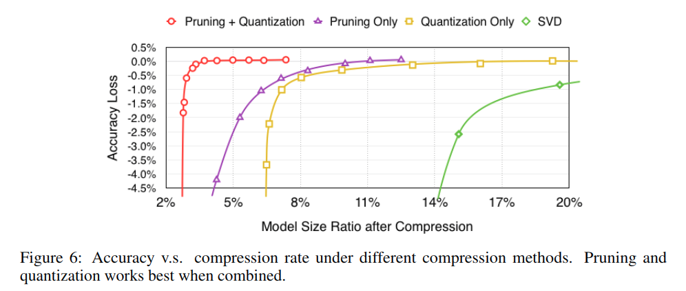

# Model Compression Methods Summary
**[Summary of Methods:](https://arxiv.org/pdf/1710.09282.pdf)** 

## 1 . 矩阵分解(Matrix Factorization)
  - 1). **SVD(singular value decomposition) (2015)**([Paper](https://arxiv.org/pdf/1412.6115.pdf))  
    **核心原理: 大部分weights是fc层产生的**, 而W矩阵通过SVD可以分解为三个小矩阵降低模型参数:  
    

    

    带来的好处就是:  
    - 降低计算时内存占用: 在fc层计算减少5-13x  
    - 提高运算速度: 时间复杂性从O(nmk)降到O(nmt + nt^2 + ntk)  
    - 提高模型泛化能力:low-rank projection显著减少learnable parameters  

    Experiment:  
    

  - 2). **Flattened Convolutions (2014)**([Paper](https://arxiv.org/abs/1412.5474)) 
    **核心原理: 大部分计算时间用于卷基计算**,将3D卷积计算用3次1D的卷积计算能显著降低计算量和参数. 
    

    

    此外,卷积flatten与SVD等价([Paper](https://arxiv.org/abs/1404.0736)):  
    

    Experiment Result:  
    

## 2. 权值剪枝(weights pruning)
  - 1). **Magnitude-based Method**
    - a). *Iterative Pruning + retraining (2015)* ([Paper](https://arxiv.org/abs/1506.02626))  
      **核心原理:** 将训练好的模型根据权值的大小进行剪枝(阈值τ),然后重新训练(可重复以上步骤).有一个为地方需要注意点是在文章里pruning之后的retrain需要的时间是比原来要长的(75h vs 173h).
      

      对于AlexNet模型剪枝之后的模型参数量: 
      

      剪枝的数量对精度的影响,这点可以作为模型压缩最后输出大小的参考: 
      

      **缺点:** 由于减掉的连接是没办法恢复的,所以误剪很有可能导致严重的精度损失甚至在后面的retrain中恢复不了,一方面需要很 **长时间的retrain** 来恢复精度,另一方面限制了模型的 **压缩效率**.

    - b). *Pruning with rehabilitation (2016)* ([Paper](https://arxiv.org/pdf/1608.04493.pdf))  
      **核心原理:** 针对前一个方法的缺点,这种方法不直接删除连接,而是在训练的时候将 **不太重要的连接权值置为0**,阻止其传播到下一层.具体操作如下: 在train的时候对计算k层的loss的权值Wk添加一个Tk的mask,如果权值小于阈值ak,那么Tk=0,如果位于ak和ak+t(t为很小的margin)之间为保持输入值(没有prune和slice),大于ak+t的时候Tk=1. (一般来说,直接使用根据每一层的平均绝对值和方差的ak也能满足需求,但是这里通过添加t获取两个阈值用来提高方法的鲁棒性).
      

      Experiment Result(包括与前一种方法的对比): 
      
  - 2). **Hessian-based method**
    - a). *Optimal Brain Damage (1990)* ([Paper](http://yann.lecun.com/exdb/publis/pdf/lecun-90b.pdf))  
      **核心原理**: 用saliency评价权重对training error的影响,通过构建一个理论上合理的saliency评估方法,将saliency小的链接删除.

      首先通过泰勒级数定义一个objective function *E*,参数变动对 *E* 的影响就是参数的saliency.  
      

      通过①忽视交叉项(第3项)和由于②pruning是在模型已经收敛之后进行的从而忽视一阶导数项(第1项)以及③忽视在二次近似中的三次项(最后项),可以将上式简化为:  
      

      **训练流程:**  
      训练好模型后计算每个参数的二阶导,通过上式计算E然后排序,删除低saliency的参数后重新训练.

      Experiment Result:  
      与之前Magnitude方法的对比:  
      

      重新训练的效果:  
      )
    - b). *Optimal Brain Surgeon (1993)* ([Paper](https://authors.library.caltech.edu/54983/3/647-second-order-derivatives-for-network-pruning-optimal-brain-surgeon%281%29.pdf)])  
      **核心原理:** 与OBD相比,对saliency的估计更加准确,并且直接提供权重更新,可以最小化objective function的改变;但是需要更多的计算量,而且权重的更新就不是最小化objection function本身的值.

      objective function如下: 
      
      其中`H=∂^2E/∂w^2`是Hessian矩阵,通过与前一种方向相似的简化可转化为只保留第二项`1/2δw^-T.H.δw`,prune的目标就是: 
      
      通过拉格朗日形式求解: 
      

      **训练流程:**
      训练好模型后计算H^-1,根据最小的Lq找出q,如果E的增加很少,权重q需要被删除并用上面的δw方式来更新所有权重;反之则保留权重q.

      Experiment Result:  
      OBS与OBD的对比:  
      

## 3. 量化(quantization method)
  - 1). **Full quantization**
    - a). *Fixed point format (2015)* ([Paper](https://arxiv.org/pdf/1502.02551.pdf)) 
      **核心原理:** 一个数可以分解为[QI, QF],其中QI对应整数部分,QF对应小数部分.这个数的bit数可以用整数的bit数(IL)+小数bit数(QL)表示,宽度就是WL=IL+FL.用<IL,FL>来表示数的fixed-point形式,这限制了FL bit的精度,其范围为`[-2^IL-1, 2^IL-1-2^-FL]`,定义ϵ为给定的fixed-point形式下最小的正数,为`-2^FL`.⌊x⌋定义为ϵ的小于或等于x的最大整数倍形式,通过rounding将高精度的float类型的x转成低精度的fixed-point类型进行训练: 
      
      并把<IL,FL>上下界以外的值saturate到界内:  
      

      **训练流程:** 
      将a,b两个d维向量转换成fixed-point形式,首先计算`z=Σ(d, i=1)ai.bi`,结果的fixed-point形式为<2*IL, 2*FL>,然后在用Convert函数`c0=Convert(z, <IL_hat, FL_hat>)`重新转成<IL, FL>形式.

      分成两步来计算的的好处为①模拟 **FPGA** 中DSP硬件中矩阵内积的计算方式(DSP接受18bits输入,然后积在48bits寄存器中积累MACC的计算结果).②在累加之后在用rounding可以有效减少硬件overhead③这种方式用CPU/GPU中容易模拟fixed-point计算.

      Experiment Result: 
      Fixed-point形式在fc层和cnn层训练的效果如下: 
      

      
    - b). *Code Book (2014)*([Paper](https://arxiv.org/pdf/1412.6115.pdf))  
      **核心原理:** 相比于简单的对weights进行二值化: 
      通过对weights进行kmeans聚类,weights的每个column进行单独的kmeans聚类,weights与聚类中心c的残差进行聚类迭代,将weights用k值化. 
      

      

      Experiment Result:  
      PQ不同k的结果: 
      

      不同quantization的比较: 
      

    - 2). **quantization with full precision copy**  
      - a). *Binaryconnect (2016)* ([Paper](https://arxiv.org/pdf/1511.00363.pdf))([Code](https://github.com/MatthieuCourbariaux/BinaryConnect)) 
        **核心原理**:只用+1/-1对weights进行二值化,这样可以把很多乘法累加操作变成单纯的累加操作,定制化的DL硬件层面对这种操作很好的适配.

        二值化有两种操作,其中Stochastic binarization 会对训练起regularizer的作用,效果比dropout略差,但是需要在quantizing的时候产生随机bit因此对硬件的要求更高. 
        

        Stochastic和determinstic的regularizer效果: 
        
        **训练流程** 
        在前向和后向计算的时候对weights进行binarization,但是在参数update的时候用原本的full-precision的weights. 
        

        Experiment Result:  
        不同方法在minst和cifar数据集上的错误率: 
        

      - b). *BNN (2016)* ([Paper](https://arxiv.org/pdf/1602.02830.pdf))([Code](https://github.com/itayhubara/BinaryNet)) 
        **核心原理:** 将所有weights和activation以及训练时候计算参数的梯度都进行二值化.此时需要传播离散状态的梯度: 
        
        并用shift based BN 和shift based AdaMax learning rule 替换原来的BN和Adam. 
        

        

        Experiment Result: 
        

## 3.5 pruning + quantization + encoding
  **流程:** 
  

  *model pruning*: 剪枝后的结构用 **CSR(compressed sparse row)** 和 **CSC (compressed sparse column)** 来存储.为了进一步压缩,用存储index difference代替实际的位置,而这个difference在conv层为8bit,fc层为5bit,如果difference大于该bit数的边界,那么就用0来填充.  
  

  *quantization and weights sharing*: weights share 是通过将weights quantize到预定的bins,然后秩序保存这些bins的weights以及每个weights对应的bin的index即可. weights的bins是通过 **kmeans** 来获取的,初始化是通过 **linear(效果最好), density-based, random initialization** 
  

  

  

  *Huffman coding*: 使用 **variable lenght** 的编码来code source symbol, 越常用的symbol占用的bit越少.  

  **压缩效果:** 
  

  

  **压缩后的模型加速效果**: 由于全连接层的权重占了模型的大部分,通过Deep Compression之后的效果也越好,但是inference的时候大部分时间都是在conv层的计算中,因此实际的提速效果并不太明显.  
  

  **Note:** 
  

## 4. light network with small architecture (轻量化模型)
  常用的网络有四个: **SqueezeNet, MobileNet, ShuffleNet, (Xception)** ([传送门](https://zhuanlan.zhihu.com/p/32746221))

  - 1). **SqueezNet (2016)** ([Paper](https://arxiv.org/abs/1602.07360)) 
    **fire module:**  
    

  - 2). **MobileNet (2017)** ([Paper](https://arxiv.org/abs/1704.04861)) 
    **depth-wise convolution + pointwise convolution** 
    

  - 3). **ShuffleNet (2017)**([Paper](https://arxiv.org/abs/1707.01083)) 
    **depth-wise convolution + channel shuffle** 
    

  

  - 4). Xception(2017) ([Paper](https://arxiv.org/abs/1707.01083)) 
    extreme version of incetion module:  
    

## Related Papers:
- [A Survey of Model Compression and Acceleration for Deep Neural Networks (2017)](https://arxiv.org/pdf/1710.09282.pdf)
- [A Survey of Model Compression and Acceleration for Deep Neural Networks](http://slazebni.cs.illinois.edu/spring17/lec06_compression.pdf)]
