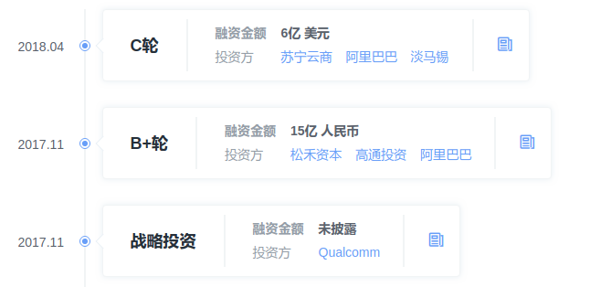
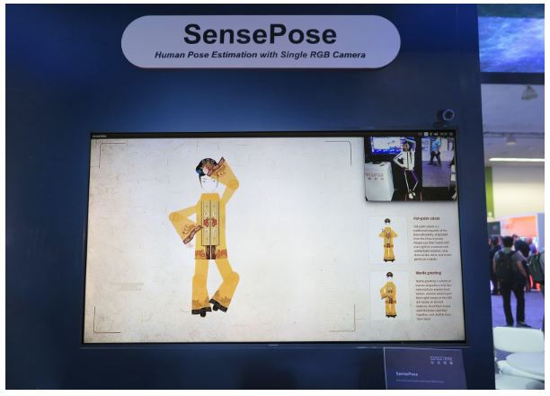
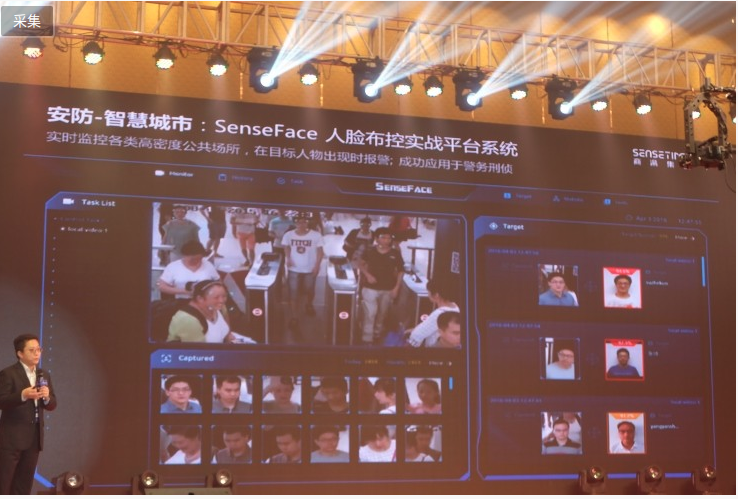
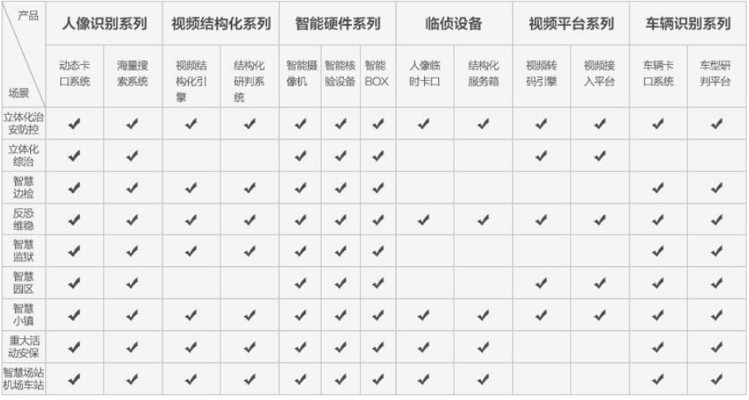
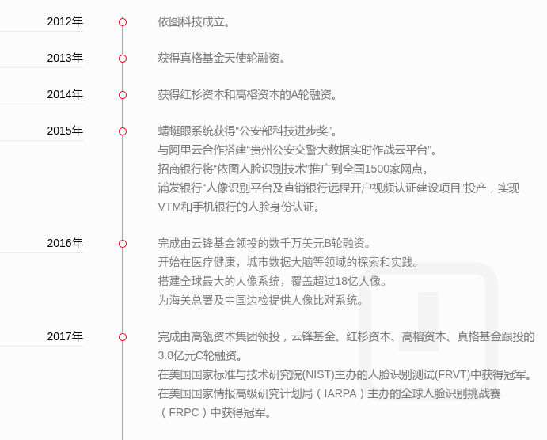
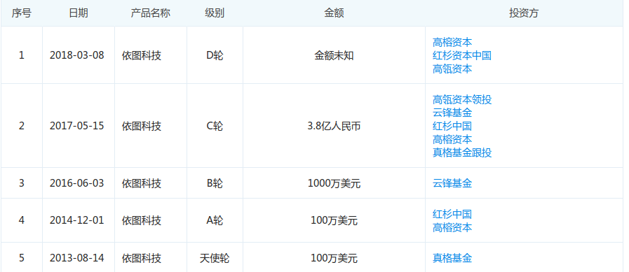

# 中国AI Unicorn4 现状报告 -- 商汤,旷视,依图,云从
## Part1. 对比分析
首先总结对比下这几家公司的关键信息: 
**PS:** √代表有;x代表没有;\*代表技术能力,越多越强.

|     | 商汤 | 旷视 | 依图 | 云从 |
| :---: | :---: | :---: | :---: | :---: |
|**成立时间**|2014|2011|2013|2015|
|**创始团队**|汤晓鸥 (港中文mmlab)|印奇 (清华姚班)|朱珑 (UCLA)|周曦 (中科院重庆所)|
|**融资规模**|12亿刀|5亿刀|4.4亿元|25亿元|
|**技术大牛**|汤晓鸥|孙剑|朱珑|中科院|
|**当前业务**|金融,安防,手机智能(VR/AR), 智能商业|金融,安防,手机智能|安防,医疗, 智慧城市,金融|金融,安防|
|**核心业务**|手机智能|金融,安防,手机智能|公安安防,医疗|金融|
|**行业布局**|自动驾驶/车载业务, AI芯片|智能硬件/智能商业, 智能地产/社区|AI芯片|安防|
|**产品**|身份验证SDK/API (人证验证一体机/闸机), 拍照成像增强SDK, 安防解决方案, SenseU广告机|身份验证SDK/API, 人脸技术SDK, 安防解决方案|身份验证API/SDK, 安防解决方案 (蜻蜓眼), 医疗辅助诊断 解决方案, (病灶定位, 病历检索挖掘)|身份验证SDK/API|
|**产品模式**|开放平台,解决方案, 硬件产品|开放平台,解决方案, 硬件产品|整体解决方案|SDK,API|
|**特点**|研究院,技术积累深厚|工程化强,开放平台|产品化强,垂直领域|国家队|

### 技术对比
|  技术方向  |  具体技术      | 商汤  | 旷视  | 依图   | 云从  | 奇点云 |
| :---: | :---: | :---: | :---: | :---: | :---: | :---: |
| **人脸分析** | 人脸检测|  √    |  √    |  √    | √     | √|
|       | 人脸 关键点| √ 240  | √ 106    | √ (?)    | √ (?)     | dev |
|       | 人脸质量| √ | √ |√ | √ |√|
|       | 人脸活体| √  双目, 结构光    | √ 视频, 动作, 炫彩, 双角度  |  √ (?)   | √ 红外    |dev|
|    | 人脸特征 (比对, 检索)| **    | \***   | \***  | **    |**|
|       | 人脸聚类 (大规模 比对)| √     | √     | √     | √     |x|
|       | 人脸属性| **   | \*** 颜值, 肤质, 情绪  | * (?)  | * (?)  |*|
|       | 人像美妆| √    | √   |  ×     |  x      |x|
|       | 视线估计| x    | √   |  x     |  x      |x|
|       | 人脸融合| x   | √ | x| x |√|
|       |        |      |     |        |         ||
|**人体分析** | 人体检测| √     | √    |  √      |   x      |√|
|       | 人体抠像| x 关键点  | √   | x  | x |√|
|       | 人体 (服装) 属性| \*** | * | x | x |*|
|       |手势识别| x |√|×|×|√ (dev)|
|       |       |   |   |  |  ||
| **OCR**  |证件识别|** 卡证, 票据|\*** 证件, 通用文字|* 身份证|* 身份证|* 快递单|
|       |车牌识别| √ | √ | √| x|x|
|       | | | | | ||
| **车辆分析** | 车型识别|√ | √ |√|x|x|
|      | 车辆属性|√ | x | x | x|x|
|       | 以图搜车|x | x | √ | x |x|
|       | 车辆轨迹 | √ | x | √ | x |x|
|       |||||||
| **图像处理** |视频图像 增强|\*** 去雾, 超分, 滤镜..|* 人像相关|x|x|x|
|       |||||||
| **视频挖掘** |安防监控|*|\***|\***|*|x|
|       |内容审核|√|x|x|x|x|
|       |视频标签|√|x|x|x|x|
|       |视频内容 结构化|√|x|x|x|x|
|       |||||||
|  **3D视觉** |3D物体 识别跟踪|√|x|x|x|x|
|        |SLAM|√|x|x|x|x|
|        |SFM |√|x|x|x|x|
|        |实时 深度估计 3D重构|√|x|x|x|dev (人脸)|
|        |轻量化 VR/AR 引擎|√|x|x|x|x|
|        |机械臂 抓取算法|√|x|x|x|x|
|        |||||||
|  **自动驾驶** |行人车辆 检测+ 方向估计|√|x|√|x|x|
|          |车道线 检测|√|x|x|x|x|
|          |场景理解 (物体 分割)|√|x|x|x|x|
|          |交通标识 识别|√|x|x|x|x|
|          |大规模3D 高精度 重建|√|x|x|x|x|
|       |||||||
| **医疗分析** |肿瘤结节 检测定位|x|x|√|x|x|
|       |骨龄检测|x|x|√|x|x|
|       |儿科常见病 识别|x|x|√|x|x|
|       |病历检索|x|x|√|x|x|
|       |医疗特征 提取建模|x|x|√|x|x|
|  |||||||
| **芯片** |AI芯片|√ (?)|x|√|x|x|
| |||||||
| **通用分析** |通用物体 检测|√|√|x|x|x|
|     |通用场景 识别|√|√|x|x|x|
| |||||||
| **平台** |开放算法 平台|√|√|x|x|x|

**总结:**
- **商汤:** 由于其创始人汤晓鸥学院派出身,之前的商汤与其说是公司更像是研究院,凭借港中文多媒体实验室多年在计算机视觉和图像领域的积累,其算法研发能力方面很强而且覆盖的领域也很广(文章数量多且领域分布广泛),但是目前的工程产品化方面关注较少(专利少,产品推广一般).不过随着B轮C轮两轮大额融资和阿里的入局,今后其产品化和商业化应该会有比较大的推动(招聘信息也表明工程化人员在大量招募).
- **旷视**:相比与商汤,旷视的在金融和安防领域的技术落地是很不错的,尤其是安防领域,挖了不少业内资深人士来优化解决方案的设计.旷视创世人清华姚班+OI金牌出身的背景也给旷视吸引了一批及其优秀的潜力丰富的学生(主要也是清华)和工程师,而早在2012年就开始开放的Face++公开算法平台和背后的的Brain++算法引擎也表明其工程化能力的优秀(早年的算法并不是很优秀),应该是这几家公司里面最强的.公开算法平台帮助其磨炼技术的同时也积累了大量的行业数据,也为其在后面的竞争和业务拓展铺下很好的基础;而在安防领域的解决方案便是其探索AI技术的落地的重要一步.随着孙剑王珏等学术大牛的加入,旷视在算法技术研发上会更加强大,从而支持其向更多领域进行渗透.
- **依图**: 与上面两家公司不同,依图并不开放其算法平台(可能没有)向第三方直接输出技术,而是通过整体解决方案进行输出的.通过这种整体产品和解决方案进行输出的形式,使其在技术的使用上确保了专业性从而提升了产品整体使用效果和可靠性.依图更多的是专注于一个整体垂直领域的深入研究和开发,将算法对特定领域进行针对性优化,结合该领域的专家知识对产品进行改善优化,形成与其他公司在该行业的非对称优势,形成技术壁垒.因此,依图的策略是长期的,按垂直行业一个一个进行深入攻克.
- **云从**: 目前更多是以技术提供商的的角色对各大国资或政府背景的企业输出技术,产品,包装,结局方案的探索远远不及其他几家的,而其技术进展的历史来看与其说是云从推动行业进步到不如说是行业需求推动云从算法改进.不过由于其国家队背景的特殊性,会在国家比较关键和敏感的领域占据主要的市场,也会主导其涉足行业的行业标准制定.

## Part2. 具体研究报告
以下将具体分别从以下5个方向进行分析:
1. 发展经历
2. 核心技术
3. 产品服务
4. 技术团队
5. 行业布局

## 1. 商汤科技(Sensetime)
### 1) . 发展经历

*数据来源:鲸准:* https://rong.36kr.com/project/24439 

2014年成立,到目前完成**7轮**融资,最后一次为**C轮**融资,总融资金额超过**12亿美元**,C轮之后的估值超过**45亿美元**,目前员工超过1500人,专利84.

**公司高层**:  

(信息来源: https://www.tianyancha.com/brand/b8f8b11152)

- 商汤集团创始人: [汤晓鸥](http://www.ie.cuhk.edu.hk/people/xotang.shtml):香港中文大学教授,多媒体实验室创始人.
- 联合创始人: 徐冰(董事长,法人):汤晓鸥学生(2012-2016 phd)

- 联合创始人: [徐立](http://lxu.me/)(CEO):港中文[贾佳亚](http://www.cse.cuhk.edu.hk/leojia/index.html)(目前加入腾讯优图([信息来源](https://www.chinamoneynetwork.com/2017/05/15/tencent-youtu-lab-adds-computer-vision-scientist-jia-jiaya-to-its-team)))老师的学生(2007-2010phd,2010-2013 postdoc)
- 联合创始人: 马堃
- 联合创始人: 杨帆(副总裁)
> 在2006-2014年间任职微软亚洲研究院创新工程组，负责视觉算法的产品转化。 
信息来源: http://www.xtecher.com/Mobile/Article/view?aid=3228

- 研发总监: [林倞](http://www.linliang.net/)(CTO):中山大学教授,研究方向主要包括人机智能交互,视频分析,行为分析等(http://www.linliang.net/index.php/home/research/).
- 副总裁: 沈徽(工程院院长.首席架构师):
> 沈徽早在2001年就加入微软，从Windows网络高级开发主管一路升为微软（亚洲）互联网工程院副院长，主要负责Bing平台和AI基础架构。资料显示，沈徽在知识图谱、机器人、信息检索、机器学习、分布式存储和计算引擎、
无线网络等方面有深入的理解和第一手的专业知识。  
信息来源: http://36kr.com/p/5123584.html
- 商务副总裁: 柳钢

### 2). 核心技术
*来源: 商汤官网:* https://www.sensetime.com/core#0 
1. **人脸技术:** 检测跟踪, 关键点定位(21, 106, 240), 人脸识别, 人脸属性, 人脸活体(用户配合/不配合两套方案) ==> 衍生人脸聚类(人脸embedding), 身份验证(人脸识别+人脸活体), 人像美妆/美颜(关键点) 
**应用场景**: 手机(相册,自拍), 身份认证(金融, 安防), 用户画像(广告)

2. **通用图像识别**: 服装属性,物体检测,场景识别,车型识别,文字识别(票据,卡证,车牌)  

3. **视频挖掘**:
  - 视频内容审查(视频分类+人脸识别+视频指纹+场景识别);
  
  - 短视频标签(视频指纹+场景识别+物体识别+行为识别+...);
  
  - 视频内容结构化分析(名人识别,时装检测识别,商品识别,场景识别,行为识别,视频指纹)  
  
  

  **应用场景**: 广告插入,视频审查过滤,推荐  

4. **图像视频增强**: 去雾,超分,降噪(移动端),单图HDR,失焦修复,后聚焦(双摄),滤镜(包含风格迁移),光照估计(虚拟物体渲染,VR)
**应用场景**: 摄影/视频后处理;手机摄像头成像优化

5. **SLAM和3D视觉**:
  - 平面/三维物体识别与追踪;
  
  - 同时定位与地图构建(SLAM)
  
  - 运动恢复结构(SFM):从连续2D图像重构物体的3D结构([具体说明](https://en.wikipedia.org/wiki/Structure_from_motion))
  
  - 实时深度估计和三维重建:在线恢复视频每帧的深度图以及场景的三维模型(RGB->RGBD)，在**移动设备**上支持实时的景深虚化、双目立体化、真实感渲染、阴影合成、虚实物体的遮挡和碰撞等交互效果
  

  **应用场景**: 跨平台轻量级AR/VR,无人驾驶

6. **机器人传感与控制**: 机械臂自主抓取(视觉),RGBD传感器自动标定,机器人仿真平台(快速实验)

**其他:** 人体关键点检测, 遥感图像分割

7. **无人驾驶**:行人车辆检测,车辆属性,行人运动分析(运动方向),车道线检测;交通指示牌识别
  - 场景分割(细粒度检测,结合SLAM进行3D建模);
  
  - 基于视觉的大规模城市场景定位
  
  - 基于多目视频,雷达,卫星定位和惯性导航系统的大规模场景的高精度三维重构
  

8. **深度学习平台**: GPU云(最高320个GPU)

### 3). 产品服务
*来源: 商汤官网:* https://www.sensetime.com/authentication/87

1. **人脸比对服务:**
  - **解决方案:**
    - *静态比对服务器(基于单张图片)*: **千万级** 人脸库 **0.1s** 检索;**单GPU** 图片入库 **200万/h**. ==> 适用于人证核验(互联网金融)
    - *动态比对服务器(基于视频流):* **秒级** 人脸比对, **单GPU** 图片入库 **3万/min**;**单GPU** **12路** 高清实时视频. ==> 适用于公安刑侦,访客(会员)识别
    - *人脸布控平台(城市级大规模人脸):* **分布式GPU集群** **1000路+** 实时监控视频流人脸识别;**10亿** 级人脸抓拍**历史轨迹**检索 ==> 适用于交通枢纽,边检等.
    - 其他: 视图情报研判系统:人脸模糊检索;视频结构化解析服务器:行人车辆多属性分析.

  - **产品:** 
    - **身份验证一体机:** **云+端** 方式,技术为卡证识别+活体识别(双目/结构光)+人脸识别 ==> 银行/政府办事大厅 
    
    - **人脸识别闸机**: 支持身份证+IC卡+二维码+人脸, 技术为活体识别(双目+结构光)+离线人脸识别(1s) ==> 所有使用闸机/门禁的场所 
    
2. **移动端图像增强服务**
  - **实时视频视觉增强**: 表情涂鸦,背景替换,2D/3D渲染(AR/VR), 技术为人脸关键点,人脸手势检测,手势识别,背景分割==> 短视频,直播应用
   
  人体姿势估计替换: 
  
  (*信息来源:* https://www.csdn.net/article/a/2017-05-19/15927974)
  - **手机摄像头成像增强**
  - **智能相册**: 人脸聚类, 照片分类, 场景分类
  - **人脸解锁**

3. **无人驾驶**
  - **驾驶员监控**: RGB+红外成像方案,**离线嵌入/云+端** ==> 出租车登录,疲劳检测/注意力检测; L3自主驾驶人机控制权交接(注意力检测);数字化座舱功能控制和娱乐接口 （手势识别）
  - **车道偏离预警**: RGB图像+**FPGA** 加速,技术为车道线检测和识别(**厘米级** 精度) ==> 车辆道路定位+车辆状态预警(无人驾驶基础),未打转向灯转向预警
  输出车辆与车道线距离,车辆
  - **前车碰撞和行人检测预警**: 单目图像(RGB+红外?)+FPGA加速, **实时**(雨/雾/强光/黑夜)输出前方(100m)识别物体(机动车+非机动车+行人)的相对距离、相对速度，以及相对碰撞时间和绝对碰撞时间。当报警时间达到临界值时，输出报警信号
  - **遥感影像解析**: 路网提取(图像分割),其他用途包括:气象,国土资源,环境监控,国防(国家政府项目)
  

4. **智能零售**
  - **智慧商业解决方案(客流大屏)**: 人脸属性识别+人脸识别+视频挖掘, **无感知**,场景不限,**云+端** ==>顾客画像(消费行为分析)，客流统计分析,重点顾客分析(精细化运营分析决策) 
  

  - **广告机**: 人脸识别+人脸属性+AI互动游戏+行为分析 
  

### 4). 技术团队
目前通过公开尚不能比较完整了解商汤内部技术团队的构成,因此从以下三方面信息推测:1). 创始人**汤晓鸥**所领导的港中文多媒体技术实验室的研究和人员; 2).商汤及其联合发表的**学术文献**; 3). **技术岗招聘** 信息

1. *汤晓鸥实验室*(信息来源:http://mmlab.ie.cuhk.edu.hk/projects.html) 
  - **总体概况:**  
    根据[GTC 2016](http://mmlab.ie.cuhk.edu.hk/)上的说法, 该实验室被列为全球top10的AI Lab,是由汤晓鸥于2001年创立的.汤晓鸥本人就不用多说了,大牛! 
     (*来源: google scholar:* https://scholar.google.com/citations?user=qpBtpGsAAAAJ&hl=en)

    汤晓鸥香港实验室目前Staff有**7人**,除汤以外还包括**2名**副教授,**1名** 助理教授,**3名** 研究助理教授,**3名** 博后,**1名** 副研究员,**19名** phd;联合实验室的[中科院深圳技术研究中心](http://mmlab.siat.ac.cn/yuqiao/student.html)有**2名**教授**1名**副教授,下属phd数量不详,大于**5人**.

    而根据目前该实验室的[毕业生](http://mmlab.ie.cuhk.edu.hk/alumni.html)去向(Kaiming He也是这个实验室的毕业生),8人去了商汤(总共68人),而计算14年商汤成立以后开始计算的话这个比例高达8/18.综上,汤晓鸥团队应该占了商汤所宣称的100人+phd技术团队的**40%以上**.业内优秀的有号召力的PI对人才吸引力可见一斑!

  - **主要研究方向:**
    主要大方向如下:主要分3大块:**人脸分析,视频监控分析,图像视频检索** 
    

    从实验室开放的[公共数据集](http://mmlab.ie.cuhk.edu.hk/datasets.html)来看:**人脸** 相关的有5个(celeba等), **行人** 相关的有2个,**场景** 相关的有6个,**服装** 相关的有4个(deepfashion),**车辆** 相关的有1个,**图像检索** 相关1个.总结来看与主要研究方向比较吻合人脸分析和视频监控分析为主.

    1. **人脸分析**: 人脸相关的研究仍然是该实验室目前主要的研究方向,到目前的发表[人脸相关的文献](https://scholar.google.com/scholar?q=allintitle:+%22face%22+OR+%22facial%22+author:%22tang+xiaoou%22&hl=en&as_sdt=1,5&as_vis=1)为**115篇**,其中2012年以后发表通过深度学习的为**40/86篇**.主要内容包括**人脸识别(23篇文献),人脸对齐(7篇)/跟踪(2篇).人脸检测(5篇),[人脸素描合成](http://mmlab.ie.cuhk.edu.hk/project_face_sketch.html)和识别(刑侦),人脸超分辨率**.

    2. **视频监控分析**: 主要技术方向包括**行人检测([8篇](http://mmlab.ie.cuhk.edu.hk/project_human_detection.html)),人群检测([16篇](http://mmlab.ie.cuhk.edu.hk/project_crowd_analysis.html)),行人识别([>6篇](http://mmlab.ie.cuhk.edu.hk/project_reidentification.html)),跟踪([6篇](http://mmlab.ie.cuhk.edu.hk/project_tracking.html)),摄像头组网([7篇](http://mmlab.ie.cuhk.edu.hk/project_camera_network.html))** (主要用于安防和无人驾驶场景)

    3. **图像和视频检索**: 主要包括**网络图像检索和重排序([5篇](http://mmlab.ie.cuhk.edu.hk/project_image_reranking.html)),图像质量和超分辨率([11](http://mmlab.ie.cuhk.edu.hk/project_photo_quality.html)),动作识别([10篇](http://mmlab.ie.cuhk.edu.hk/project_action.html)),音乐视频匹配([7篇](http://mmlab.ie.cuhk.edu.hk/project_music.html))**

    4. **深度学习和机器学习**:主要包括聚类(包括图像聚类)([12篇](http://mmlab.ie.cuhk.edu.hk/project_machine_learning.html))

    5. **3D-空间/物体重构**: [12篇](http://mmlab.ie.cuhk.edu.hk/project_3D_line_drawing.html)

    6. **图像/视频编辑**: 主要包括图像去雾,过滤,消光.([9篇](http://mmlab.ie.cuhk.edu.hk/project_image_and_video_editing.html))

    PS:以上文献统计来源来自[实验室官网项目](http://mmlab.ie.cuhk.edu.hk/projects.html)和[google scholar](https://scholar.google.com/citations?user=qpBtpGsAAAAJ&hl=en)

  - **联合发表的文献:** 主要集中在计算机视觉领域三大顶会之二:CVPR(CVPR2017 23篇), ICCV(ICCV2017 43篇), ECCV. 此外在AAAI、ICML、NIPS、TPAMI、IJCV、TIP也有不少.根据[google scholar](https://scholar.google.com/scholar?hl=en&as_sdt=1%2C5&as_ylo=2014&as_vis=1&q=author%3A+%22sensetime%22&btnG=)的信息,与商汤有关的论文大概在115篇左右. 整体方向与之前没有大致相同.不过值得注意的是不少文献是由商汤实习生参与的,说明其联合的实验室有不少学生直接参与商汤的日常科研项目.

  - **招聘信息:**  
    - **1). 超算平台相关: 高性能异构计算平台,大规模并行计算,异构优化; 2). 芯片设计相关: ASIC设计,FPGA开发, SOC构架; 3).无人驾驶相关: ADAS开发,自动驾驶控制, 4). 理论研究:深度学习核心构架,计算机视觉研究**,这4个方向是商汤在[拉钩](https://www.lagou.com/gongsi/j40459.html)上社招的主要算法相关技术岗位,而商汤强项的人脸和视频监控相关的人员招聘不多,说明这方面的技术已经很强;而商汤官网上的招聘信息主要是校招和实习生,(猜测可能用于降低博士的研发压力以及培养人才).

    - 杭州3D视觉研究中心: 浙大鲍虎军任主任,[张国锋](http://www.cad.zju.edu.cn/home/gfzhang/)任副主任:主要招聘为为**AR/VR,3D重建,SLAM,SFM**方向人员.(*信息来源:* http://www.sohu.com/a/163257609_715754)

    - 商汤日本研发中心: 主要与Honda联合开发自动驾驶方向为主: 
    
    *信息来源:* https://www.sensetime.jp/job

**总结**,从前面的招聘信息来看,商汤确实目前确实有自己开发的 **超算平台(DeepLink)** 和 **底层计算库(plugin_sample)**.此外,2018.2,商汤与MIT宣布达成人工智能联盟,成为MIT Intelligence Quest (IQ)计划的一部分 ([消息来源](http://news.mit.edu/2018/mit-sensetime-announce-effort-advance-artificial-intelligence-research-0228)),算是搭上了全球AI研究第一梯队的顺风车 

(*信息来源:* https://www.leiphone.com/news/201612/SgrlzOqKb4T8qdfH.html)

因此目前商汤最大的技术优势包括以下几点:1. 深厚的**人脸**分析,视频**监控**/挖掘技术背景,软件层面来说在安防领域的所需的算法都有比较强的积累; 2. 有自己的超算平台和庞大的博士团队,不光自己研发实验的效率能提升,转化测试学术界新算法的能力也很强; 3. 目前的算法研究重点向**自动驾驶**所需相关技术转移(SLAM,3维重建,视频结构化分割/检测)

### 5. 行业布局
首先来看下商汤官方宣称的行业布局: 

(*信息来源:* https://www.sensetime.com/cases#0)

(*信息来源:* https://www.leiphone.com/news/201612/SgrlzOqKb4T8qdfH.html)

**官方** 显示的**合作伙伴**如下: 

以上4个方向确实是主要的落地场景,根据其投资人[IDG资本的说法](http://tech.qq.com/a/20180409/019200.htm),商汤的收入主要来自**安防,金融,手机移动互联网3块**.

- 1). **安防/智慧城市**  
  从其销售方面的[招人情况(17年10月为止的数据)](http://hr.sensetime.com/alljob/?p=1%5E2&PageIndex=3)来看,**安防** 方向是最多的,说明这块业务仍在快速增长和拓展中. 目前安防已有的合作方是广州和云南的**公安**系统([消息来源]( https://www.sensetime.com/cases#0),但是网上并无其他来源的信息,可靠性存疑)以及与深圳公安局的**城市规模化安防**应用(2018.3.20)([消息来源](http://tech.163.com/18/0326/17/DDREI7NN00098IEO.html#from=relevant))); 还与**华为**联合发布了超高密度人脸识别一体化方案(服务器单机即可实现224路高清视频流人脸识别的实时处理),作为**华为平安城市方向**的重要一步([消息来源](http://www.lanjingtmt.com/news/detail/29552.shtml)).

  

  此外,去年11月与**上海市政府**签订全方位战略合作协议(消息来源:[1](https://www.sensetime.com/road?lang=zh-cn);[2](http://tech.qq.com/a/20180409/019200.htm);[3](http://money.163.com/17/1129/17/D4E772LT002580S6.html#from=keyscan)).将在沪设立全球研发、**智能汽车**、**智能芯片**、智能教育等相关总部，全面推动人工智能创新应用和核心技术落地.在3.11与提供智慧城市解决方案提供与运营商**上海仪电集团**达成战略合作;在3.14日与**临港集团**签订战略合作协议,内容包括:加快商汤人工智能**超算中心**、**智能驾驶** 等重大产业项目落地临港科技城，积极探索和推进与临港松江科技城等园区的载体型、平台型项目的合作；共同打造人工智能研究及**人才培养**平台，促进人工智能领域的技术创新、产业孵化和专业人才培养([消息来源](http://tech.163.com/18/0314/16/DCSCUI8C00098IEO.html)). (感觉这个套路有点像受深圳市政府扶植多年的华大基因)

  总的来说,相比于上海的智慧城市规划,个人认为更多的是上海需要引进AI产业的以及商汤需要其安防领域算法能力的落地标杆的共同利益所致,而以商汤的体量和目前的大数据处理能力(虽然有在招大数据方向的人),很难说会有很突破性的实际应用落地;而深圳公安局的合作则是更加实际有力的成功案例,可能能够真正帮其打开这一领域市场的关键.

- 2). **互联网金融服务**
  主要场景是**身份验证**,目前的合作伙伴包括**借贷宝(融360)(超过1亿次人脸验证);换呗(分众);中国移动(3亿次验证)** ([信息来源](https://www.leiphone.com/news/201612/SgrlzOqKb4T8qdfH.html))
  
  
  感觉这部分业务比较尴尬,阿里腾讯这两大互联网金融巨头都有自家产品,所以对商汤而言这个天花板是看得到的,可能会考虑海外市场(东南亚之类的),但是从人员招聘来看貌似并没有准备花大力气拓展.

- 3). **手机/移动互联网应用**
  合作伙伴包括:**美图、小咖秀等相机APP，OPPO,vivo,小米,华为等手机厂商,微博(社交应用),bigo(短视频)**([消息来源](http://tech.qq.com/a/20180409/019200.htm)).
  

  个人认为,这部分应用用到的技术多且杂,而且由于端的限制对算法模型本身的要求会比较高,对AI厂商而言是秀肌肉和技术输出,产品落地的好试验场.正如google用自家强大的算法改造android底层,不光对自家APP提供强大的算法支持实现智能化,也在不增加一般开发者开发成本(不需要专业的算法背景)的基础上就能极大的提高安卓应用的能力和用户体验,这可以视为一种AI平台化的输出能力.因此,这部分不光是商汤目前的盈利点,也是实践用AI推动移动互联网这一垂直领域的生态进化的重要场所(这个行业都无法通过AI赋能更不用谈其他行业),这是AI改造其他行业的起点.

- 4). **智能商业**
  目前已知的合作伙伴为**苏宁**,具体落地场景就是苏宁无人店. 
  

  能查到的具体落地信息很少,貌似这也是AI厂商改造传统垂直行业遇到的普遍问题:行业理解还不太够,对于商汤这种学院派出身的尤其如此.

- 5). **自动驾驶/车载业务** 
  这部分主要是通过劳世竑(具体可以看[这里](http://www.sohu.com/a/227658038_100140080))在2017.12与本田达成为期5年的L4无人驾驶研发合作协议([消息来源](http://world.honda.com/news/2017/c171207ceng.html))之后开始启动的,而且从目前招聘来看势头很猛,尤其是商汤的日本研发中心(见上文)主要研发的就是**自动驾驶/车载服务**相关的技术,可见商汤对这块还是非常重视的. 
  自动/无人驾驶作为全球科技巨头的比拼AI算法能力的重点领域,日本三大汽车厂商之一的本田选择商汤(商汤之前基本没碰过自动驾驶),一方面说明行人车辆方面场景检测方面的积累很深,另一方面说明商汤的研发能力在超算平台加持下确实也很强.这个领域是目前最能密集输出AI能力的地方,商汤的入场也是意料之中的.

- 6). **芯片** 
  主要合作伙伴就是英伟达和高通:2017.10上GTC英伟达宣布与商汤合作([消息来源](https://venturebeat.com/2017/10/17/nvidias-plan-to-turn-data-from-500-million-cameras-into-ai-gold/));2017.10高通战略投资商汤,并且宣布战略合作(消息来源:[1](https://www.qualcomm.com/news/releases/2017/10/20/sensetime-and-qualcomm-collaborate-drive-device-artificial-intelligence);[2](http://tech.qq.com/a/20180409/019200.htm)).目前招聘的情况来看来看在端上的芯片工程师确实比较多,这可能与商汤目前很多产品通过**云+端**的方式实现有关,根据商汤自己的定位来说还是算法公司,暂时没有打算单独进军AI芯片,以和专业公司合作为主([消息来源](http://money.163.com/17/1129/17/D4E772LT002580S6.html#from=keyscan)).

  端上算法模型的开发部署是目前工业界的一大热点,算法结合神经计算芯片(AI芯片)能够更有效的处理更多场景,所以商汤之后肯定会涉足其中的.

- 7). **行业生态(投资)**
  从工商局可以查到的商汤对外投资信息来看:  
  
  其投资的的成都[**新舟锐视**](http://www.cdxzrs.com/)主要开发智能摄像机(多用于安防领域);而[**深网视界**](http://www.sensenets.com/product/product-4.html#1)也主要是基于监控视频的人脸检索和人群分析,所以目前商汤已投资的公司还是围绕在其深入**安防领域**市场的布局.

  此外商汤对**51VR**投资2.1亿,其他计划投资的项目还有10多个，包括AI芯片、医疗、物联网、手机和互联网，还包括游戏([消息来源](http://www.sohu.com/a/227658038_100140080))

  商汤确实在像小米一样构建自己AI产业链的生态...

- 8). **深度学习平台** 
  这部分在之前的官网是是找不到的,平台这种事目前只有google,facebook,amazon, apple, microsoft, baidu之类的国际大厂在做,而且目前算法开源并且社区很活跃的只有google的Tensorflow,facebook的caffe+pytorch和amazon的mxnet,其他的比如微软的cntk和百度的paddlepaddle社区活跃度就很低了,基本只有自己公司的人在用,而这部分能力最适合的就是集成到自家的云计算平台上.个人认为即使今后开放了这个平台,客户定位依旧十分尴尬,而且从CEO的[演讲](http://www.cyzone.cn/a/20180130/323466.html)也没有看到这方面的苗头.知乎这位同学的[观点](https://www.zhihu.com/question/58609598)在下也十分赞同: 
  > 个人看法是平台型公司不一定是未来AI公司的出路，把一个一个行业慢慢吃透，用技术去推动行业生态的改变，才是AI公司的出路。

最后,CEO徐立的关于学术和工业的思考([信息来源](http://www.cyzone.cn/a/20180130/323466.html)): 

**总结:** 商汤由于其创始人汤晓鸥是学院派出身,之前与其说是公司更像是研究院,凭借港中文多媒体实验室多年在计算机视觉和图像领域的积累,其算法研发能力方面很强而且覆盖的领域也很广(文章数量多且领域分布广泛),不过目前的工程产品化方面关注较少(专利少).不过随着B轮C轮两轮大额融资和阿里的入局,今后其产品化应该会有比较大的动作(招聘信息也表明工程化人员在大量招募).

### 参考:
- 商汤官网: https://www.sensetime.com/
- 商汤招聘: http://hr.sensetime.com/alljob/?p=1%5E2&PageIndex=3
- [一文读懂30亿美元估值的商汤科技，这些年做了哪些布局](http://tech.qq.com/a/20180409/019200.htm)
- [商汤徐冰：大牌投资人排队想投，阿里15亿投资完全是传言](http://money.163.com/17/1129/17/D4E772LT002580S6.html#from=keyscan)
- [阿里要15亿投资不缺钱的商汤科技，打的什么算盘？](http://36kr.com/p/5105265.html)
- [商汤、云从、依图、旷视和格灵深瞳五家公司的深度学习算法实现手段差别和公司产品优势有哪些？](https://www.zhihu.com/question/58609598)
- [融资6亿美金背后：商汤加速裂变](http://www.sohu.com/a/227658038_100140080)
- [商汤联合华为发布“超高密人脸识别”解决方案](http://www.lanjingtmt.com/news/detail/29552.shtml)
- [打造上海AI示范园 商汤科技与临港集团达成战略合作](http://tech.163.com/18/0314/16/DCSCUI8C00098IEO.html)
- [商汤科技CEO徐立：让AI产业化落地，还要靠这双轮驱动？](http://www.cyzone.cn/a/20180130/323466.html)
- [商汤科技成为独角兽的秘诀，是人才“黑洞效应”](http://www.lieyunwang.com/archives/419121)
- [商汤研发总监林倞：20张PPT谈四大领域产业布局｜2016 CAIIC](https://www.leiphone.com/news/201612/SgrlzOqKb4T8qdfH.html)
- [Nvidia’s plan to turn data from 500 million cameras into AI gold](https://venturebeat.com/2017/10/17/nvidias-plan-to-turn-data-from-500-million-cameras-into-ai-gold/)
- [MIT and SenseTime announce effort to advance artificial intelligence research](http://news.mit.edu/2018/mit-sensetime-announce-effort-advance-artificial-intelligence-research-0228)
- [SenseTime and Qualcomm to Collaborate to Drive On-Device Artificial Intelligence](https://www.qualcomm.com/news/releases/2017/10/20/sensetime-and-qualcomm-collaborate-drive-device-artificial-intelligence)
- [Honda and China-based SenseTime to Pursue Joint Research and Development in the Area of AI Technologies for Automated Driving](http://world.honda.com/news/2017/c171207ceng.html)

## 2. 旷视科技(Megvii/Face++)
### 1). 发展历程

(信息来源: 旷视官网: https://www.megvii.com/about-us/)

旷视科技成立于2011年年底,是4巨头中成立最早的,不过发展是从2014年印奇退博之后开始的,目前完成了**6轮**融资,最后一次为C轮,总融资金额为**5亿**美元,目前员工超过400人,专利**267**.

(信息来源:企查查:http://www.qichacha.com/firm_52848015fa94a3e58cdaacd8c63eb737.html#run)

### 2). 核心技术
旷视的核心技术无疑是人脸技术,其成名之战就是2015德国Ce老马展示的Smile to Pay技术([信息来源](http://money.163.com/15/1218/14/BB4ICHU700253B0H.html)).不过随着其业务线的扩展,其技术也扩展到文字识别,行人识别方向等.

  1. **人脸技术**: **非配合动态** 人脸检测,识别,关键点定位(106);人脸属性:年龄,性别,人种,情绪,颜值,头部朝向,视线估计,皮肤状态;在线/离线人脸[活体检测](https://www.faceplusplus.com.cn/face-based-identification/)(**通过关键点实时定位和变化检测**);超大人像实时检索技术(对不同场景下的人脸进行优化) 
  

  **应用场景:** 各种场景(金融,安防,边检)的身份验证;智能手机应用,包括人脸编辑(美妆,滤镜,贴纸),智能相册;客户画像和推荐.比如:
  

  颜值评分: 
  

  肤质分析: 
  

  注意力捕获用户关注重点以及用户状态(疲态检测): 
  

  2. **人体分析**: 人体检测,抠像(前后景分离);人体属性(性别,服装颜色);手势识别
  

  **应用场景**: 人群检测,人流数量统计(安防);手机图像增强:背景虚化,合成,替换(短视频,直播);客户画像推荐.
  

  3. **文字识别**: 证件信息提取(身份证,驾驶证,银行卡);通用文字识别(视频,书籍,广告牌,单据等)
  

  **应用场景**: 证件认证,认证合一;结构化信息提取,**内容审核管理**

  4. **场景物体识别**: 场景检测,物体检测.**应用场景:** 智能相册(相片聚类);视频结构化处理(视频标签);特定物体匹配追踪.

### 3). 产品服务
与商汤类似,旷视主要业务分也是以技术输出为主,而其在2012年就开始开放的Face++人工智能开放平台的API也为其扩张和技术优化做出了不少的贡献.目前,旷视的主要产品集中在4个方向:①FaceID服务,②人脸分析服务③智能安防④智能地产.

  1. **FaceID服务** 
  这个主要就是提供**金融行业**的在线身份验证服务,以**SDK,H5,小程序**等形式的接入,包含多种人脸验证方式:  
  

  2. **人脸分析服务** 
    - **产品**: **移动端** 人脸关键点SDK,人脸比对SDK, 身份证质量SDK,视频美化SDK(面部AP贴纸,虚拟背景,美型美颜),并能达到**实时**的效果. ([信息来源](https://www.faceplusplus.com.cn/face-landmark-sdk/))
    - **解决方案**: **定制化** 金融行业解决方案,手机行业解决方案,(虽然官网上还有在线营销解决方案,汽车行业解决方案,教育行业解决方案,但是没有具体的案例,可能是还没有具体案例或者还没有具体的落地方案)

  3. **智能地产解决方案:** 包括人员同行管理(门禁,访客管理,陌生人预警,会议室管理);车辆管理(停车缴费管理,车辆信息识别统计,寻车);视频监控(人员识别,行为分析,轨迹分析,场景图像分析);**智能零售**(会员识别,推送提醒,客流属性,消费行为,线上线下数据打通,精准营销).适合**企业楼宇园区,生活社区,校园管理,连锁商超**.
  

  4. **智能安防解决方案:** 主要由以下资格子模块根据不同场景(包括重点场所监控,群体性维稳时间,景区防控等,具体看[这里](https://www.megvii.com/smart-security/use-cases/))进行组合:
    

    

    

    产品特点为**系统库容量**为亿级,单机入库速度为1000人/s;支持高并发全帧率检测和识别,top10命中率99%;1500万底库检索时间小于1s;包含端上人脸识别算法和3D降噪技术的[智能摄像机](http://www.sohu.com/a/196294473_642762)

  5. **智能摄像头MegEye:**: 暂时没有找到公开发售的聚到,可能只是作为其整体结局方案中的一环打包销售.([信息来源](http://www.sohu.com/a/196294473_642762))

  6. **人证一体机**: 使用红外活体模组实现活体检测([信息来源](http://www.cctime.com/html/2017-10-20/1329614.htm))

  (信息来源: [1](https://www.megvii.com/smart-commerce/), [2](https://www.megvii.com/smart-commerce/), [3](https://www.megvii.com/smart-commerce/), [4](https://faceid.com/))

总体来说,旷视的技术输出应该是工程化的最好的,其开放平台的调用磨炼了其核心的人脸技术大规模调用的可靠性.此前,旷视的主要产品就是人脸分析相关的SDK,但是目前官网上已经开始有成型的整套解决方案,而且根据其构架图来看应该是有具体的落地场景的,因此似乎旷视正在从一家算法提供商慢慢转化成更具体的商业解决方案提供商.

### 4). 技术团队
与商汤不同的,旷视成立之初并没有像汤晓鸥这种在CV领域深耕多年的行业dalao(汤晓鸥在无论在学术界的号召力还是人脉资源都是要比旷视强不少的),但是创始人团队的3个人均是[清华交叉信息学院姚班](http://iiis.tsinghua.edu.cn/yaoclass/)(这个班的水平可以参考[这里](http://www.360doc.com/content/16/1118/23/26653558_607665642.shtml))出身的精英,其中唐,杨二人均为IOI竞赛金牌出身,在国内OI界有比较强的号召力,因此吸引了一大帮OI界的天才.而随着2016.7 MSRA的首席科学家[孙剑](http://www.jiansun.org/)大牛的正式加入担任首席科学家(很早就开始有接触)以及同时加入的Adobe首席科学家[王珏](http://www.sohu.com/a/164104646_418390),旷视除人脸方向的算法技术的研发实力也在慢慢补齐,而工程能力应该比商汤还强不少. 
正如人才是每个AI公司的重要资产一样,除了需要暴露在闪光灯下的创始人团队和首席科学家之外,关于内部具体的牛人信息外露的比较少([知乎ZrpHercule的信息](https://www.zhihu.com/question/30456488?sort=created)),因此还是从以下三方面来研究下商汤的技术团队及其实力:**①创始人团队②孙剑③技术招聘信息**.

  1. 创始人三剑客: **印奇,唐文斌,杨沐**  
    [印奇](https://baike.baidu.com/item/%E5%8D%B0%E5%A5%87/19456600?fr=aladdin):本科期间在MSRA实习,涉及**人脸识别**系统研发,哥伦比亚大学博士期间研究方向为**3D摄像**,博二放弃学业创立旷视(经历有点像盖茨).
    [唐文斌](https://baike.baidu.com/item/%E5%94%90%E6%96%87%E6%96%8C/14692119?fr=aladdin):清华OI总教练,IOI金牌.ACM/ICPC 2008 World Final 第6名。TopCoder前Target选手(ID: OpenGL)
    [杨沐](http://www.cyzone.cn/s/20150711/11340.html):IOI金牌.

    不得不说清华的圈子确实很强,旷视的重要人脉来源就是清华,其核心几乎清一色清华出身(配置豪华),清华本科Columbia博士毕业的张弛(内部称驰爷)于2015从Google离职加入Face++,负责行人车辆视频方向的研究([信息来源](https://www.guokr.com/post/724994).而国内OI圈是一个小且精的圈子,前辈对后辈的影响非常大,经常抱团,所以这些OI界的传奇前辈会对后辈有不少的吸引力,像[范浩强](http://www.sohu.com/a/150540826_263220)(清华人称范爷),周而进(IOI金牌),杨弋(NOI金牌)这些清华后辈加入旷视有很大原因在此,与汤晓鸥的商汤围绕其实验室和学生的人才体系很不一样.

  2. **首席科学家[孙剑](http://www.jiansun.org/)** 
  MSRA的首席科学家,是ResNet和Faster RCNN这两个目前深度学习非常常用的算法文章的通讯作者.其近些年的H指数非常高(与汤晓鸥差不多),证明其在深度学习领域的深厚功底.  
  
  (数据来源: google scholar: https://scholar.google.com/citations?user=7aQ_YLwAAAAJ&hl=en)

  根据其自身的说法:视频理解的核心问题为: 
  

  根据其对Face++内部的描述(信息来源),face++对于算法模型的工程化部署非常重视:  
  > 我们的研发部门里有一个专门的小组负责研究如何训练最好的基础神经网络，并沿着以下三个子问题深入： 
  1）针对不同计算复杂度下设计最优的神经网络； 
  2）针对不同计算平台的实际要求，来设计最高效的网络； 
  3）针对不同问题设计最合适的网络。 
  另外对神经网络模型的压缩和低比特化表示也是我们研究的重点之一。

  其认为Face++与MSRA研发部门的人的特点很像:  
  > 1）他们都同样有着既基于产品，又探索前沿技术的使命定位；  
    2）他们都同样聚集着一群追求极致，有Geek精神，且高自我驱动的精英； 
    3）他们都用同样的套路推进研究工作：确定问题–>实现、研究和理解既有方法–>进行持续改进或创新。 

  人才培养方向:  
  > 我们大致将人才向两个方向培养：研究科学家，和全栈人工智能工程师。研究科学家主要聚焦在算法上，寻求对问题的本质解，我们的培养目标是成为能独挡一面领域专家；全栈人工智能工程师是我们内部的叫法，目的是培养即能上九天揽月（算法设计和训练），又能下五洋捉鳖（算法的工程化，研究问题和方式系统化）的全能战士，他们既能做research,又懂system，能建系统、造轮子。针对目前AI发展的趋势，我们需要大量的全能人才来将AI “+” 到不同的行业上，解决实际问题。这就对人才提出了更高的要求。我们相信即便没有AI背景的工程师，在这里工作1-2年后就能成为独当一面的人才。

  做事方式:  
  > 有了一帮志同道合的小伙伴们，就要围绕这上面介绍的四个视觉理解核心问题开展研究、并将研究成果应用在具体的视觉识别场景中。Face++的研发团队扁平化，每个研究小组由2-4人组成，聚焦一个课题。课题可以是短期的，例如对已经应用的某个产品线上的算法的改进；课题也可以是长期的，例如持续提升识别的精度和性能。 我们的每个研究员都可以在不同的课题之间自由切换，这样能最大程度发挥个人的长处和积极性，同时也让大家有机会短时间了解更多的问题，有更丰富的经历，能更快的成长。套用现在深度学习的精髓，每个人的学习也需要输入大数据。

  研发环境:  
  > 做深度学习研究需要一个非常高效的训练引擎/平台和充沛的计算资源，Face++内部使用了近两年的“MegBrain”是一个全自主研发的训练引擎，它与目前流行的TensorFlow（Google一年前发布）设计相似，同属基于Computing Graph的新一代训练引擎。为什么非要自研系统呢？公司研究深度学习开展得非常早，当时还没有很好用的系统，并且MegBrain在同时满足灵活性及精简性的基础上，能最大限度提升工作效率。目前在AI创业公司中完全使用自研深度学习训练引擎的，可能只有Face++。

  总的来说,孙剑的加入无疑使旷视有了更多接触和拉拢学界工业界巨头的机会,旷视美国研究院的的成立和王珏的加入也说明了这一点: 
  > “主要是三个方面的原因。一是和旷视有天然的亲近感。旷视是一帮有才华的清华年轻人创立的，在企业文化中有清华行胜于言，脚踏实地的价值观。对于作为清华校友的我来讲，对于这样的文化有天然的熟悉和亲近感。二是孙剑博士的诚意邀请。我和孙剑博士认识和同行多年，彼此都比较熟悉，他不远万里到西雅图来邀请我，我内心是无法拒绝的。第三是机遇。我个人觉得中国目前人工智能研究的环境，从数据规模到商业机会都比美国要好，但是在人才储备上仍然不占优势。能够帮助中国的人工智能公司，特别是初创公司更进一步，在美国吸引顶尖人才为我所用，对中国高科技发展是一件里程碑性质的事情。这样的机会在人生中并不多见，碰到了就应该抓住”。

  (信息来源:http://www.sohu.com/a/164104646_418390)

  此外,孙剑透露的旷视内部的研究状况的信息应该还是比较准确的,在大批OI金牌码农的强大码力下,旷视对于深度模型在不同硬件条件下的优化和部署很早就开始研究并且现在是由一定优势的.从研究方向来看,目前旷视发表的文献数量已经超过40篇([信息来源](https://scholar.google.com/scholar?start=70&q=%22%40megvii%22&hl=en&as_sdt=1,5&as_ylo=2014&as_vis=1)),之前发表的文章以人脸分析为主,但包括不少对于深度网络结构和原理的研究;
  而孙剑加入以后2017年其领导发表的论文已经有9篇,主要涉及**行人检测,分割,模型压缩,检测网络框架**等,使旷视的技术和落地的范围其他领域扩展了不少.

  3. **招聘信息(来源:[拉钩](https://www.lagou.com/gongsi/j1561.html))**  
  从招聘信息来看,目前旷视技术岗社会招聘大部分为**前后端开发工程师(包括java,安卓,ios,python)和测试人员**,虽然算法职位也有,但是以研究员的形式为主而且数量不多,所以与商汤类似,对于算法层面人才的培养是倾向于公司内部培养(可参见上面孙剑的描述);而大量前后端和测试的招聘说明目前旷视还是有大量技术准备落地,很可能是要在他们的算法平台上发布的,所以未来一段时间内旷视主页上的核心技术部分的new和beta标签将会持续涌现.

**总结**,目前旷视最大的优势还是在于1.**人脸相关技术以及积累下来的人脸数据**(1.2亿人([信息来源](https://baijia.baidu.com/s?old_id=749733)))(这一点目前远远超过商汤);2.完善的自主算法框架和深度学习平台(**MegBrain**),算法工程化能力很强.

### 5. 行业布局
根据旷视在官网上新上线的技术和解决方案来看,其目前的行业布局包括以下3个方面:**①安防②金融安全③手机智能**,其中,安防作为人脸识别技术的重要落地场景应该是旷视目前最重视的领域,而从旷视在各地成立分公司,很有可能就是安防业务的拓展和部署的需要(相比于其他两个,安防跟需要进行实地考察和调整).

根据36氪的[报道](http://36kr.com/p/5100351.html)(2017.10.31),旷视目前的合作伙伴包括: 
> 根据公开信息，目前的合作伙伴包括**国家公安部、国家身份证中心，以及阿里巴巴、蚂蚁金服、华为、联想、富士康、中信银行、招商银行、小米、vivo、万科、凯德**等近千家企事业单位。旷视科技告诉36氪，在金融安全领域，旷视科技旗下的FaceID平台已为全球2.5亿人完成远程实名身份验证，是**支付宝、今日头条、滴滴出行**等知名公司的AI服务提供商；在城市安防领域，旷视科技推出了智能安防系列解决方案，已在全国26个省市上线，并被中国公安部列入重点技术推广目录，作为国家公安部重大活动智能安保方案主要提供商，旷视科技参与了**杭州G20峰会、厦门金砖峰会、海南博鳌论坛、上海劳力士大师赛**等国际级峰会、赛事的安保工作；在手机智能领域，旷视科技与**vivo、小米**等国内一线手机厂商实现合作，推出了人脸解锁手机；此外，在最近比较热门的商业物联领域，旷视科技先后与阿里巴巴、小麦铺, **缤果盒子** 等新零售企业合作，为其提供视觉和感知技术。

- (1). **安防(城市大脑)**  
  从旷视提供的解决方案的多样性来看,旷视应该做了不少安防类的实际项目,并且效果还不错(比如2017年的博鳌亚洲论坛的唯一智能视频技术应用提供商获得来自公安部的表扬([信息来源](http://www.sohu.com/a/136182439_418390))),能查到的与公安的合作有湖北公安厅,合肥公安局,无锡公安局,铜仁公安局等.  
  2017年旷视挖来了负责过北京市奥运安保指挥系统、武警总体规划以及海外国家信息化建设等项目的17年安防老兵[陈雪松](http://tech.sina.com.cn/roll/2017-11-24/doc-ifypapmz4546898.shtml),说明旷视在对安防行业落地的重视.根据陈的说法: 
  > “AI初创公司纯做技术没有出路，算法提供商一定要做端到端的整体解决方案，如果不直接面对客户，一定会被上下游碾压。”  
  “早在几年前，我做奥运安保时就想过采用人脸识别，那个时候基于模式识别的准确率在数字上达到了85%，但经实测后发现根本行不通。85%的通过率与0本质上是一样的。而应用深度学习之后，识别率大幅提升，AI在安防行业的价值才终于得以体现。”  
  “说到底，就是要提升算法精度，最少是小数点后的两个数量级以上。”  
  "安防行业未来的场景会愈来愈多元。对于试错率容忍度较高的安防“黑名单”追踪来说，小数点后的几个数量级的增加的确作用不大；但对于红名单、白名单、灰名单而言，精度提升的意义就非常明显，99%和99.9%的可靠度差距并不是0.9%，而是要反过来算，差距是10倍。" 
  目前人脸识别落地安防的确是趋势所向，但人脸识别只是AI落地安防行业的一小部分，在很多实际场景中，人脸识别作用并不大。  
  “‘人形追踪’技术（或者说行人再识别（ReID）技术）可以很好地解决这个问题，这也是旷视接下来重点深耕的方向。"

  以上说法一方面表明**了解AI的传统行业**资深专家在AI技术具体实际落地方案中制定和优化中起了重要作用;另一方面也透露出旷视对在安防领域的进行应用落地思考和努力,其提供解决方案更加贴近实际,相比于商汤强了不少. 此外,旷视开发智能摄像头(MegEye)也很有可能是其在安防领域项目之后的经验总结.根据旷视科技安防事业部解决方案总监安洋的[以下说法](https://www.leiphone.com/news/201801/rv3mnx5EtJikc5Ja.html),旷视对AI技术在安防领域的应用和其对安防产业的影响有自己的计划.
  > 不拒绝做芯片级的算法来赋能其他传统安防厂商，让后者有能力扩大整个AI安防市场的容量；  
  旷视不会仅仅充当嫁衣角色，也会在自己擅长的领域做一些事情。

  

- (2). **金融**  
  与商汤一样,旷视在互联网金融领域的落地主要是在**身份认证**方面,这也是目前互联网金融对于CV技术主要且重要的需求.

- (3). **手机智能**
  与商汤不同的是旷视在手机方向的合作还是主要以人脸解锁和基于人脸分析SDK的APP应用嵌入为主,针对手机摄像头成像优化,图像增强比较少,官网也确实没有类似商汤的图像增强的demo,说明旷视在这方面的积累比较少.而根据旷视云事业部副总裁吴文昊的判断--60%的摄像头应用在手机上([消息来源](http://www.qichacha.com/postnews_aa97381c53211cb41b545f14fcde9298.html)),结合旷视强大的移动端算法优化能力,旷视不会放弃这个部分的市场(根据[官网的说法](https://www.faceplusplus.com.cn/mobile-solutions/)vivo手机的影像优化有用face++的技术).

- (4). **智能零售**
  最近(4.8)旷视宣布全资收购艾瑞思机器人(主要产品是仓储物流机器人)进入智能工业机器人领域(两者在2017年就达成合作)([消息来源](http://tech.china.com/article/20180411/kejiyuan0326123107.html)).而根据2018.4.12旷视科技副总裁敖翔的题为《人工智能公司从巨头公司转向商业化之旅》演讲(如下)中,其提到旷视已把零售作为人工智能的主战场.虽然这个说法可能有些夸张,但是也反映了旷视在以上三个领域取得一定成绩以后开始向其他领域渗透,而首当其冲的就是当下最火热的新零售.此前,与支付宝合作的KPro, 缤果盒子也是旷视对于新零售的探索. 
  > 从去年8、9月份开始，我们看到零售已经是人工智能的主战场。讲零售就是讲人货场，特别是我们做智能视觉公司，一定还是从效率，一定还是从精准性的角度出发，去做商业。从人的角度，理解会员，让商户感动会员。从货的角度，比如仓储和选品。从场的角度，我们可以尝试着彻底的数字化，让所有现在大家已经非常擅长的线上数据化运营的能力和经验运用到线下店铺运营去。  
  理解一个人，我认识还不够，我要理解你。目前这方面我们在做一些工作，还没有完全商业化，如果一个现象，比如说你在看一个广告，但是我们知道你在看广告，广告并没有在看你，传统的模式，我不知道在看我的，是什么样的人，胖与瘦，他有没有戴眼镜，这些信息在传统的体系里面是断裂的，这样一个千人千面的现实或技术对零售会有很大的促进作用。  
  　　关于货，两个切入点。一个点是仓储，我们觉得整个物流体系的高效完善一定能改善我们的体验，我们收购了一个公司艾瑞思，提供比较先进的视觉智能的仓储机器人，看起来是一个扫地机器人，但其实它可以搬起500公斤的东西，不需要辅助设备而可以完成搬运。我们尝试完全自主式的，没有预设条件的识别所有的商品，这个案例是一个货架，没有特殊标识，但是商品可以完全识别出来，所有的空档全部都可以识别出来，这样的技术成熟可以完善我们在无人便利店里面的消费体验。  
  　　关于场，对一个消费场所来说，我会觉得完全数字化要充分理解消费者、会员用户在一个消费场所里面与环境的互动，可能会铺设摄像头，像这个例子里面我们的案例摄像头。还有，我们可以做一些智能货架，我们已经成立了一个智能货架的产品，里面并不设摄像头，使用的是近距离感应的传感器，这个其实挺便宜的，有了这些之后，不需要真正的完成视觉，你也可以很清楚的感应出一个人的触动、走动，结合一般的视觉和这种相对低端但是近距离的传感技术，我们尝试把一个店面完整的信息抓取出来。设想一下，在一个线上店铺，比如淘宝、天猫或京东，消费者的每个行为都是得到京东捕捉的，也许我喜欢一个商品，我今天加到购物车，明天不想买了我会删掉，这些信息都会用上，这在线下全部是缺失的，我们很多线上的运营经验线下完全无法施展，有一句老话，线下是蒙着脸的，我们需要把所有的信息都搜集起来做数据分析，要了解人的运动轨迹，你有没有看到商品，我们的货品要包装，更令人亲睐，更能吸引人眼球。我们现在在做的事情甚至可以了解人口学的分布，甚至可以更清楚的得到一些更深入的数据，甚至进入到人，这样的数据如果跟店里面的销售数据打通的话，相信会带来巨大化学反应。

  (信息来源: http://news.10jqka.com.cn/20180412/c603884757.shtml)

- (5). 其他: 从旷视官网上可以知道其提供的解决方案还包括在线营销,汽车行业和教育行业.但是目前并没有特别具体的案例,更多的只是当前技术的整合,尤其是汽车行业更是缺乏自动驾驶所需的关键技术.

最后,印奇的"4+2+x"的商业逻辑: 
> 通过对脸、人、车和文字四个感知对象的识别对现实世界进行数字化的转化和抓取，再经由旷视领先的AI算法为决策和执行端的“手”和“脚”等载体赋能，最后投入众多行业去解决实际问题.

**总结**: 相比与商汤,旷视的在金融和安防领域的技术落地是很不错的,尤其是安防领域,挖了不少业内资深人士来优化解决方案的设计.旷视创世人清华姚班+OI金牌出身的背景也给旷视吸引了一批及其优秀的潜力丰富的学生(主要也是清华)和工程师,而早在2012年就开始开放的Face++公开算法平台和背后的的Brain++算法引擎也表明其工程化能力的优秀(早年的算法并不是很优秀),应该是这几家公司里面最强的.公开算法平台帮助其磨炼技术的同时也积累了大量的行业数据,也为其在后面的竞争和业务拓展铺下很好的基础;而在安防领域的解决方案便是其探索AI技术的落地的重要一步.随着孙剑王珏等学术大牛的加入,旷视在算法技术研发上会更加强大,从而支持其向更多领域进行渗透.

### 参考
- 旷视官网: https://www.megvii.com/
- Face++官网: https://www.faceplusplus.com.cn/
- [孙剑: 从微软研究院到Face++ 这半年的思考与观察](https://baijia.baidu.com/s?old_id=749733)
- [新智元专访 | 旷视科技美国研究院主任王珏：做能落地的AI研究](http://www.sohu.com/a/164104646_418390)
- [旷视科技28岁CEO印奇上榜福布斯 靠的是“刷脸”](http://www.guancha.cn/economy/2016_02_26_352261_s.shtml)
- [Face++团队，目前发表的论文有哪些？](https://www.zhihu.com/question/26558251/answer/113530447)
- [一文看懂旷视(Face++)全新智能人像抓拍机MegEye-C3S！](http://www.sohu.com/a/196294473_642762)
- [回一封来自公安部的感谢信](http://www.sohu.com/a/136182439_418390)
- [旷视科技如何推进人脸识别在安防领域的落地？](https://www.leiphone.com/news/201704/VGKD2w53IMadGQAR.html)
- [创收翻倍背后，旷视安防的为与不为](https://www.leiphone.com/news/201801/rv3mnx5EtJikc5Ja.html)
- [17 年资历的安防老兵，在旷视 Face++ 的所闻所感](http://tech.sina.com.cn/roll/2017-11-24/doc-ifypapmz4546898.shtml)
- [36氪首发 | 旷视科技完成4.6亿美元C轮融资， 中国国有资本风险投资基金领投](http://36kr.com/p/5100351.html)
- [旷视科技敖翔：零售是人工智能的主战场](http://news.10jqka.com.cn/20180412/c603884757.shtml)
- [巨擘思维：旷视科技占领智能机器人高地](http://tech.china.com/article/20180411/kejiyuan0326123107.html)

## 3. 依图科技
### 1). 发展经历

(信息来源: 依图官网:http://www.yitutech.com/intro/)

(信息来源: 企查查: http://www.qichacha.com/company_muhou3?keyNo=cd87470c7d644d45da0ad8cbf177c1ac&name=%E4%B8%8A%E6%B5%B7%E4%BE%9D%E5%9B%BE%E7%BD%91%E7%BB%9C%E7%A7%91%E6%8A%80%E6%9C%89%E9%99%90%E5%85%AC%E5%8F%B8
  )
依图成立的时间也很早,发展的时间可能比旷视还要长一些,并于2017.5完成**3.8亿人民币C轮**融资,目前正在进行D轮融资.其人数在B轮的时候只有**40人**,在C轮的时候差不多有一百人,被外界誉为小而美的团队(虽然周工作时间经常超过110h).专利**24**项.

### 2). 核心技术
由于依图并没有像商汤和旷视一样通过算法开放平台以API/SDK形式输出算法,更多的是以整个产品和解决方案的形式进行技术输出,因此对于其底层的技术只能从其提供的解决方案中来窥探一二 (信息来源: [依图官网](http://www.yitutech.com/corebusiness/4.html)).

- **1. 人脸技术**: 其人脸算法主要分为**动态人像**和**静态人像**两部分:其中静态人像包括**10亿级1:1,1:N,N:N人脸比对算法**,精度为**百亿分之一**的误报,18亿级**秒级**返回,最小识别人像为**20像素**眼间距,支持**全人种**,**跨年龄段**;而动态人像包括**人脸跟踪捕获识别技术**,机器支持**万路**横向扩展,单台支持**200路实时**视频流.

- **2. 车辆技术**: 主要包括**车辆车型识别**(基于车头车尾车辆**品牌识别**),**车辆特征检索**(以图搜车),**车牌号识别**(假套牌识别),**图像分割?**(遮阳板,安全带)和**行为检测**(开车打手机)等技术

- **3. 医疗图像检测分割**: 肺结节检测(图像分割,检测,3维卷积),精度92%;骨龄检测,精度0.1岁;乳腺/甲状腺等器官的结节和肿块的秒级检测;手足口病、急性扁桃体炎、急性鼻咽炎、急性支气管炎检测;病历检索(文本分析);病历特征信息提取(NLP)  

- **4. 智能硬件和AI芯片**: 目前只知道依图是通过投资Think Force进入智能芯片制造领域的,其他信息尚不明确,具体可以参考余凯博士的[地平线科技](http://www.horizon.ai/)

### 3). 产品服务
依图的核心产品是**智能安防**和**智能医疗**两大块,均有比较成熟的产品落地并大规模使用的.其他产品还包括智能金融,智慧城市,智能硬件. (信息来源: 依图官网: http://www.yitutech.com/corebusiness/3.html)

  - **1. 智能安防**  
    依图目前的核心产品就是在安防领域的**蜻蜓眼人像大平台**,核心算法就是方面的人脸识别比对,不过由于有公安的大量实际数据支撑,目前依图的人脸识别库已经达到**10亿**级别,应该是这4家里面人脸识别算法在实际应用中最强的. 
    

    

  - **2. 智能医疗**  
    依图另一个核心产品就是医疗垂直领域用于辅助诊断的产品**care.ai**系列产品:包括care.ai胸部CT智能辅助诊断、care.ai儿童骨龄智能辅助诊断、care.ai儿科门诊智能辅助诊断、 care.ai病历智能搜索引擎、  care.ai临床智能科研平台,通过CV,NLP技术实现将多维度医疗数据进行整合，建立了一整套包含**数据ETL、数据标注、模型训练学习、临床工作流**集成的数据处理平台.  

    *肺结节检测:* 检测率超过92%,对病灶密度体积大小**形态特征**直接描述,根据医生手动修改直接生成报告,重构智能**数字肺**,精准定位 
    

    *儿童骨龄检测:* 精度小于0.1岁,适应范围从新生儿到青春期结算所有儿童.  
    

    *肿块结节检测:* 乳腺/甲状腺肿块秒级检测;在形态学,钙化程度,结构异常化,血管丰富程度等维度上进行精细的描述;降低小结节的漏检;输出BI-RADS／TI-RADS的分级报告
    

    *儿科常见病辅助诊断*: 支持手足口病,急性扁桃体炎,急性鼻咽炎,急性支气管炎检测(覆盖门诊总量**90%** ),精度97%;对电子病例进行判读  
    

    *病例智能检索引擎:* 能够医疗概念和层级关系并提取搜索词条的医疗术语;理解临床场景下的医学概念和用户搜索意图;病历,病案,检验,影像**多类数据跨平台整合**;指定字段搜索,多词条搜索,检索词条指定逻辑组合 (类似谷歌学术的搜索功能)  
    

    *智能科研平台:* 构建信息提取模型，自动从临床病历等数据中提取出数千个**特征**信息;深度理解医学术语、医学知识、临床科研路径，整合病历文本与医学影像检验**多类信息**;自动观测变量的相关因素，根据相关变量数据类型与分布自动选择建模算法，并自动完成建模分析、假设检验等步骤(**存疑**);病例对照研究的数据制备及假设检验分析、典型病例的精确匹配及对照组建立、前瞻性科研自动化信息抓取及队列建立、横断面研究的数据筛选及危险因素自动挖掘(**存疑**).
    

  - **3. 智慧金融**  
    这部分产品主要也是整合了**安防**和**人脸识别**技术进行搭建的,这个模式在4家公司中都是一样的,具体包括:刷脸取款解决方案;智能网点解决方案;远程核身解决方案

    *刷脸取款解决方案:* **双目活体检测** 人脸认证系统(对于电子屏幕攻击、打印照片攻击、面具攻击等方式可以在真人通过率达到96%时，异常情况拒绝率达到99%~99.99%),可识别**故意侧脸、有意遮挡脸部、戴墨镜、戴口罩**

    *智能网点解决方案:* **身份识别(会员,黑名单)**;客流统计  
    

    *远程身份核验:* 活体检测功能;人脸1v1比对功能;身份证OCR功能(人证合一)

  - **4. 智慧城市**: 路网状态建模,车辆行为建模,快速预测算法,**信号灯周期相位优化** (杭州城市大脑)

### 4). 技术团队
**[朱珑](http://people.csail.mit.edu/leozhu/):** 目前来看,依图的技术团队担任首席科学家角色的还是创始人朱珑本人,其在传统计算机视觉领域和深度学习领域都有非常优秀的研究经历,个人在CVPR,ICCV,ECCV,NIPS,PAMI这类计算机视觉和算法领域顶会上均有文章,可见其功力非同一般.
> 美国加州大学洛杉矶分校（UCLA），获统计学博士。师从霍金的弟子艾伦·尤尔（Alan Yuille）教授。从事计算机视觉的统计建模和人工智能的研究。麻省理工学院人工智能实验室担任博士后研究员，深入研究大脑科学和计算摄影学；纽约大学深度学习鼻祖Yann Lecun的Courant数学研究所担任研究员。  
(信息来源: http://www.yitutech.com/intro/)

**林晨曦**: 另一位创始人则是有非常强的工程化能力,在阿里云的时候参与组建团队并搭建了飞天分布式操作系统;在MSRA的时候从事机器学习、计算机视觉、信息检索以及分布式系统方向的研究.2002年曾参加上海交通大学ACM/ICPC代表队并获得全球大学生程序设计竞赛世界冠军,其算法功底也是非常强悍的.

**倪浩**: 依图医疗总裁

**吕昊(首席创新官)**: 前谷歌研究科学家,美国华盛顿大学计算机博士学位，研究方向为智能人机交互，研发和评估智能交互系统及其工具。([消息来源](https://baijiahao.baidu.com/s?id=1592102713142789057&wfr=spider&for=pc))

其他的成员包括MSRA和上海交大培养的本科生: MSRA: 刘缙,周健,吴岷(技术副总裁);上海交大: 朱一和,戎术,张至先,俞梦洁

依图对于人才和团队的理念如下:([信息来源](http://www.sohu.com/a/125969608_355029))  
  - 注重任务完成的效率和质量
  - 在AI 人才"市场"寻求志同道合者
  - 利用大牛和理想吸引优秀的高材生
  > 为了从高校获取优秀的人才，他们邀请朱珑的博士导师、全球计算机视觉界奠基人之一 Alan Yuille 来华分享授课，花时间与一流高校大学生交流计算机视觉产业的宏伟蓝图，强调他们的才华应该用以解决真正的世界性难题。  

  > 我们偏向于扁平化，因为越迟金字塔化，公司越优秀，效率就高。公司现在上海交大、清华、浙大刚毕业年轻人会稍微多一点，创业上这样比较危险，这也是我们团队比较特殊的地方，我们的能力在于可以把年轻人培养起来。 (消息来源: http://biz.jrj.com.cn/2017/05/18140122498014.shtml)

  - 团队重视稳定性和协同能力,重视个人能力,结构相对扁平:对人才的能力要求很强,与其他人所连的边界越多,比如既懂工程又懂算法，既懂商务又懂产品,能够跨越流程式的业务模式，能缩减管理成本，效率更高。

### 5). 行业布局
依图的行业布局相比于其他公司还是比较清晰明了的:目前主要就是其产品解决方案中涉及到的几个领域:**安全(安防和金融安全),医疗,城市交通,智能硬件.** 
 - **1. 安防** 
  依图安防的产品"蜻蜓眼"应该是这几家公司在实际公安场景下功能最完善,最能符合公安部门需求,经过**实际场景**考验的产品,这部分是依图最早摸索和落地的,早在2012年就经过努力在苏州市公安局成功落地以后,借助全国公安系统内部的交流学习所示范和辐射的作用,依图的产品在全国范围内的公安进行扩展,一边在实际场景下打磨算法,另一边结合各地公安不同场景不同需求进一步扩充和丰富产品内容,是产品进一步符合更多用户的需求和认可. ([信息来源](http://www.sohu.com/a/125969608_355029)) 
  此外,借助公安的数据在搭建了国内乃至全球**最大的人脸比对库**, 依图将产品向海关边检进行扩展.虽然目前还没有像旷视一样在社区安防这类场景有明确的解决方案,但是借助其在公安场景下积累的声誉和产品化经验,个人认为其应该会进入其他安防场景并且竞争优势比较强. 2018.3.30的消息,华为携手依图发布全景式人脸识别解决方案面向的场景就是平安城市和智能社区,可以视为其在传统公安场景下对外拓展的一个尝试([消息来源](http://cloud.it168.com/a2018/0330/3196/000003196463.shtml)). 

  安防类场景的技术解决方案:具体场景包括公安(身份甄别、合成追逃、侦查破案、服务民生),海关口岸(边检卡口),金融行业应用(实名认证),商业应用(客户人群&VIP识别) 
  

  合作伙伴:  
  

- **2. 医疗**  
  这部分业务现在应该算是依图区别于其他几家公司的一大特色:在融合大量专家知识的基础上用计算机视觉和自然语言处理技术对医疗垂直领域进行深入研究和开发.相比与之前很火热的移动医疗,依图对自己的定位是`服务于医院的人工智能`,主要目标有两个:`1.通过计算机视觉技术对医疗影像数据进行分析,辅助医生进行智能诊断;2.提供给用户"医学知识的结构化输出"，建立医生和病人之间更友好的交互平台。`因此,依图直接与顶级是三甲医院合作(主要顶级医院的专家心态更开放),并且直接全职招聘了医生来更好的获取专家知识.而依图对于AI在医疗行业理解的三句话可以扩展为AI用于某个垂直领域开发的经验: 
  > 公开数据集这件事算是我们的一个教训，公开数据集可以让你起步，但不能让你进入临床,因为数据集只局限于一个特定的场景.  
  第一句话：“仅谈算法是外行的表现，内行的人都谈标准”。算法目前已经趋同,但靠算法去保持先进性是不现实的;  
  第二句话：“医生大脑里的知识是非常宝贵的，但想挖掘很困难。” 短时间无法将一个行业最精华的东西,最深的理解写出来，没有行业理解数据也不可能得到很好的训练  
  第三句话：“对数据理解的深度，决定了一个AI能够走多远。”对数据的理解，本质上是反映了你对场景的理解深度。

  而其对于医疗人工智能的三个层次的理解也可以理解为依图在医疗领域每一步走的方向:  
  > 第一个层次是帮助医生去解决重复性问题;  
  第二个层次是帮助医生去聘请人工智能的专家顾问组，就像辅助诊断，让专家的思维逻辑摆在你的眼前;  
  第三个层次是帮助医学专家去拓展新的医学疆界，帮助不少医生去做课题，帮助他去发现一些疾病原来可能没有办法去处理的，不同的特征之间的关联性到底有多大。

  此外,相比于图像技术,医疗领域大量的病历,报告是以文本形式保存的,因此更需要使用自然语言处理进行文本挖掘.总的来说,依图对于医疗行业的野心还是比较大的,想成为AI行业深入改造医疗行业的行业制定者: `数据的标准，临床路径的标准，效果评估的标准 `

  (信息来源: http://www.yitutech.com/news/369.html, **建议阅读** (原始视频可以看2017阿里云栖大会的[医疗专场](https://yunqi.aliyun.com/2017/hangzhou/videos?spm=a2c4e.11154921.880280.487.5e7555a2tTyN8O&wh_ttid=pc#/video/219))

  合作伙伴:  
  

- **3. 金融安全** 
  目前依图对在金融场景的技术落地方案与其他几家没有区别:主要应用就是身份验证.产品开发并没有想医疗那么深入,个人猜测有两个可能:1. 金融行业对于AI技术的需求并没有那么强烈,改变其他的场景的需求并不强烈;2. 依图尚未对金融这个垂直行业展开深入挖掘(人数限制)

  合作伙伴: 
  

- **3. 智慧城市** 
  这个目前依图是参与阿里的城市大脑项目来进行落地的,目前最主要的作用就是治堵,那么依图在其中的主要贡献应该就是其车辆识别检测技术.这种项目与其说是AI技术项目,跟不如说是大数据和建模项目,因此个人并不觉得这方面会有很突破性的商业落地方案,更多是作为政府项目来进行,所以依图会有多大的投入不好说(虽然依图拿政府项目拿的手软).(不过智慧城市这个理念不光在国内很火,在美国也很火,2017年的ICM大赛有一道题就是关于这方面的探索)

  智慧城市技术构架: 
  

  技术目标:  
  

- **4. 智能硬件** 
  最早了解到依图想做智能硬件方向还是2017.11 AI芯片创业公司[ThinkForce](http://www.think-force.com/join.html)的A轮4.5亿融资中有依图的身影([消息来源](https://www.chinaventure.com.cn/cmsmodel/news/detail/321890.shtml)),虽然目前还没有硬件产品出现,更具官网上对智能硬件的描述,可以发现依图的是将AI芯片作为AI技术进一步渗透到安防金融民生等领域提高智慧体验的重要一步: 
  
  

  ThinkForce对于AI芯片的理念应该可以作为依图对此思考的参照:  
  > AI时代是“算法即芯片”的时代。我们通过对各类AI算法的研究，提取其共性的运算特征并将它们硬件加速，辅以相对灵活的固件及驱动程序，完成与上层应用软件的无缝衔接。依图科技在这方面的经验和技术积累给我们带来了很大的帮助。同时，AI一定需要落到垂直行业的各个应用场景里面去才能产生价值，我们会和各垂直行业的企业深度合作，与其说用AI颠覆行业，我们更愿意用高效的算力协助业界伙伴创造更多价值。

  对于AI创业公司来说,AI芯片是能够在广大算法趋同的AI初创公司中凸显差异和能力的一个重要领域,因为芯片需要比较高的技术要求.提高终端的性能一方面不仅能够提高"云+端"部署方式的灵活性,另一方面智能硬件所具备的**感知,互联,智能**三大要素在进行万物互联的物联网中能发挥更重要的功能,因此通过AI芯片似乎还能在IoT产业进行提前的探索和布局.

- **5. 招聘信息**
  从[拉钩网](https://www.lagou.com/gongsi/j68457.html)上的招聘信息来看,招募的都是大量的实施后售后人员,说明依图的业务落地已经是比较多的;而没有进行算法人员的招聘更多的能说明前面所说的依图选择从高材生阶层中自己培养需要的算法人才.

**总结**: 与上面两家公司不同,依图并不开放其算法平台(可能没有)向第三方直接输出技术,而是通过整体解决方案进行输出的.通过这种整体产品和解决方案进行输出的形式,使其在技术的使用上确保了专业性从而提升了产品整体使用效果和可靠性.依图更多的是专注于一个整体垂直领域的深入研究和开发,将算法对特定领域进行针对性优化,结合该领域的专家知识对产品进行改善优化,形成与其他公司在该行业的非对称优势,形成技术壁垒.因此,依图的策略是长期的,按垂直行业一个一个进行深入攻克.

### 参考
- 依图官网: http://www.yitutech.com/
- [那个只肯接受徐小平100万美金的依图科技，如今已经估值数亿](http://www.sohu.com/a/125969608_355029)
- [C轮融资3.8亿 依图科技创始人说:我们很贵 别人买不起](http://biz.jrj.com.cn/2017/05/18140122498014.shtml)
- [依图医疗倪浩：仅谈算法是外行的表现，内行的人都谈标准](http://www.yitutech.com/news/369.html)
- [依图悄然进军AI芯片领域，对标地平线，机器视觉竞争进入下半场](http://www.sohu.com/a/206876908_610300)
- [资本聚焦AI芯片：ThinkForce获得依图、云锋、红杉、高瓴4.5亿元投资](https://www.chinaventure.com.cn/cmsmodel/news/detail/321890.shtml)

## 4. 云从科技
### 1). 发展经历

(信息来源:鲸准: https://rong.36kr.com/project/27486)

云从于2015.4成立,是4家公司里面成立最晚的,核心团队为从中科院重庆所(绿色智能技术研究院·智能多媒体技术研究中心)的团队,是中科院最大的人脸识别研究团队.目前完成B轮**5亿**融资+广州**20亿**政府资金支持;到目前超过400人(根据知乎小道[消息](https://www.zhihu.com/question/36505680)),专利**16**项.

### 2). 核心技术
相比于其他平台型公司(旷视和商汤),云从的技术比较单一,目前主要集中在**人脸识别技术**(双层异构深度神经网络,2.4亿张人脸训练集([消息来源](http://www.sohu.com/a/129575201_473283))),具体包括:人脸检测,跟踪,关键点检测,人脸对齐,活体检测(红外),人脸比对,人脸质量,属性分析,人脸聚类;其他还有OCR.

(信息来源:http://www.cloudwalk.cn/sdkplus.html)

### 3). 产品服务
目前主要输出**人脸服务API和SDK**(安卓,Linux,Windows平台)为主

(信息来源: http://www.cloudwalk.cn/product.html)

### 4). 技术团队
主要依赖中科院体系以及围绕"国家队"这一身份开展的联合实验室.

1. *[周曦](https://baike.baidu.com/item/%E5%91%A8%E6%9B%A6/16034807?fr=aladdin)*: 中科院百人计划,phd赴UIUC交流阶段师从[Tomas S.Huang](http://ifp-uiuc.github.io/),近些年发表的[文章](https://dblp.uni-trier.de/pers/hd/z/Zhou:Xi)主要与人脸技术相关.单从学术水平上来说均不及前面3家公司的汤晓鸥,孙剑和朱珑.

2. **UIUC联合实验室**: 就是周曦老板Tomas S.Huang的实验室,此人被誉为计算机视觉之父,因此其实验室不光帮助云从云从建立一套核心技术体系，还给云从带来非常丰富的人脉资源.

3. **Google联合实验室**

4. 中科院联合实验室及上交联合实验室

和创始人[周曦]phd时期的UIUC的老板[Tomas S.Huang](http://ifp-uiuc.github.io/)的联合实验室(此人为誉为计算机视觉之父)

(信息来源: https://mp.weixin.qq.com/s?__biz=MzI3MTA0MTk1MA==&mid=2652016755&idx=2&sn=30b95b15cfad728e9a828c29052f1482&chksm=f121e482c6566d944d65ba04ae88885499cea7dd64a14b8ab8e8a0c12a2cfc34e9738f94773b&scene=27)

### 5). 行业布局
  由于云从国家队的背景,所以无论在人才,市场,资源方面都有很大优势:主要体现在1.**人才优势**:与国内外高校诸多的联合实验室;2.**平台优势**:和科大讯飞、百度、腾讯一起参加了国家发改委的项目，人工智能云平台。参与制定行业国家**标准**;3.**资源优势**:跟**公安部，四大行，民航总局**有联合实验室，作为中科院的旗下企业，中科院给我们支持还是比较大的，建立联合实验室，因此有大量的数据可以使用开发。

  虽然说作为行业标准的制定者,云从可以参与的领域有很多,但目前主要集中在**安防**和**金融**,其中金融是目前的主要业务.

  - **金融**: 主要业务与其他几家差不多,都是以**身份核验**为主,但是由于其国家队背景,轻松拿下了四大行(当当然官方宣称是第一),是国内银行方面的最大提供商,另一方面可以参与银行比较
  

  - **安防**: 根据云从的认识: `安防市场比金融市场大几个数量级，因为有一定规模的银行全国只有100余家，而安防可以深入到县`([消息来源](http://www.sohu.com/a/129575201_473283)),可以看出云从下一步的方向就是安防,不过考虑到目前云从的技术只有人脸,尚无**车辆识别技术**,因此第一阶段应该还是主要会向银行安防入手,慢慢向更多的安防场景扩展.

**总结:** 根据云从对友商不做评价来看([消息来源](http://www.sohu.com/a/129575201_473283)),云从核心的人脸技术与其他三家比应该并不占优势.所以云从的崛起更多的是政策需要.这一点云从自己也有比较清楚的认识:  
> 三月份的两会上，国务院总理李克强明确指出要加快培育壮大包括人工智能在内的新兴产业，“人工智能”也首次被写入全国政府工作报告。随后国家发改委公布了《2017年“互联网+”重大工程拟支持项目名单》中包含四个AI公司，偏居西南的云从科技是其中唯一一家创业公司。
> 图像识别特别是人脸识别算是比较敏感的国家重点行业。云从代表创新、创业，并且地处重庆，全国一盘棋，选择云从科技，可以更好的服务于西部大开发，符合国家整体战略。 
信息来源: http://www.sohu.com/a/129575201_473283

**总结**: 云从目前更多是以技术提供商的的角色提供sdk,其官网上的行业解决方案的与其他几家相比还是比较简单的,产品的包装和落地应该是远远不及其他几家的,其技术进展与其说是云从推动行业进步到不如说是行业需求推动云从算法改进.不过由于其国家队的背景,应该会在国家需要领域占据主要的市场.

个人感想(笑):  

### 参考
- 云从官网: http://www.cloudwalk.cn/index.html
- [云从科技姚志强：AI落地需要合作伙伴支持，中国已处于国际领先地位](https://www.iyiou.com/p/45565)
- [云从科技完成B轮融资 AI国家队继续巩固多行业龙头地位](http://www.xinhuanet.com/itown/2017-11/21/c_136768471.htm)
- [云从孙庆凯：巨头芯片争霸，视觉识别技术是打穿上下游的关键](https://mp.weixin.qq.com/s?__biz=MzI3MTA0MTk1MA==&mid=2652016755&idx=2&sn=30b95b15cfad728e9a828c29052f1482&chksm=f121e482c6566d944d65ba04ae88885499cea7dd64a14b8ab8e8a0c12a2cfc34e9738f94773b&scene=27)
- [云从周曦：我为何拒掉千亿美元国际顶级资本 | 计算机视觉领军人物专访](http://www.sohu.com/a/129575201_473283)
- [云从科技创始人周曦：出租屋小公司成长为人脸识别“国家队”](https://www.thepaper.cn/newsDetail_forward_1784153)
